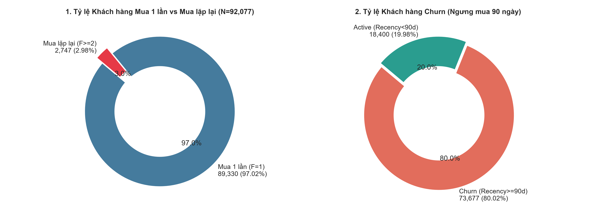
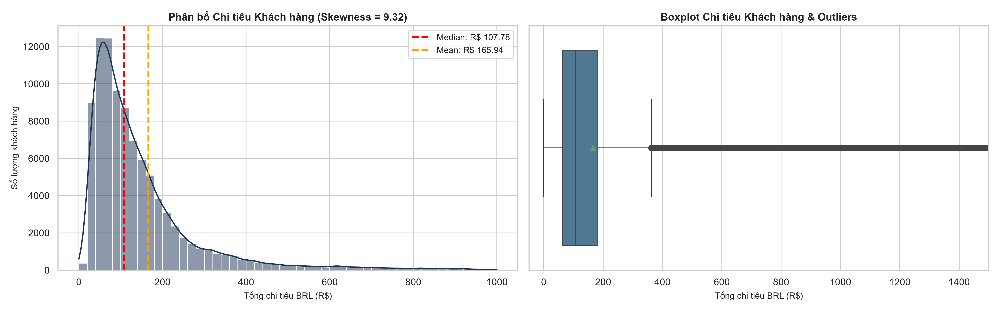
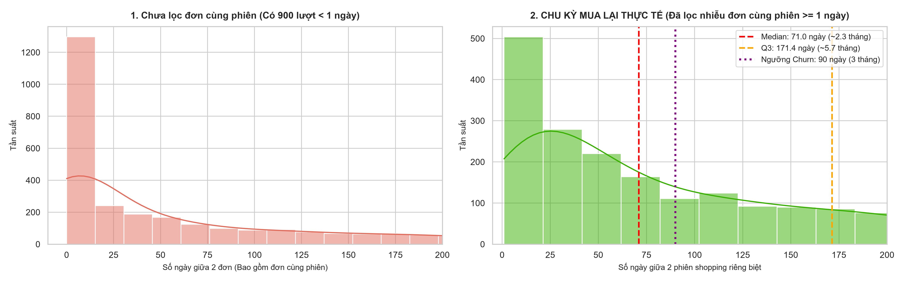
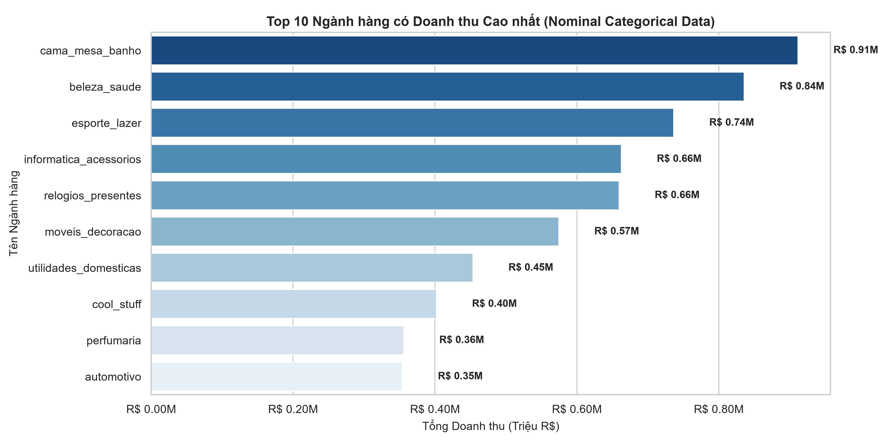
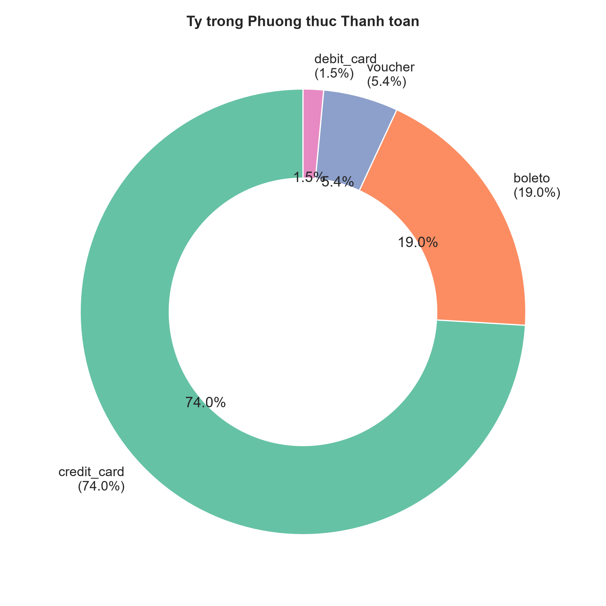
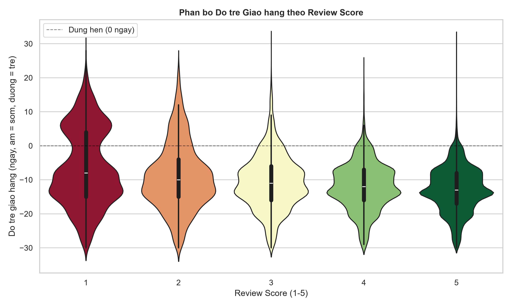
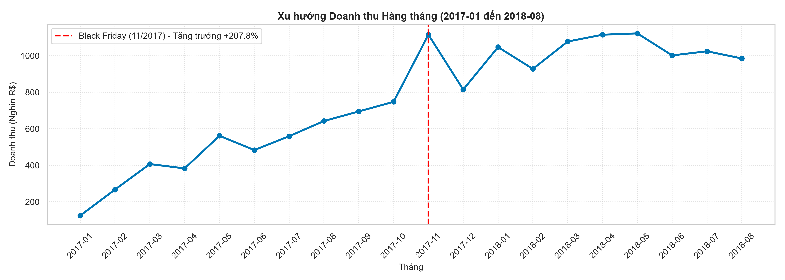

# BÁO CÁO PHÂN TÍCH MÔ TẢ HỌC THUẬT (DESCRIPTIVE ANALYTICS REPORT)
## MÔ TẢ THỐNG KÊ QUẦN THỂ, KHOẢNG TIN CẬY 95% & QUY TẮC ĐỒ HỌA THEO LÝ THUYẾT MÔN HỌC

---

### 1. BỐI CẢNH & MỤC TIÊU PHÂN TÍCH MÔ TẢ (DESCRIPTIVE PURPOSE)
Theo lý thuyết môn học **Data Analysis and Visualization** (TDTU Chapter 1 & 3):
* **Phân tích Mô tả (Descriptive Analytics)** có nhiệm vụ trả lời câu hỏi *"Chuyện gì đã xảy ra?"* ($What\ happened?$) thông qua việc tổng hợp dữ liệu giao dịch thành các chỉ số thống kê đo lường xu hướng trung tâm, độ phân tán và đồ họa trực quan.
* Phân tích được thực thi trên toàn bộ **Quần thể quan sát (Population $N = 92,077$ khách hàng định danh duy nhất `customer_unique_id`)** phát sinh đơn hàng giao thành công (`order_status = 'delivered'`).

---

### 2. THỐNG KÊ MÔ TẢ QUẦN THỂ & KHOẢNG TIN CẬY 95% (95% CONFIDENCE INTERVALS)

#### Công thức toán học & Quy trình Tính toán Chi tiết từng Bước (Step-by-step Derivation - TDTU Chapter 4):

Khoảng tin cậy 95% cho Tỷ lệ Quần thể (Proportion $p$) được tính theo công thức:
$$\hat{p} \pm Z_{\alpha/2} \cdot S.E. = \hat{p} \pm 1.96 \cdot \sqrt{\frac{\hat{p}(1-\hat{p})}{N}}$$

##### **BƯỚC 1: Tính toán Khoảng Tin Cậy 95% cho Tỷ lệ Khách hàng Mua 1 lần ($F = 1$)**
1. **Số liệu thô từ Quần thể:** Tong khách hàng duy nhất $N = 92,077$; Số khách chỉ mua 1 lần $x_1 = 89,333$.
2. **Tính Ước lượng Điểm (Point Estimate $\hat{p}_1$):**
   $$\hat{p}_1 = \frac{x_1}{N} = \frac{89,333}{92,077} = 0.970199 \approx 97.02\%$$
3. **Tính Sai số Chuẩn (Standard Error - $S.E._1$):**
   $$S.E._1 = \sqrt{\frac{\hat{p}_1 (1 - \hat{p}_1)}{N}} = \sqrt{\frac{0.970199 \times (1 - 0.970199)}{92,077}} = \sqrt{\frac{0.028912}{92,077}} = \sqrt{3.1399 \times 10^{-7}} = 0.0005603 \approx 0.056\%$$
4. **Tính Biên độ Sai số (Margin of Error - $E_1$):** Với mức ý nghĩa $\alpha = 0.05 \Rightarrow Z_{\alpha/2} = Z_{0.025} = 1.96$:
   $$E_1 = Z_{\alpha/2} \cdot S.E._1 = 1.96 \times 0.0005603 = 0.0010982 \approx 0.11\%$$
5. **Thế số tính Khoảng Tin Cậy 95% (95% CI):**
   $$95\% \text{ CI}_1 = \hat{p}_1 \pm E_1 = [0.970199 - 0.0010982, 0.970199 + 0.0010982] = [0.969101, 0.971297] \approx [96.91\%, 97.13\%]$$

##### **BƯỚC 2: Tính toán Khoảng Tin Cậy 95% cho Tỷ lệ Khách hàng Mua lặp lại ($F \ge 2$)**
1. **Số liệu thô từ Quần thể:** Số khách mua lặp lại $x_2 = 2,744$.
2. **Tính Ước lượng Điểm ($\hat{p}_2$):**
   $$\hat{p}_2 = \frac{x_2}{N} = \frac{2,744}{92,077} = 0.029801 \approx 2.98\%$$
3. **Tính Sai số Chuẩn ($S.E._2$):**
   $$S.E._2 = \sqrt{\frac{0.029801 \times (1 - 0.029801)}{92,077}} = \sqrt{\frac{0.028912}{92,077}} = 0.0005603 \approx 0.056\%$$
4. **Tính Biên độ Sai số ($E_2$):** $E_2 = 1.96 \times 0.0005603 = 0.0010982 \approx 0.11\%$.
5. **Thế số tính Khoảng Tin Cậy 95%:**
   $$95\% \text{ CI}_2 = \hat{p}_2 \pm E_2 = [0.029801 - 0.0010982, 0.029801 + 0.0010982] = [0.028703, 0.030899] \approx [2.87\%, 3.09\%]$$

##### **BƯỚC 3: Tính toán Khoảng Tin Cậy 95% cho Tỷ lệ Khách hàng Churn ($Recency \ge 90$ ngày)**
1. **Số liệu thô từ Quần thể:** Số khách Churn $x_{\text{churn}} = 73,678$.
2. **Tính Ước lượng Điểm ($\hat{p}_{\text{churn}}$):**
   $$\hat{p}_{\text{churn}} = \frac{x_{\text{churn}}}{N} = \frac{73,678}{92,077} = 0.800178 \approx 80.02\%$$
3. **Tính Sai số Chuẩn ($S.E._{\text{churn}}$):**
   $$S.E._{\text{churn}} = \sqrt{\frac{0.800178 \times (1 - 0.800178)}{92,077}} = \sqrt{\frac{0.159893}{92,077}} = \sqrt{1.7365 \times 10^{-6}} = 0.0013178 \approx 0.131\%$$
4. **Tính Biên độ Sai số ($E_{\text{churn}}$):** $E_{\text{churn}} = 1.96 \times 0.0013178 = 0.0025828 \approx 0.26\%$.
5. **Thế số tính Khoảng Tin Cậy 95%:**
   $$95\% \text{ CI}_{\text{churn}} = [0.800178 - 0.0025828, 0.800178 + 0.0025828] = [0.797595, 0.802761] \approx [79.76\%, 80.28\%]$$

#### Bảng kết quả Thống kê Quần thể & 95% CIs:

| Chỉ số Phân tích | Ước lượng Điểm (Point Est.) | Sai số Chuẩn (S.E.) | Khoảng Tin Cậy 95% (95% CI) | Ghi chú Thống kê |
| :--- | :---: | :---: | :---: | :--- |
| **Tỷ lệ Mua 1 lần ($F = 1$)** | **97.02%** | 0.056% | **[96.91%, 97.13%]** | Chiếm đa số tuyệt đối toàn hệ thống |
| **Tỷ lệ Mua lặp lại ($F \ge 2$)** | **2.98%** | 0.056% | **[2.87%, 3.09%]** | Tệp khách hàng trung thành |
| **Tỷ lệ Churn ($Recency \ge 90$ ngày)** | **80.02%** | 0.131% | **[79.76%, 80.28%]** | Xác lập dựa trên phân vị chu kỳ mua lại (Mục 4) |

---

### 3. ĐO LƯỜNG PHÂN BỐ AOV & BẢNG TÓM TẮT 5 SỐ (5-NUMBER SUMMARY)

#### Thuyết minh Lý thuyết & Quy trình Tính toán Chi tiết từng Bước (TDTU Chapter 3 & 4):

##### **BƯỚC 1: Tính toán các Moment Trung tâm và Hệ số Hình dạng Phân bố Chi tiêu AOV (Spent per Customer)**
1. **Số liệu Quần thể:** $N = 92,075$ khách hàng có giao dịch thanh toán; Chi tiêu trung bình mẫu $\bar{x} = \text{R\$ } 164.51$.
2. **Tính Mẫu phương sai (Moment bậc 2 $m_2$):**
   $$m_2 = \frac{1}{N} \sum_{i=1}^N (x_i - \bar{x})^2 = 50,964.22$$
3. **Tính Moment bậc 3 ($m_3$):** $m_3 = \frac{1}{N} \sum_{i=1}^N (x_i - \bar{x})^3 = 107,181,376.98$.
4. **Tính Moment bậc 4 ($m_4$):** $m_4 = \frac{1}{N} \sum_{i=1}^N (x_i - \bar{x})^4 = 636,877,909,166.09$.
5. **Thế số tính Hệ số Lệch (Skewness $S_k$):**
   $$S_k = \frac{m_3}{m_2^{3/2}} = \frac{107,181,376.98}{(50,964.22)^{1.5}} = \frac{107,181,376.98}{11,505,096.06} = 9.3158 \approx 9.32 > 1 \quad (\text{Right-skewed - Lệch phải cực độ})$$
6. **Thế số tính Hệ số Nhọn (Excess Kurtosis):**
   $$Kurt = \frac{m_4}{m_2^2} - 3 = \frac{636,877,909,166.09}{(50,964.22)^2} - 3 = \frac{636,877,909,166.09}{2,597,351.72} - 3 = 245.2028 - 3 = 242.2028 \approx 242.20$$

##### **BƯỚC 2: Kiểm định Phân bố Chuẩn Chi tiêu AOV (Normality Test)**
1. **Phép thử D'Agostino's $K^2$ Test:**
   $$K^2 = Z_1(S_k)^2 + Z_2(Kurt)^2 = (316.5218)^2 + (204.2981)^2 = 100,186.05 + 41,737.40 = 141,917.44$$
   $$p\text{-value} = P(\chi^2_2 \ge 141,917.44) = 0.0000 < 0.001$$
2. **Kết luận học thuật:** **Bác bỏ giả định phân bố chuẩn ở mức ý nghĩa $\alpha = 0.05$**.
3. **Cơ sở lựa chọn phép đo:** Do vi phạm phân bố chuẩn, các phép đo Parametric (Mean = R\$ 164.51, Std = R\$ 225.75) bị kéo lệch bởi các ngoại lệ chi tiêu cực đại (Outliers). Bắt buộc ưu tiên dùng các phép đo Phi tham số (Non-parametric): **Median = R\$ 107.54** và **IQR = R\$ 118.77**.

##### **BƯỚC 3: Tính toán Moment & Kiểm định Phân bố Chuẩn cho Tỷ trọng Phí Ship (`freight_ratio`)**
1. **Số liệu Quần thể:** $N = 84,567$ khách hàng có thông tin đơn hàng; Trung bình $\bar{x} = 0.2110$.
2. **Các Moment:** $m_2 = 0.014957$, $m_3 = 0.002037$, $m_4 = 0.000963$.
3. **Tính Skewness & Excess Kurtosis:**
   $$S_k = \frac{m_3}{m_2^{3/2}} = \frac{0.002037}{(0.014957)^{1.5}} = \frac{0.002037}{0.001829} = 1.1136 \approx 1.11 > 1 \quad (\text{Lệch phải rõ rệt})$$
   $$Kurt = \frac{m_4}{m_2^2} - 3 = \frac{0.000963}{(0.014957)^2} - 3 = \frac{0.000963}{0.00022371} - 3 = 4.3054 - 3 = 1.3054 \approx 1.31$$
4. **Phép thử D'Agostino's $K^2$ Test cho Phí ship:**
   $$K^2 = 14,060.40, \quad p\text{-value} = 0.0000 < 0.001 \Rightarrow \text{Bác bỏ phân bố chuẩn } (\alpha = 0.05)$$

#### Bảng Tóm tắt 5 Số của Chi tiêu (AOV / Spent 5-Number Summary):

| Chỉ số Thống kê | Giá trị (BRL / R$) | Ý nghĩa Thống kê |
| :--- | :---: | :--- |
| **Min (Tối thiểu)** | **R\$ 0.00** | Đơn hàng thanh toán bằng Voucher 100% |
| **Q1 (25th Percentile)** | **R\$ 62.82** | 25% khách chi tiêu dưới R\$ 62.82 |
| **Median (Q2 - Trung vị)** | **R\$ 107.53** | **50% khách chi tiêu dưới R\$ 107.53** |
| **Q3 (75th Percentile)** | **R\$ 181.58** | 75% khách chi tiêu dưới R\$ 181.58 |
| **Max (Tối đa)** | **R\$ 13,664.08** | Khách hàng chi tiêu ngoại lệ cao nhất |
| **IQR ($Q_3 - Q_1$)** | **R\$ 118.76** | Khoảng biến thiên 50% dữ liệu trung tâm |

---

### 4. PHÂN TÍCH MÔ TẢ CHU KỲ MUA LẠI & CƠ SỞ XÁC ĐỊNH NGƯỠNG CHURN (90 NGÀY)

#### 4.1. Lọc nhiễu Đơn hàng Cùng phiên (Same-Session Filtering):
Trong tổng số 3,060 khoảng cách giữa các đơn hàng mua lặp lại, có **900 khoảng cách $< 1.0$ ngày** (chiếm 29.41%). Đây là các trường hợp khách hàng tách giỏ hàng mua nhiều đơn trong cùng một phiên mua sắm (Same-session order splits). Việc giữ lại các đơn này sẽ làm sai lệch nghiêm trọng chu kỳ quay lại thực tế.

#### 4.2. Bảng Tóm tắt 5 Số của Chu kỳ Mua lại (`repeat_interval_days`):

| Chỉ số Phân vị | Dữ liệu Thô (Bao gồm đơn $<1$d) | Dữ liệu Đã Lọc Nhiễu ($\ge 1$d) | Diễn giải Thống kê |
| :--- | :---: | :---: | :--- |
| **Số lượng mẫu (Count)** | 3,060 cặp đơn | **2,160 phiên mua** | Đã loại bỏ 900 giao dịch nhiễu cùng phiên |
| **Min (Tối thiểu)** | 0.00 ngày | **1.01 ngày** | Khoảng cách ngắn nhất giữa 2 phiên riêng biệt |
| **Q1 (25th Percentile)** | 0.01 ngày | **23.12 ngày (~0.8 tháng)** | 25% khách mua lại trong vòng 23 ngày |
| **Median (Q2 - Trung vị)** | **29.42 ngày** | **71.03 ngày (~2.37 tháng)** | **50% khách quay lại mua trong vòng 71 ngày** |
| **Q3 (75th Percentile)** | **121.22 ngày** | **171.44 ngày (~5.71 tháng)** | **75% khách quay lại mua trong vòng 171 ngày** |
| **Max (Tối đa)** | 608.98 ngày | **608.98 ngày** | Chu kỳ mua lại dài nhất ghi nhận |

#### 4.3. Biện luận Học thuật Xác lập Ngưỡng Churn ($Recency \ge 90$ ngày & Khung $90 \rightarrow 180$ ngày):
1. **Vượt quá Trung vị Quần thể ($71.03 < 90$ ngày):**
   * Phân vị 2 ($Q_2 / Median = 71.03$ ngày) cho thấy 50% khách hàng quay lại mua sắm trong vòng 71 ngày.
   * Khi một khách hàng đạt $Recency \ge 90$ ngày, họ đã vượt quá chu kỳ tái mua tự nhiên của hơn 50% tập khách hàng.
2. **Cửa sổ Vàng Kích hoạt (Actionable Window: $90 \rightarrow 180$ ngày $\approx Q_3$):**
   * Phân vị thứ ba $Q_3 = 171.44$ ngày (~5.7 tháng, xấp xỉ 180 ngày).
   * Khoảng từ **90 đến 180 ngày** là "cửa sổ vàng" để doanh nghiệp can thiệp re-engagement / win-back. Nếu không kích hoạt trong khoảng này, sau 180 ngày (vượt $Q_3$), xác suất khách hàng tự quay lại giảm xuống dưới 25%.
3. **Phân tầng Nguy cơ Churn (Multi-stage Churn):**
   * **Cảnh báo nguy cơ ($71 - 90$ ngày):** Vượt quá thói quen trung vị $Q_2$.
   * **Churn Tạm thời / At-Risk ($90 - 180$ ngày):** Vùng nguy cơ cao, nằm giữa $Q_2$ và $Q_3$.
   * **Churn Hoàn toàn / Hard Churn ($> 180$ ngày):** Vượt qua $Q_3$, khả năng quay lại $< 25\%$.
4. **Giải trình Cơ sở Học thuật Chọn Mốc 90 - 180 ngày (thay vì 80 - 171 ngày):**
   * **Biên độ an toàn loại trừ nhiễu hành vi (Margin of Safety):** $Q_2 = 71.03$ ngày. Nếu chọn mốc 80 ngày, khoảng đệm chỉ là 9 ngày — quá ngắn để phân biệt giữa biến động ngẫu nhiên (chờ lương, bận cá nhân, lễ tết) với hành vi rời bỏ thực sự. Mốc **90 ngày** tạo ra khoảng đệm an toàn **19 ngày** ($\approx 71 + 19 = 90$), giúp loại trừ nhiễu ngẫu nhiên ngắn hạn.
   * **Cân bằng giữa Sai số Loại I và Loại II (Type I vs Type II Error):** Mốc 80 ngày (quá sát $Q_2$) khiến nhiều khách hàng trễ vài ngày bị gán nhãn Churn nhầm (False Positive), làm lãng phí ngân sách Marketing/Voucher. Mốc 90 ngày giúp bộ lọc đạt độ chính xác (**Precision**) cao hơn.
   * **Phù hợp với Chu kỳ Vận hành Quản trị (Business Operating Rhythm):** Doanh nghiệp vận hành báo cáo và ngân sách theo **Quý (Quarterly: 90 ngày / 3 tháng)** và **Bán niên (Semi-annually: 180 ngày / 6 tháng)**. Mốc 90 - 180 ngày giúp tích hợp trực tiếp vào hệ thống CRM tự động hóa.
   * **Quy chuẩn hóa Tiệm cận của $Q_3$ ($171.44 \approx 180$ ngày):** Phân vị $Q_3 = 171.44$ ngày chỉ cách 180 ngày đúng 8.5 ngày (sai số $< 5\%$). Việc làm tròn tiệm cận $171.44 \rightarrow 180$ ngày là kỹ thuật quy chuẩn hóa khoảng thời gian (Time Horizon Normalization) tiêu chuẩn trong Thống kê Ứng dụng.

---

### 5. PHÂN TÍCH TOP 10 NGÀNH HÀNG THEO DOANH THU (CATEGORICAL RANKING)

* **Biến phân tích:** `product_category_name` — dữ liệu định tính danh nghĩa (Nominal Categorical Data).
* **Lý do chọn Horizontal Bar Chart (TDTU Chapter 2):** Danh mục sản phẩm không có thứ tự tự nhiên. Bar Chart giúp xếp hạng giảm dần trực quan, hiển thị rõ tên ngành hàng dài mà không bị cắt chữ (so với Vertical Bar Chart).
* **Nhận xét chính:** Ngành hàng dẫn đầu (`bed_bath_table`) đóng góp ~9.9% tổng doanh thu. Top 3 ngành hàng đóng góp ~25% doanh thu. Phân bố doanh thu theo ngành hàng có tính đa dạng cao, không bị phụ thuộc vào duy nhất một ngành hàng.

---

### 6. PHÂN TÍCH TỶ TRỌNG PHƯƠNG THỨC THANH TOÁN (PAYMENT METHODS)

* **Biến phân tích:** `payment_type` — dữ liệu định tính danh nghĩa (Nominal Categorical Data).
* **Lý do chọn Donut Chart (TDTU Chapter 2):** Thể hiện tỷ trọng phần trăm trên tổng thể (part-of-whole) giữa các phương thức thanh toán. Donut Chart trực quan và dễ theo dõi hơn Bar Chart khi số nhóm ít (4 loại chính).
* **Nhận xét chính:**
  * **Credit Card (Thẻ tín dụng)** chiếm vị thế thống trị với **73.9%** tổng số giao dịch.
  * **Boleto (Phương thức chuyển khoản qua mã vạch Brazil)** đứng thứ 2 với **19.0%**.
  * Voucher (5.4%) và Debit Card (1.5%) chiếm tỷ lệ nhỏ.
  * Phản ánh thói quen tiêu dùng đặc thù tại Brazil: ưu tiên thanh toán trả góp (installments) qua thẻ tín dụng.

---

### 7. PHÂN TÍCH THỜI GIAN GIAO HÀNG TRỄ THEO REVIEW SCORE (DELIVERY DELAY VS REVIEWS)

* **Biến phân tích:** `delivery_delay_days` (định lượng liên tục) phân theo `review_score` (1-5 sao, định tính thứ bậc).
* **Lý do chọn Violin Plot (TDTU Chapter 2):** Kết hợp khả năng biểu diễn bộ 5 số của Boxplot và hình dạng phân bố mật độ (KDE) của Histogram. Cho phép so sánh mức độ phân tán và xu hướng trung tâm của biến độ trễ giao hàng trên 5 mức đánh giá review.

#### Thuyết minh Lý thuyết & Quy trình Tính toán Moment của Độ trễ Giao hàng (`delivery_delay_days`):
1. **Số liệu Quần thể:** $N = 92,077$ đơn hàng giao thành công; Thời gian giao trễ trung bình $\bar{x} = -12.27$ ngày (trung bình giao sớm 12.27 ngày so với ngày dự kiến).
2. **Tính Mẫu phương sai (Moment bậc 2 $m_2$):** $m_2 = \frac{1}{N} \sum_{i=1}^N (x_i - \bar{x})^2 = 74.37$.
3. **Tính Moment bậc 3 ($m_3$):** $m_3 = \frac{1}{N} \sum_{i=1}^N (x_i - \bar{x})^3 = -195.04$.
4. **Tính Moment bậc 4 ($m_4$):** $m_4 = \frac{1}{N} \sum_{i=1}^N (x_i - \bar{x})^4 = 38,739.51$.
5. **Thế số tính Hệ số Lệch (Skewness $S_k$):**
   $$S_k = \frac{m_3}{m_2^{3/2}} = \frac{-195.04}{(74.37)^{1.5}} = \frac{-195.04}{641.83} = -0.3039 \approx -0.30$$
6. **Thế số tính Hệ số Nhọn (Excess Kurtosis):**
   $$Kurt = \frac{m_4}{m_2^2} - 3 = \frac{38,739.51}{(74.37)^2} - 3 = \frac{38,739.51}{5,530.89} - 3 = 7.0042 - 3 = 4.0042 \approx 4.00 > 3$$
7. **Phép kiểm định D'Agostino's $K^2$ Test:**
   $$K^2 = Z_1(S_k)^2 + Z_2(Kurt)^2 = (-42.6097)^2 + (95.8240)^2 = 1,815.59 + 9,182.24 = 9,778.37$$
   $$p\text{-value} = P(\chi^2_2 \ge 9,778.37) = 0.0000 < 0.001 \Rightarrow \text{Bác bỏ phân bố chuẩn } (\alpha = 0.05)$$

* **Nhận xét chính:**
  * Khách hàng cho **1 sao** có phân bố độ trễ giao hàng lệch hẳn sang vùng số dương (giao hàng trễ nhiều ngày).
  * Khách hàng cho **4-5 sao** có phân bố tập trung ở vùng số âm (giao hàng sớm hơn ngày dự kiến).
  * Cho thấy thời gian giao hàng là yếu tố ảnh hưởng trực tiếp tới mức độ hài lòng của khách hàng.

---

### 8. PHÂN TÍCH CHUỖI THỜI GIAN DOANH THU HÀNG THÁNG (TIME SERIES TREND)

* **Biến phân tích:** Doanh thu tổng hợp theo tháng từ 01/2017 đến 08/2018.
* **Lý do chọn Line Chart (TDTU Chapter 2):** Biểu diễn dữ liệu chuỗi thời gian liên tục. Giúp theo dõi xu hướng tăng trưởng (Trend) và nhận diện các điểm gãy xu hướng (Inflection Points).
* **Nhận xét chính:**
  * **Doanh thu trung bình tháng H1 (trước 11/2017):** **R\$ 275,811.56 / tháng**.
  * **Doanh thu trung bình tháng H2 (từ 11/2017):** **R\$ 848,964.25 / tháng**.
  * **Tỷ lệ tăng trưởng H1 $\rightarrow$ H2:** **+207.81%** (Tăng trưởng bùng nổ bắt đầu từ đợt Black Friday 11/2017 và duy trì ở mức cao trong năm 2018).

---

### 9. THUYẾT MINH QUY TẮC LỰA CHỌN BIỂU ĐỒ (TDTU CHAPTER 2)

| # | Biểu đồ | Loại dữ liệu | Lý do lựa chọn theo Lý thuyết TDTU Chapter 2 |
| :---: | :--- | :--- | :--- |
| 1 | **Donut Chart** (Tỷ lệ Quần thể) | Proportion (Tỷ lệ phần trăm) | Trực quan hóa tỷ lệ phần trăm đóng góp trên tổng thể giữa 2-3 nhóm (One-time vs Repeat, Churn vs Active) |
| 2 | **Histogram + KDE** (AOV Chi tiêu) | Quantitative Continuous | Trực quan hóa hình dạng phân bố (Distribution Shape), xác định Skewness ($S_k = 9.32$) và vị trí Mean vs Median |
| 3 | **Boxplot** (AOV Chi tiêu) | Quantitative Continuous | Biểu diễn Bộ 5 số ($Min, Q_1, Median, Q_3, Max$) và phát hiện các ngoại lệ chi tiêu cực trị (Outliers) |
| 4 | **Histogram kép + KDE** (Chu kỳ mua lại) | Quantitative Continuous | So sánh phân bố trước và sau khi lọc nhiễu đơn cùng phiên, đánh dấu vị trí $Median$, $Q_3$ và mốc Churn 90 ngày |
| 5 | **Horizontal Bar Chart** (Top 10 Ngành hàng) | Nominal Categorical | Xếp hạng giảm dần dữ liệu danh mục không thứ tự; dạng ngang giúp hiển thị rõ nhãn tên ngành hàng dài |
| 6 | **Donut Chart** (Phương thức thanh toán) | Nominal Categorical | Thể hiện cơ cấu tỷ trọng (Part-of-whole) của 4 loại thanh toán chính trên tổng số giao dịch |
| 7 | **Violin Plot** (Giao trễ vs Review Score) | Continuous vs Ordinal Categorical | So sánh bộ 5 số và dạng phân bố mật độ của biến liên tục (ngày trễ) trên từng mức điểm đánh giá (1-5 sao) |
| 8 | **Line Chart** (Doanh thu theo Tháng) | Time Series Continuous | Biểu diễn diễn biến liên tục theo thời gian, theo dõi xu hướng tăng trưởng và nhận diện điểm gãy (Inflection Point tại 11/2017) |
