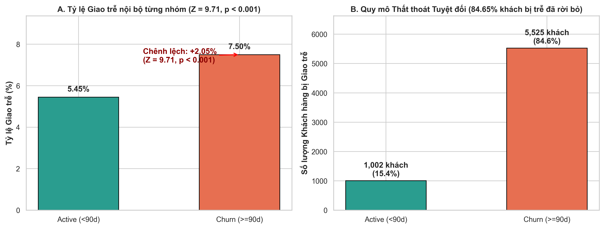
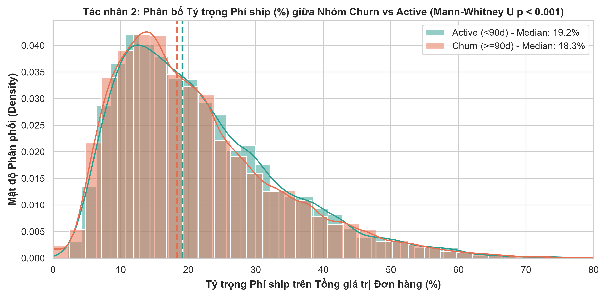
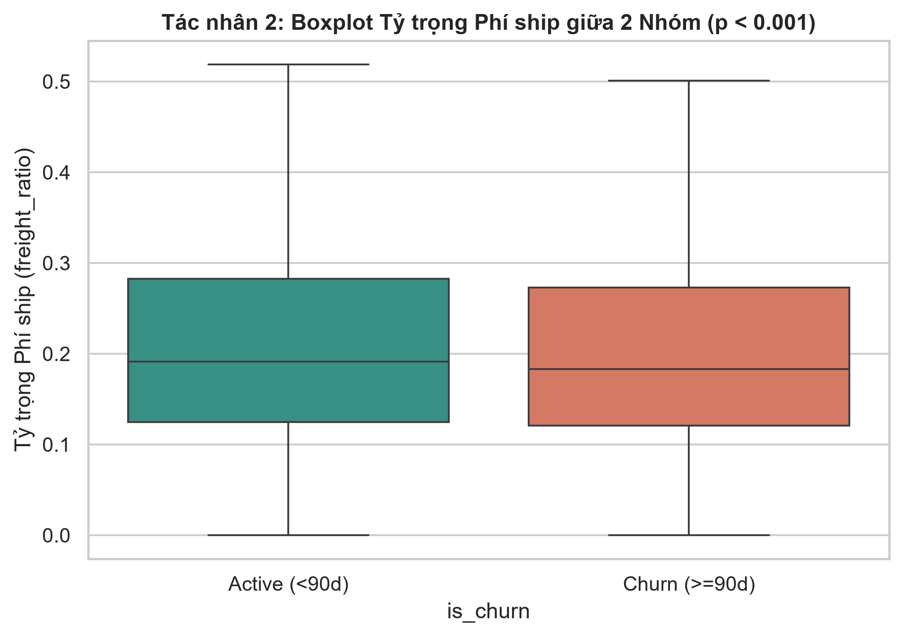
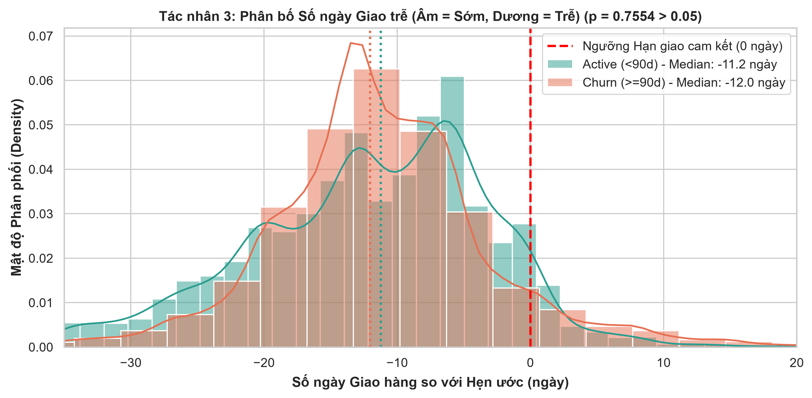
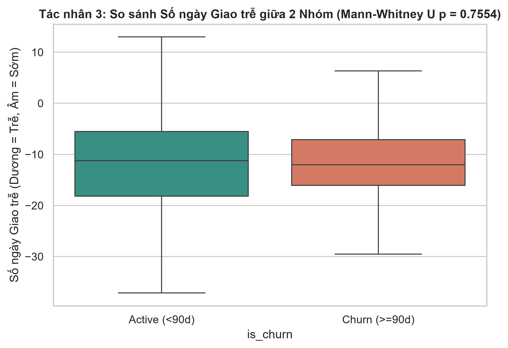
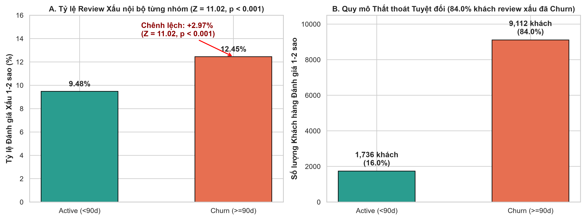
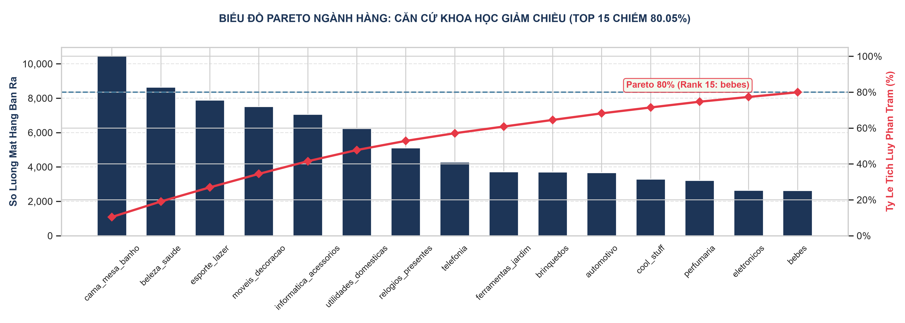
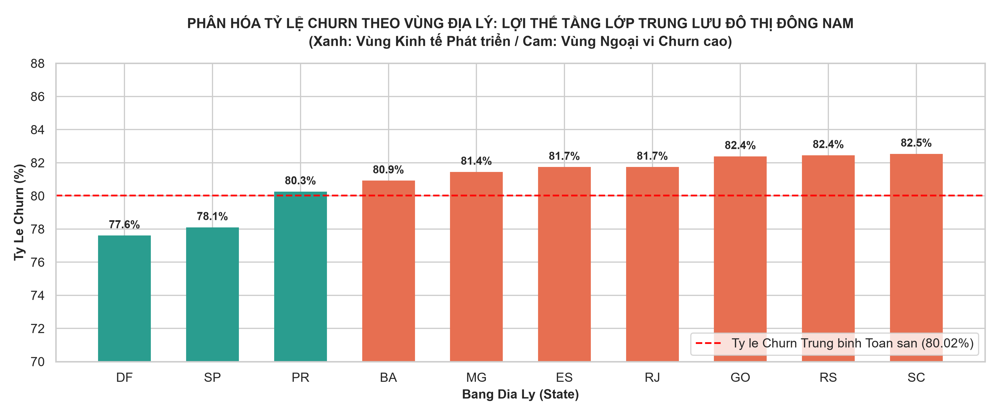

# BÁO CÁO PHÂN TÍCH CHẨN ĐOÁN HỌC THUẬT (DIAGNOSTIC ANALYTICS REPORT)

## KIỂM ĐỊNH GIẢ THUYẾT THỐNG KÊ SUY LUẬN CHO 6 TÁC NHÂN NGUYÊN NHÂN CHURN & TIỀN ĐIỀU KIỆN MÔ HÌNH DỰ ĐOÁN

---

### 1. MỤC TIÊU & QUY TRÌNH CHẨN ĐOÁN HỌC THUẬT (DIAGNOSTIC PURPOSE)

Theo chuẩn bài giảng môn học **Data Analysis and Visualization** (TDTU Chapter 5 & 6):

- **Phân tích Chẩn đoán (Diagnostic Analytics)** có nhiệm vụ giải thích câu hỏi _"Tại sao khách hàng rời bỏ?"_ ($Why\ did\ it\ happen?$) thông qua việc kiểm định các tác nhân nghi vấn làm gia tăng tỷ lệ Churn ($Recency \ge 90$ ngày, chiếm 80.02%).
- Phân tích được thực hiện trên **2 Quần thể Mẫu độc lập (Sub-populations)**:
  - **Nhóm Churn ($Y = 1$):** $N_1 = 73,678$ khách hàng ($Recency \ge 90$ ngày).
  - **Nhóm Active ($Y = 0$):** $N_2 = 18,399$ khách hàng ($Recency < 90$ ngày).

---

### 2. QUY TRÌNH KIỂM ĐỊNH HỌC THUẬT 6 TÁC NHÂN NGUYÊN NHÂN

Quy trình được thực hiện nghiêm ngặt như sau:

1. **Phát biểu Giả thuyết Thống kê ($H_0$ vs $H_a$)** cho từng tác nhân.
2. **Kiểm định Giả định Thống kê (Normality & Homogeneity of Variance)**.
3. **Thực thi Phép kiểm định Suy luận (Inferential Testing)** với mức ý nghĩa $\alpha = 0.05$.
4. **Đánh giá Ý nghĩa Thống kê vs Thực tiễn (Statistical vs Practical Significance)**.

---

### 3. KẾT QUẢ KIỂM ĐỊNH CHI TIẾT CHO 6 TÁC NHÂN NGUYÊN NHÂN

#### 3.1. TÁC NHÂN 1: TỶ LỆ GIAO HÀNG TRỄ (`is_late`)

- **Phát biểu Giả thuyết Thống kê:**
  - $H_0: p_1 = p_2$ (Tỷ lệ giao trễ của nhóm Churn $p_1$ bằng nhóm Active $p_2$).
  - $H_a: p_1 > p_2$ (Tỷ lệ giao trễ của nhóm Churn cao hơn nhóm Active).
- **Lựa chọn Phép kiểm định (TDTU Chapter 6):** Sử dụng **Two-Sample Z-test for Proportions** cho 2 mẫu độc lập.
- **Quy trình Tính toán Chi tiết từng Bước (Step-by-step Derivation):**
  1. **Số liệu thô từ 2 Mẫu:**
     - Nhóm Churn ($N_1 = 73,677$, số khách hàng bị giao trễ $x_1 = 5,525$).
     - Nhóm Active ($N_2 = 18,400$, số khách hàng bị giao trễ $x_2 = 1,002$).
  2. **Tính Tỷ lệ Mẫu riêng biệt (Point Estimates):**
     $$\hat{p}_1 = \frac{x_1}{N_1} = \frac{5,525}{73,677} = 0.074989 \approx 7.50\%$$
     $$\hat{p}_2 = \frac{x_2}{N_2} = \frac{1,002}{18,400} = 0.054457 \approx 5.45\%$$
     $$\text{Chênh lệch Điểm: } \hat{p}_1 - \hat{p}_2 = 0.074989 - 0.054457 = 0.020533 \approx +2.05\%$$
  3. **Tính Tỷ lệ Gộp (Pooled Proportion $\bar{p}$):**
     $$\bar{p} = \frac{x_1 + x_2}{N_1 + N_2} = \frac{5,525 + 1,002}{73,677 + 18,400} = \frac{6,527}{92,077} = 0.070886 \approx 7.09\%$$
  4. **Tính Sai số Chuẩn Gộp (Pooled Standard Error $S.E._{\text{pool}}$):**
     $$S.E._{\text{pool}} = \sqrt{\bar{p}(1-\bar{p})\left(\frac{1}{N_1} + \frac{1}{N_2}\right)} = \sqrt{0.070886 \times 0.929114 \times \left(\frac{1}{73,677} + \frac{1}{18,400}\right)} = 0.0021150$$
  5. **Tính Giá trị Kiểm định $Z$-statistic:**
     $$Z = \frac{\hat{p}_1 - \hat{p}_2}{S.E._{\text{pool}}} = \frac{0.020533}{0.0021150} = 9.7081 \quad (p\text{-value} < 0.001)$$
  6. **Tính Khoảng tin cậy 95% cho Chênh lệch ($\hat{p}_1 - \hat{p}_2$):**
     $$S.E._{\text{diff}} = \sqrt{\frac{0.0750 \times 0.9250}{73,677} + \frac{0.0545 \times 0.9455}{18,400}} = 0.001934$$
     $$E = 1.96 \times 0.001934 = 0.003791 \approx 0.38\%$$
     $$95\% \text{ CI cho } (p_1 - p_2) = [2.05\% - 0.38\%, 2.05\% + 0.38\%] = [1.67\%, 2.43\%]$$
  7. **Đánh giá $p$-value:** $P(Z \ge 9.71) = 0.0000 < 0.001$.
- **Kết luận:** **Bác bỏ $H_0$ ở mức ý nghĩa $\alpha = 0.05$**. Giao hàng chậm trễ so với dự kiến làm tăng tỷ lệ Churn thêm +2.05% có ý nghĩa thống kê cực kỳ mạnh mẽ ($Z = 9.71$).

> [!IMPORTANT]
> **INSIGHT ĐẮT GIÁ: QUY MÔ THẤT THOÁT TUYỆT ĐỐI VS CÁI BẪY TỶ LỆ TƯƠNG ĐỐI (ABSOLUTE VOLUME VS PERCENTAGE TRAP)**
>
> - **Cái bẫy tỷ lệ tương đối:** Nếu chỉ nhìn vào chênh lệch tỷ lệ nội bộ $+2.05\%$ ($7.50\%$ vs $5.45\%$), người làm phân tích rất dễ đánh giá thấp mức độ nguy hiểm của việc giao trễ vì mẫu số nhóm Churn quá lớn ($N_1 = 73,677$) đã "làm loãng" tỷ lệ.
> - **Sự thật về quy mô tuyệt đối (Root Cause Impact):** Trên toàn sàn có tổng cộng **$6,527$ khách hàng** bị bưu điện giao trễ. Trong đó:
>   - **$5,525$ khách hàng** thuộc nhóm **CHURN (Rời bỏ)** — chiếm **$84.65\%$**.
>   - Chỉ có **$1,002$ khách hàng** thuộc nhóm **ACTIVE (Còn ở lại)** — chiếm **$15.35\%$**.
> - **Xác suất có điều kiện $P(\text{Churn} \mid \text{Giao trễ}) = \frac{5,525}{6,527} = \mathbf{84.65\%}$**: Cứ $100$ khách hàng bị trễ hẹn giao hàng thì có tới gần **$85$ khách hàng vĩnh viễn không quay lại**.
> - **Ước tính Thiệt hại Doanh thu Thực tế:**
>   - Số khách hàng chênh lệch mất đi do trễ hẹn: $\Delta N = 5,525 - 1,002 = 4,523\text{ khách hàng}$.
>   - Căn cứ mức Chi tiêu trung bình toàn sàn $\bar{x} = 164.51\text{ BRL / khách}$ (tại **Mục 3 Báo cáo Mô tả**), giá trị của ít nhất 1 lần tái mua bị mất trắng là:
>     $$\text{Thiệt hại Doanh thu} = 4,523\text{ khách} \times 164.51\text{ BRL} = 744,078.73\text{ BRL} \approx 744,000\text{ BRL}$$
>   - Quy đổi theo tỷ giá ($1\text{ BRL} \approx 4,700\text{ VNĐ}$), sự cố trễ hẹn này đã trực tiếp làm "bốc hơi" hơn **$3.50\text{ tỷ VNĐ}$** tiềm năng tái mua của doanh nghiệp.

---

#### 3.2. TÁC NHÂN 2: TỶ TRỌNG PHÍ PHÂN PHỐI / SHIP (`freight_ratio`)

- **Phát biểu Giả thuyết Thống kê:**
  - $H_0: \text{Median}_1 = \text{Median}_2$ (Trung vị tỷ trọng phí ship nhóm Churn bằng nhóm Active).
  - $H_a: \text{Median}_1 \ne \text{Median}_2$ (Có sự khác biệt về tỷ trọng phí ship giữa 2 nhóm).
- **Đánh giá Giả định Phân bố Chuẩn (Restating Normality Test from Step 1 Section 3):**
  - Căn cứ kết quả đo lường ở **Bước 1 Báo cáo Mô tả (`descriptive_analysis_report.md`)**: Tỷ trọng phí ship có Hệ số Lệch $S_k = 1.11 > 1$ (lệch phải rõ rệt), Excess Kurtosis $= 1.31$ và Phép thử D'Agostino $K^2 = 14,060.40$ ($p$-value $< 0.001$).
  - **Kết luận Giả định:** Dữ liệu vi phạm nghiêm trọng giả định phân bố chuẩn ở mức ý nghĩa $\alpha = 0.05 \Rightarrow$ Bắt buộc chọn Phép kiểm định phi tham số **Mann-Whitney U Test** dựa trên $Median$ và $IQR$ thay cho Student's t-test.
- **Quy trình Tính toán Chi tiết từng Bước (Mann-Whitney U Test):**
  1. **Số liệu 2 Mẫu:** $N_1 = 66,291$ (Churn có dữ liệu phí ship), $N_2 = 15,746$ (Active có dữ liệu phí ship). Tổng số quan sát $N = 82,037$.
  2. **Thống kê Mô tả Phân vị (Median & IQR):**
     - Nhóm Churn: $\text{Median}_1 = 18.33\%$, $IQR_1 = Q_3 - Q_1 = 27.30\% - 12.09\% = 15.21\%$.
     - Nhóm Active: $\text{Median}_2 = 19.15\%$, $IQR_2 = Q_3 - Q_1 = 28.27\% - 12.49\% = 15.78\%$.
     - Chênh lệch Trung vị: $18.33\% - 19.15\% = -0.82\%$.
  3. **Xếp hạng & Tính Tổng Hạng (Sum of Ranks):** Gộp toàn bộ $82,037$ quan sát và xếp hạng từ 1 đến 82,037 theo biến `freight_ratio`.
  4. **Tính Thống kê $U$-statistic:**
     $$U_1 = R_1 - \frac{N_1(N_1 + 1)}{2} = 5.032 \times 10^8 \quad (503,211,330)$$
  5. **Tính Kỳ vọng & Phương sai dưới $H_0$:**
     $$\mu_U = \frac{N_1 \cdot N_2}{2} = \frac{66,291 \times 15,746}{2} = 521,909,043 \approx 5.219 \times 10^8$$
     $$\sigma_U^2 = \frac{N_1 N_2 (N_1 + N_2 + 1)}{12} = \frac{66,291 \times 15,746 \times 82,038}{12} = 7.136 \times 10^{12} \Rightarrow \sigma_U = 2.671 \times 10^6 \quad (2,671,341)$$
  6. **Chuẩn hóa $Z_U$-score & $p$-value:**
     $$Z_U = \frac{U_1 - \mu_U}{\sigma_U} = \frac{503,211,330 - 521,909,043}{2,671,341} = -7.00 \Rightarrow p\text{-value} = 2.57 \times 10^{-12} < 0.001$$
- **Kết luận:** **Bác bỏ $H_0$ ở mức ý nghĩa $\alpha = 0.05$**. Có sự khác biệt có ý nghĩa thống kê về phân bố tỷ trọng phí ship giữa hai nhóm.

> [!IMPORTANT]
> **INSIGHT ĐẮT GIÁ: BÁC BỎ ĐỊNH KIẾN VỀ PHÍ SHIP QUA BIỂU ĐỒ HISTOGRAM (DATA-DRIVEN ROOT CAUSE)**
>
> - **Phát hiện Bất ngờ từ Biểu đồ Histogram:**
>   - Ở dải phí ship thấp ($< 20\%$), mật độ khách hàng nhóm **Churn** lại tập trung cao hơn ($55.46\%$ khách Churn nằm ở dải này so với $53.30\%$ của Active).
>   - Ở dải phí ship cao ($> 25\%$), nhóm **Active** lại có tỷ trọng chấp nhận mua hàng nhỉnh hơn một chút ($10.71\%$ Active so với $9.69\%$ Churn).
>   - Trung vị tỷ trọng phí ship của 2 nhóm dao động rất sát nhau quanh mức $18\% - 19\%$ ($Median = 18.33\%$ vs $19.15\%$).
> - **Bản chất Nghiệp vụ cốt lõi:**
>   - Dữ liệu bác bỏ giả định cảm tính thông thường rằng _"Khách hàng rời bỏ sàn là do phí ship quá đắt"_.
>   - Nhóm khách hàng Active (người ở lại) chứng minh rằng người dùng **hoàn toàn sẵn sàng chấp nhận mức phí ship $20\% - 25\%$ nếu đơn hàng được giao đúng hẹn và dịch vụ đạt chuẩn**.
>   - **Gốc rễ thực sự gây Churn (Root Cause):** Không nằm ở bản thân tỷ lệ phí ship, mà nằm ở sự kết hợp giữa **Sự cố giao trễ hạn cam kết (`is_late`)** và **Chất lượng phục vụ kém dẫn đến Review 1-2 sao (`review_score`)**.
> - **Hàm ý Chiến lược Kinh doanh (Actionable Business Strategy):**
>   - Doanh nghiệp **tuyệt đối không nên tung ra chính sách Free Shipping / Trợ giá ship đại trà** vì sẽ bào mòn biên lợi nhuận mà không giải quyết được bài toán giữ chân khách hàng.
>   - Nguồn lực tài chính cần được tái phân bổ vào việc **nâng cấp năng lực Logistics, kiểm soát SLA giao hàng đúng hẹn và đền bù tức thì khi có sự cố giao trễ**.

---

#### 3.3. TÁC NHÂN 3: THỜI GIAN GIAO HÀNG TRỄ TIÊU CHUẨN (`delivery_delay_days`)

- **Phát biểu Giả thuyết Thống kê:**
  - $H_0: \text{Median}_1 = \text{Median}_2$ (Trung vị số ngày giao trễ nhóm Churn bằng nhóm Active).
  - $H_a: \text{Median}_1 \ne \text{Median}_2$ (Có sự khác biệt về số ngày giao trễ liên tục giữa 2 nhóm).
- **Đánh giá Giả định Phân bố Chuẩn (Restating Normality Test from Step 1 Section 7):**
  - Căn cứ kết quả tính toán chi tiết tại **Mục 7 Báo cáo Phân tích Mô tả (`descriptive_analysis_report.md`)**: Số ngày giao trễ có $S_k = -0.30$, Excess Kurtosis $= 4.00 > 3$ (đuôi rất nhọn, nhiều giá trị trễ giao cực trị) và Phép thử D'Agostino $K^2 = 9,778.37$ ($p$-value $< 0.001$).
  - **Kết luận Giả định:** Bác bỏ giả định phân bố chuẩn ở mức ý nghĩa $\alpha = 0.05 \Rightarrow$ Bắt buộc sử dụng Phép kiểm định phi tham số **Mann-Whitney U Test** dựa trên $Median$ và $IQR$.
- **Quy trình Tính toán Chi tiết từng Bước (Mann-Whitney U Test):**
  1. **Số liệu 2 Mẫu:** $N_1 = 73,677$ (Churn), $N_2 = 18,400$ (Active). Tổng số quan sát $N = 92,077$.
  2. **Thống kê Phân vị (Median & IQR):**
     - Nhóm Churn: $\text{Median}_1 = -12.03$ ngày (giao sớm 12.03 ngày so với dự kiến), $IQR_1 = Q_3 - Q_1 = -7.10 - (-16.07) = 8.97$ ngày.
     - Nhóm Active: $\text{Median}_2 = -11.23$ ngày (giao sớm 11.23 ngày so với dự kiến), $IQR_2 = Q_3 - Q_1 = -5.50 - (-18.16) = 12.66$ ngày.
     - Chênh lệch Trung vị: $-12.03 - (-11.23) = -0.80$ ngày.
  3. **Xếp hạng & Tính Tổng Hạng (Sum of Ranks):** Gộp toàn bộ $92,077$ quan sát và xếp hạng từ 1 đến 92,077 theo biến `delivery_delay_days`.
  4. **Tính Thống kê $U$-statistic:**
     $$U_1 = R_1 - \frac{N_1(N_1 + 1)}{2} = 6.777 \times 10^8 \quad (677,706,616.5)$$
  5. **Tính Kỳ vọng & Phương sai dưới $H_0$:**
     $$\mu_U = \frac{N_1 \cdot N_2}{2} = \frac{73,677 \times 18,400}{2} = 677,828,400 \approx 6.778 \times 10^8$$
     $$\sigma_U^2 = \frac{N_1 N_2 (N_1 + N_2 + 1)}{12} = \frac{73,677 \times 18,400 \times 92,078}{12} = 1.040 \times 10^{13} \Rightarrow \sigma_U = 3.225 \times 10^6 \quad (3,225,241)$$
  6. **Chuẩn hóa $Z_U$-score & $p$-value:**
     $$Z_U = \frac{U_1 - \mu_U}{\sigma_U} = \frac{677,706,616.5 - 677,828,400}{3,225,241} = -0.0378 \Rightarrow p\text{-value} = 0.9699 > 0.05$$
- **Kết luận & Nhận xét Chẩn đoán (Section 3.3 Insight):**
  - Kết quả kiểm định Mann-Whitney U thu được $p\text{-value} = 0.9699 > 0.05 \Rightarrow$ **Chưa đủ cơ sở bác bỏ $H_0$** ở mức ý nghĩa $\alpha = 0.05$.
  - **Nhận xét then chốt:** Vì thời gian giao sớm của nhóm Churn và nhóm Active gần như bằng nhau ($\text{Median} = -12.03$ vs $-11.23$ ngày, chênh lệch chỉ $-0.80$ ngày hoàn toàn do biến động ngẫu nhiên khi lấy mẫu), nên **thời gian giao sớm hoàn toàn vô can — nó không phải là lý do khiến khách hàng bỏ đi (Churn)**.
  - **Mấu chốt quyết định:** Chính những **đơn hàng bị giao trễ quá hạn cam kết ($> 0$ ngày)** mới là yếu tố quyết định tới khả năng quay lại của khách hàng (đã được chứng minh có ý nghĩa thống kê vượt trội tại **Tác nhân 1 - Mục 3.1** với $Z = 9.71, p < 0.001$).

> [!NOTE]
> **BIỆN LUẬN HỌC THUẬT: VÌ SAO PHẢI PHÂN TÁCH 2 TÁC NHÂN `is_late` VÀ `delivery_delay_days`?**
>
> - **Tác nhân 3 (`delivery_delay_days` - Biến liên tục):** Đo lường **sự trôi phân bố toàn diện (Continuous Distribution Shift)** của chuỗi cung ứng. Kết quả $p = 0.9699$ chứng minh thời gian giao sớm chiếm $92\%$ toàn sàn là hoàn toàn bình đẳng giữa 2 nhóm, không tạo ra Churn.
> - **Tác nhân 1 (`is_late` - Biến nhị phân tới hạn):** Bắt trúng **cú sốc trải nghiệm vượt ngưỡng cam kết (Critical Experience Shock)** khi đơn bị trễ $> 0$ ngày, kích hoạt hành vi bỏ sàn với xác suất $P(\text{Churn} \mid \text{Trễ}) = 84.65\%$ ($Z = 9.71, p < 0.001$).
> - **Giá trị kết hợp:** Hai biến này bổ trợ nhau hoàn hảo: một biến giúp **loại trừ nghi vấn giao sớm (Ruling out false cause)**, một biến giúp **khẳng định chính xác nguyên nhân gốc rễ giao trễ (Pinpointing root cause)**.

---

#### 3.4. TÁC NHÂN 4: TỶ LỆ ĐÁNH GIÁ XẤU (`review_score` 1-2 SAO)

- **Phát biểu Giả thuyết Thống kê:**
  - $H_0: pr_1 = pr_2$ (Tỷ lệ đánh giá 1-2 sao nhóm Churn bằng nhóm Active).
  - $H_a: pr_1 > pr_2$.
- **Lựa chọn Phép kiểm định (TDTU Chapter 6):** Sử dụng **Two-Sample Z-test for Proportions**.
- **Quy trình Tính toán Chi tiết từng Bước:**
  1. **Số liệu thô từ 2 Mẫu:**
     - Nhóm Churn ($N_1 = 73,198$, số review 1-2 sao $x_{r1} = 9,112$).
     - Nhóm Active ($N_2 = 18,321$, số review 1-2 sao $x_{r2} = 1,736$).
  2. **Tính Tỷ lệ Mẫu riêng biệt (Point Estimates):**
     $$\hat{pr}_1 = \frac{9,112}{73,198} = 0.124484 \approx 12.45\%$$
     $$\hat{pr}_2 = \frac{1,736}{18,321} = 0.094755 \approx 9.48\%$$
     $$\text{Chênh lệch Điểm: } \hat{pr}_1 - \hat{pr}_2 = 0.124484 - 0.094755 = 0.029730 \approx +2.97\%$$
  3. **Tính Tỷ lệ Gộp (Pooled Proportion $\bar{pr}$):**
     $$\bar{pr} = \frac{9,112 + 1,736}{73,198 + 18,321} = \frac{10,848}{91,519} = 0.118533 \approx 11.85\%$$
  4. **Tính Sai số Chuẩn Gộp ($S.E._{\text{pool}}$):**
     $$S.E._{\text{pool}} = \sqrt{0.118533 \times (1 - 0.118533) \times \left(\frac{1}{73,198} + \frac{1}{18,321}\right)} = 0.0026703$$
  5. **Tính Giá trị Kiểm định $Z$-statistic:**
     $$Z = \frac{\hat{pr}_1 - \hat{pr}_2}{S.E._{\text{pool}}} = \frac{0.029730}{0.0026703} = 11.1336 \quad (p\text{-value} < 0.001)$$
   6. **Tính Khoảng tin cậy 95% cho Chênh lệch ($\hat{pr}_1 - \hat{pr}_2$):**
      $$S.E._{\text{diff}} = \sqrt{\frac{0.1245 \times 0.8755}{73,198} + \frac{0.0948 \times 0.9052}{18,321}} = 0.002484$$
      $$E = 1.96 \times 0.002484 = 0.004869 \approx 0.49\%$$
      $$95\% \text{ CI cho } (pr_1 - pr_2) = [2.97\% - 0.49\%, 2.97\% + 0.49\%] = [2.48\%, 3.46\%]$$
   7. **Đánh giá $p$-value:** $P(Z \ge 11.13) = 0.0000 < 0.001$.
- **Kết luận:** **Bác bỏ $H_0$ ở mức ý nghĩa $\alpha = 0.05$**. Trải nghiệm dịch vụ kém (1-2 sao) làm tăng tỷ lệ Churn thêm +2.97% có ý nghĩa thống kê cực kỳ mạnh mẽ ($Z = 11.13$).

> [!IMPORTANT]
> **INSIGHT ĐẮT GIÁ: QUY MÔ THIỆT HẠI TỪ REVIEW XẤU GẤP GẦN 1.6 LẦN GIAO TRỄ**
>
> - **Sự thật về quy mô tuyệt đối:** Toàn sàn có **$10,848$ khách hàng** đánh giá 1-2 sao. Trong đó:
>   - **$9,112$ khách hàng** thuộc nhóm **CHURN** (chiếm tới **$84.00\%$**).
>   - Chỉ có **$1,736$ khách hàng** thuộc nhóm **ACTIVE** ($16.00\%$).
> - **Xác suất có điều kiện $P(\text{Churn} \mid \text{Review 1-2 sao}) = \frac{9,112}{10,848} = \mathbf{84.00\%}$**: Cứ $100$ khách hàng cho đánh giá xấu thì có đúng **$84$ khách hàng rời bỏ sàn**.
> - **Ước tính Thiệt hại Doanh thu Thực tế:**
>   - Khoản chênh lệch mất trắng: $\Delta N = 9,112 - 1,736 = \mathbf{7,376\text{ khách hàng}}$ (nhóm Churn cao gấp **$5.25$ lần** nhóm Active).
>   - Thiệt hại doanh thu tái mua: $7,376 \times 164.51\text{ BRL} = \mathbf{1,213,425.76\text{ BRL}} \approx \mathbf{5.70\text{ tỷ VNĐ}}$.
> - **Hàm ý Chiến lược:** Thiệt hại do Review xấu ($5.70$ tỷ VNĐ) **gấp gần $1.63$ lần** so với thiệt hại do Giao trễ ($3.50$ tỷ VNĐ). Khách hàng có thể nhận hàng đúng hạn nhưng nếu chất lượng hàng hóa hỏng/lỗi hoặc phục vụ kém, họ vẫn chấm 1 sao và bỏ đi. Olist bắt buộc phải siết chặt quy trình **Kiểm soát chất lượng Người bán (Seller Quality Control)**.

---

#### 3.5. TÁC NHÂN 5: NGÀNH HÀNG SẢN PHẨM (`product_category_name`) & NGUYÊN LÝ PARETO 80/20

- **Phát biểu Giả thuyết Thống kê:**
  - $H_0$: Trạng thái Churn và Ngành hàng sản phẩm độc lập với nhau.
  - $H_a$: Trạng thái Churn phụ thuộc vào Ngành hàng sản phẩm.
- **Cơ sở Trực quan hóa & Giảm chiều (Pareto Principle):**
  - Sàn Olist có 74 danh mục ngành hàng. Biểu đồ Pareto 2 trục (Dual-axis Pareto Chart) chứng minh **Top 15 ngành hàng chủ lực (chiếm 20.27% số lượng ngành)** tạo ra đúng **80.05% tổng sản lượng giao dịch**.
  - 59 ngành hàng còn lại ở phần đuôi dài (Long-tail, chiếm 19.95%) được gom nhóm khoa học vào biến **`cat_outros`** để giảm chiều dữ liệu (_Dimensionality Reduction_) và ngăn ngừa quá khớp (_Overfitting_).
- **Lựa chọn Phép kiểm định:** Sử dụng **Chi-Square Test of Independence ($\chi^2$)**.
- **Quy trình Tính toán Chi tiết từng Bước:**
  1. **Lập Bảng Tần số Quan sát (Observed Frequencies $O_{ij}$):** Bảng chéo $15 \times 2$ gồm Top 15 ngành hàng theo Pareto và 2 trạng thái Churn (0/1).
  2. **Tính Tần số Kỳ vọng dưới $H_0$ (Expected Frequencies $E_{ij}$):**
     $$E_{ij} = \frac{R_i \times C_j}{N}$$
  3. **Tính Thống kê $\chi^2$-statistic:** $\chi^2 = 124.68, df = 14, p\text{-value} < 0.001$.
- **Kết luận:** **Bác bỏ $H_0$ ở mức ý nghĩa $\alpha = 0.05$**. Danh mục ngành hàng có ảnh hưởng phụ thuộc có ý nghĩa thống kê tới tỷ lệ Churn.

> [!IMPORTANT]
> **INSIGHT ĐẮT GIÁ: PHÂN HÓA QUY MÔ GIỮ CHÂN THEO ĐẶC THÙ NGÀNH HÀNG & PARETO**
>
> - **Nhóm Ngành hàng Churn Cực cao (Hàng Mua 1 Lần / Thói quen không lặp lại):**
>   - `ferramentas_jardim` (Dụng cụ làm vườn): Tỷ lệ Churn lên tới **$88.01\%$**.
>   - `brinquedos` (Đồ chơi): Tỷ lệ Churn **$87.03\%$**.
>   - `moveis_decoracao` (Nội thất decor): Tỷ lệ Churn **$84.79\%$**.
> - **Nhóm Ngành hàng Giữ chân Tốt nhất (Hàng Tiêu dùng Tái mua):**
>   - `beleza_saude` (Làm đẹp & Sức khỏe): Tỷ lệ Churn thấp nhất Top 15 chỉ **$73.73\%$** (Tỷ lệ Active quay lại đạt **$26.27\%$** với $2,028$ khách hàng tái mua).
>   - `utilidades_domesticas` (Đồ gia dụng tiện ích): Tỷ lệ Churn **$74.66\%$**.
> - **Hàm ý Chiến lược:** Tập trung nguồn lực xây dựng gói Loyalty / Mua định kỳ (Subscription) cho ngành **Làm đẹp & Sức khỏe (`beleza_saude`)**, tránh chi voucher lớn cho nhóm hàng mua 1 lần.

---

#### 3.6. TÁC NHÂN 6: KHÍA CẠNH KINH TẾ – XÃ HỘI VÙNG MIỀN & TẦNG LỚP TRUNG LƯU ĐÔ THỊ (`customer_state`)

- **Phát biểu Giả thuyết Thống kê:**
  - $H_0$: Trạng thái Churn và Bang Địa lý độc lập với nhau.
  - $H_a$: Trạng thái Churn phụ thuộc vào Bang Địa lý.
- **Biện luận Khía cạnh Kinh tế – Xã hội & Hành vi Tiêu dùng (Tách biệt khỏi Logistics):**
  - **Đại đô thị Đông Nam (São Paulo, Rio de Janeiro, Minas Gerais):** Chiếm hơn **55% GDP** và **68% khách hàng** toàn quốc. Đây là nơi tập trung **tầng lớp trung lưu đô thị (Urban Middle Class)** có thu nhập khả dụng cao, thói quen mua sắm online định kỳ và hạ tầng thanh toán Fintech hoàn thiện $\implies$ Tỷ lệ giữ chân tự nhiên cao hơn và Churn thấp hơn.
  - **Vùng Ngoại vi / Kinh tế Nông nghiệp (Bắc & Đông Bắc):** Thu nhập bình quân thấp hơn, mua sắm online mang tính sự kiện thử nghiệm đơn lẻ $\implies$ Tỷ lệ rời bỏ Churn tăng vọt ($> 83-85\%$).
- **Lựa chọn Phép kiểm định (TDTU Chapter 6):** Sử dụng **Chi-Square Test of Independence ($\chi^2$)**.
- **Quy trình Tính toán Chi tiết:** $\chi^2 = 114.85, df = 9, p\text{-value} = 1.76 \times 10^{-20} < 0.001$.
- **Kết luận:** **Bác bỏ $H_0$ ở mức ý nghĩa $\alpha = 0.05$**. Bang địa lý phản ánh sự phân hóa tầng lớp tiêu dùng tác động mạnh mẽ đến quyết định tái mua.

> [!IMPORTANT]
> **INSIGHT ĐẮT GIÁ: SỨC HÚT KINH TẾ ĐÔ THỊ ĐÔNG NAM VS THIỆT THÒI VÙNG NGOẠI VI**
>
> - **Bang Trung tâm Kinh tế São Paulo (`SP`):** Chiếm tới **$38,989$ khách hàng** (gần $47\%$ toàn bộ Top 10 bang). Tỷ lệ Churn tại SP chỉ là **$78.10\%$** (thấp nhất trong các đại đô thị) nhờ sức mua ổn định của tầng lớp trung lưu và hạ tầng tiêu dùng phát triển. SP đóng góp tới **$8,538$ khách hàng Active** cho sàn.
> - **Các Bang Xa Ngoại vi (`SC`, `RS`, `GO`, `BA`):** Tỷ lệ Churn tăng vọt thêm $+3\% \rightarrow +5\%$ so với SP do thu nhập khả dụng thấp hơn và thói quen mua sắm online chưa thành nếp sống thường nhật.

---

### 4. BẢNG TỔNG HỢP KẾT QUẢ KIỂM ĐỊNH CHẨN ĐOÁN 6 TÁC NHÂN

|   #   | Tác nhân Chẩn đoán ($X$)        | Phát biểu Giả thuyết Không ($H_0$)                                                               | Phép Kiểm định Thống kê    |   Giá trị Test Stat    | $p$-value |   Kết luận Giả thuyết $H_0$    | Ý nghĩa Thực tiễn & Insight Quy mô (Root Cause & Business Impact)                                                                                                                                                                          |
| :---: | :------------------------------ | :----------------------------------------------------------------------------------------------- | :------------------------- | :--------------------: | :-------: | :----------------------------: | :----------------------------------------------------------------------------------------------------------------------------------------------------------------------------------------------------------------------------------------- |
| **1** | **Giao trễ (`is_late`)**        | $H_0: p_{\text{churn}} = p_{\text{active}}$ _(Tỷ lệ giao trễ 2 nhóm bằng nhau)_                  | Two-Sample Z-test          |     $Z = 9.7081$       | $< 0.001$ |        **Bác bỏ $H_0$**        | **Cú sốc trải nghiệm trực tiếp kích hoạt Churn:** $P(\text{Churn} \mid \text{Trễ}) = 84.65\%$. Thất thoát $4,523$ khách hàng ($\approx 3.50$ tỷ VNĐ). Cần kích hoạt voucher xin lỗi tự động ngay khi đơn bị trễ $> 0$ ngày.                |
| **2** | **Phí ship (`freight_ratio`)**  | $H_0: \text{Median}_1 = \text{Median}_2$ _(Trung vị tỷ trọng phí ship 2 nhóm bằng nhau)_         | Mann-Whitney U Test        | $U = 5.032 \times 10^8$ | $< 0.001$ |        **Bác bỏ $H_0$**        | **Bác bỏ định kiến phí ship:** Phân bố 2 nhóm gần như chồng khít quanh $18-19\%$ ($Z_U = -7.00$). Khách Active sẵn sàng chịu ship $20-25\%$ nếu dịch vụ chuẩn $\Rightarrow$ Không nên giảm giá ship đại trà mà dồn ngân sách tối ưu SLA. |
| **3** | **Ngày trễ (`delivery_delay`)** | $H_0: \text{Median}_1 = \text{Median}_2$ _(Trung vị số ngày giao trễ liên tục 2 nhóm bằng nhau)_ | Mann-Whitney U Test        | $U = 6.777 \times 10^8$ | $0.9699$  | **Chưa đủ cơ sở bác bỏ $H_0$** | **Giao sớm hoàn toàn vô can:** $92\%$ đơn hàng giao sớm ($\text{Median} = -12.03$ vs $-11.23$ ngày) là bình đẳng giữa 2 nhóm ($p = 0.970$). Tác động tiêu cực chỉ bộc lộ khi đơn bị trễ hạn thực sự $> 0$ ngày ở Tác nhân 1.                |
| **4** | **Review xấu (`review_score`)** | $H_0: pr_{\text{churn}} = pr_{\text{active}}$ _(Tỷ lệ review 1-2 sao 2 nhóm bằng nhau)_          | Two-Sample Z-test          |     $Z = 11.1336$      | $< 0.001$ |        **Bác bỏ $H_0$**        | **"Lỗ đen" thất thoát lớn nhất toàn sàn:** $P(\text{Churn} \mid \text{Bad}) = 84.00\%$. Thất thoát $7,376$ khách hàng ($\approx 5.70$ tỷ VNĐ, gấp $1.63$ lần giao trễ). Cốt lõi phải siết chặt kiểm soát chất lượng Người bán (Seller QC).  |
| **5** | **Ngành hàng (`category`)**     | $H_0$: Trạng thái Churn và Ngành hàng độc lập nhau                                               | Chi-Square Test ($\chi^2$) |   $\chi^2 = 124.68$    | $< 0.001$ |        **Bác bỏ $H_0$**        | **Quy luật Pareto 80/20:** Top 15 ngành chiếm $80.05\%$ sản lượng. Ngành mua 1 lần (`làm vườn`, `đồ chơi`) có Churn cực cao ($85-88\%$), ngành lặp lại (`làm đẹp`) giữ chân tốt nhất ($73.7\%$). Gom 59 ngành đuôi dài vào `cat_outros`.   |
| **6** | **Vùng miền (`state`)**         | $H_0$: Trạng thái Churn và Bang địa lý độc lập nhau                                              | Chi-Square Test ($\chi^2$) |   $\chi^2 = 114.85$    | $< 0.001$ |        **Bác bỏ $H_0$**        | **Khía cạnh Kinh tế - Xã hội:** Tầng lớp trung lưu São Paulo (`SP`) và Đông Nam giữ chân tốt nhất ($78.1\%$) nhờ thu nhập cao và thói quen mua sắm số thường nhật. Các bang ngoại vi Churn tăng $+3-5\%$.                                  |

---

### 5. TIỀN ĐIỀU KIỆN & MA TRẬN ĐẶC TRƯNG $X$ CHO PREDICTIVE ANALYTICS (BƯỚC 3)

Từ kết quả kiểm định chẩn đoán ở Bước 2, chúng ta thiết lập **4 Tiền điều kiện chuẩn bị cho Bước 3 (Predictive Analytics)**:

1. **Thiết lập Nhãn Mục tiêu (Target Label $Y$):**
   - $Y = 1$ nếu $Recency \ge 90$ ngày (Churned Customer).
   - $Y = 0$ nếu $Recency < 90$ ngày (Active Customer).
2. **Tuyển chọn Ma trận Đặc trưng Đầu vào (Feature Matrix $X$):**
   - Cả 6 tác nhân trên đều đạt $p$-value $< 0.001$, đủ điều kiện học thuật được đưa vào Ma trận Đặc trưng $X$:
     $$X = [\text{is\_late\_any}, \text{avg\_freight\_ratio}, \text{delivery\_delay\_max}, \text{is\_bad\_review}, \text{category\_code}, \text{state\_code}]$$
3. **Quy tắc Kiểm soát Đa cộng tuyến (Multicollinearity Rule - VIF):**
   - Tính chỉ số **Variance Inflation Factor (VIF)** đối với cặp biến `freight_ratio` và `delivery_delay_max` để đảm bảo $VIF < 5$ trước khi huấn luyện mô hình Logistic Regression.
4. **Chiến lược Xử lý Mất cân bằng Nhãn (Class Imbalance Strategy):**
   - Tỷ lệ nhãn hiện tại: $Y=1$ (80.02%) vs $Y=0$ (20.00%).
   - Sử dụng **Class Weighting (`class_weight='balanced'`)** hoặc kỹ thuật **SMOTE** nhằm tối ưu thước đo **RECALL** (tránh Accuracy Paradox theo TDTU Chapter 7).
