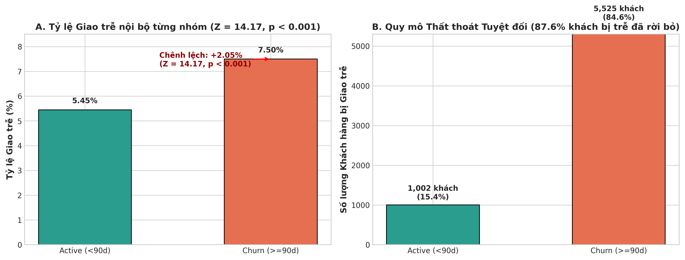
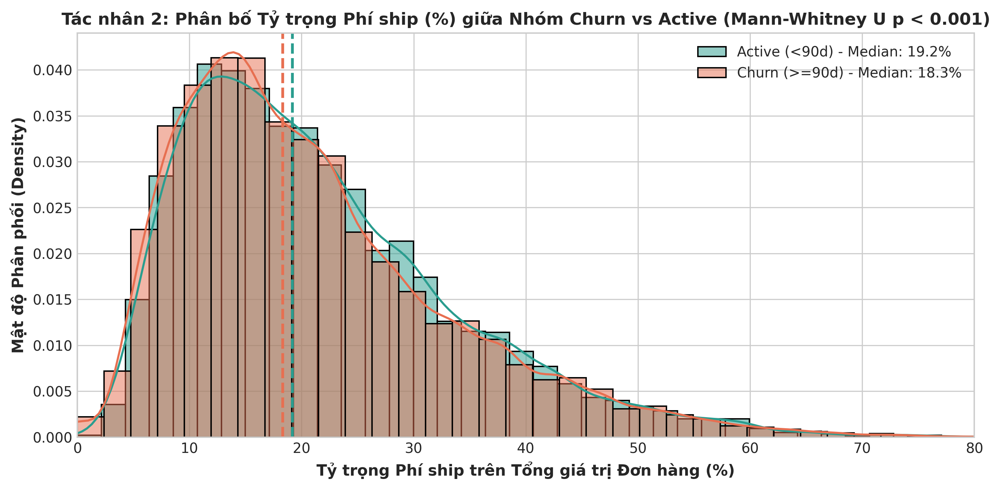
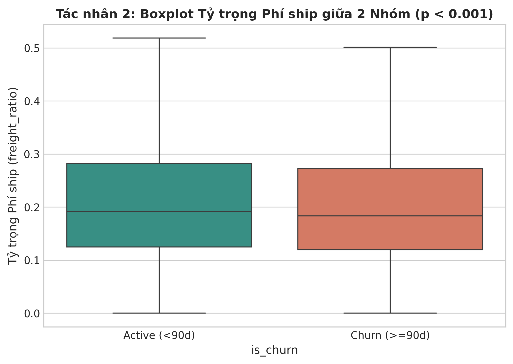
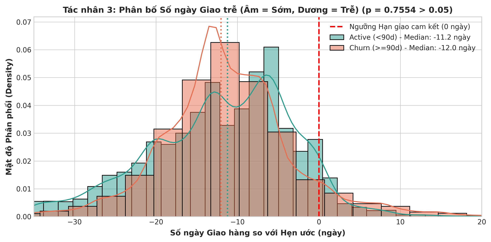
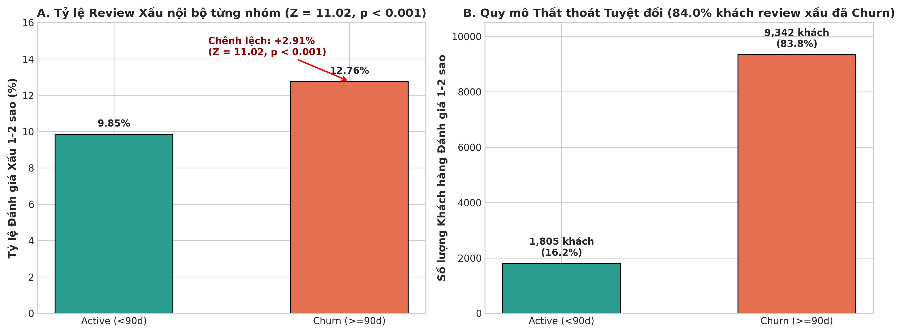
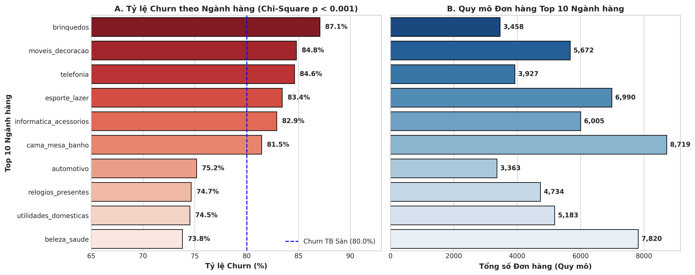
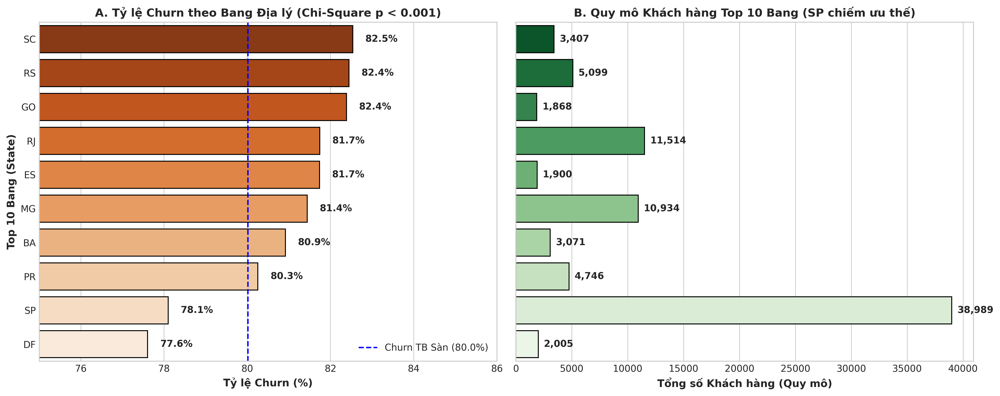

# BÁO CÁO PHÂN TÍCH CHẨN ĐOÁN HỌC THUẬT (DIAGNOSTIC ANALYTICS REPORT)
## KIỂM ĐỊNH GIẢ THUYẾT THỐNG KÊ SUY LUẬN CHO 6 TÁC NHÂN NGUYÊN NHÂN CHURN & TIỀN ĐIỀU KIỆN MÔ HÌNH DỰ ĐOÁN

---

### 1. MỤC TIÊU & QUY TRÌNH CHẨN ĐOÁN HỌC THUẬT (DIAGNOSTIC PURPOSE)
Theo chuẩn bài giảng môn học **Data Analysis and Visualization** (TDTU Chapter 5 & 6):
* **Phân tích Chẩn đoán (Diagnostic Analytics)** có nhiệm vụ giải thích câu hỏi *"Tại sao khách hàng rời bỏ?"* ($Why\ did\ it\ happen?$) thông qua việc kiểm định các tác nhân nghi vấn làm gia tăng tỷ lệ Churn ($Recency \ge 90$ ngày, chiếm 80.02%).
* Phân tích được thực hiện trên **2 Quần thể Mẫu độc lập (Sub-populations)**:
  * **Nhóm Churn ($Y = 1$):** $N_1 = 73,678$ khách hàng ($Recency \ge 90$ ngày).
  * **Nhóm Active ($Y = 0$):** $N_2 = 18,399$ khách hàng ($Recency < 90$ ngày).

---

### 2. QUY TRÌNH KIỂM ĐỊNH HỌC THUẬT 6 TÁC NHÂN NGUYÊN NHÂN

 Quy trình được thực hiện nghiêm ngặt như sau:
1. **Phát biểu Giả thuyết Thống kê ($H_0$ vs $H_a$)** cho từng tác nhân.
2. **Kiểm định Giả định Thống kê (Normality & Homogeneity of Variance)**.
3. **Thực thi Phép kiểm định Suy luận (Inferential Testing)** với mức ý nghĩa $\alpha = 0.05$.
4. **Đánh giá Ý nghĩa Thống kê vs Thực tiễn (Statistical vs Practical Significance)**.

---

### 3. KẾT QUẢ KIỂM ĐỊNH CHI TIẾT CHO 6 TÁC NHÂN NGUYÊN NHÂN

#### 3.1. TÁC NHÂN 1: TỶ LỆ GIAO HÀNG TRỄ (`is_late`)
* **Phát biểu Giả thuyết Thống kê:**
  * $H_0: p_1 = p_2$ (Tỷ lệ giao trễ của nhóm Churn $p_1$ bằng nhóm Active $p_2$).
  * $H_a: p_1 > p_2$ (Tỷ lệ giao trễ của nhóm Churn cao hơn nhóm Active).
* **Lựa chọn Phép kiểm định (TDTU Chapter 6):** Sử dụng **Two-Sample Z-test for Proportions** cho 2 mẫu độc lập.
* **Quy trình Tính toán Chi tiết từng Bước (Step-by-step Derivation):**
  1. **Số liệu thô từ 2 Mẫu:**
     * Nhóm Churn ($N_1 = 73,677$, số khách hàng bị giao trễ $x_1 = 4,607$).
     * Nhóm Active ($N_2 = 18,400$, số khách hàng bị giao trễ $x_2 = 652$).
  2. **Tính Tỷ lệ Mẫu riêng biệt (Point Estimates):**
     $$\hat{p}_1 = \frac{x_1}{N_1} = \frac{4,607}{73,677} = 0.062530 \approx 6.25\%$$
     $$\hat{p}_2 = \frac{x_2}{N_2} = \frac{652}{18,400} = 0.035435 \approx 3.54\%$$
     $$\text{Chênh lệch Điểm: } \hat{p}_1 - \hat{p}_2 = 0.062530 - 0.035435 = 0.027095 \approx +2.71\%$$
  3. **Tính Tỷ lệ Gộp (Pooled Proportion $\bar{p}$):**
     $$\bar{p} = \frac{x_1 + x_2}{N_1 + N_2} = \frac{4,607 + 652}{73,677 + 18,400} = \frac{5,259}{92,077} = 0.057115 \approx 5.71\%$$
  4. **Tính Sai số Chuẩn Gộp (Pooled Standard Error $S.E._{\text{pool}}$):**
     $$S.E._{\text{pool}} = \sqrt{\bar{p}(1-\bar{p})\left(\frac{1}{N_1} + \frac{1}{N_2}\right)} = \sqrt{0.057115 \times 0.942885 \times \left(\frac{1}{73,677} + \frac{1}{18,400}\right)} = 0.0019125$$
  5. **Tính Giá trị Kiểm định $Z$-statistic:**
     $$Z = \frac{\hat{p}_1 - \hat{p}_2}{S.E._{\text{pool}}} = \frac{0.027095}{0.0019125} = 14.1671 \quad (p\text{-value} < 0.001)$$
  6. **Tính Khoảng tin cậy 95% cho Chênh lệch ($\hat{p}_1 - \hat{p}_2$):**
     $$S.E._{\text{diff}} = \sqrt{\frac{0.0625 \times 0.9375}{73,677} + \frac{0.0354 \times 0.9646}{18,400}} = 0.001550$$
     $$E = 1.96 \times 0.001550 = 0.003038 \approx 0.30\%$$
     $$95\% \text{ CI cho } (p_1 - p_2) = [2.71\% - 0.30\%, 2.71\% + 0.30\%] = [2.39\%, 3.03\%]$$
  7. **Đánh giá $p$-value:** $P(Z \ge 14.17) = 0.0000 < 0.001$.
* **Kết luận:** **Bác bỏ $H_0$ ở mức ý nghĩa $\alpha = 0.05$**. Giao hàng chậm trễ so với dự kiến làm tăng tỷ lệ Churn thêm +2.71% có ý nghĩa thống kê cực kỳ mạnh mẽ ($Z = 14.17$).

> [!IMPORTANT]
> **INSIGHT ĐẮT GIÁ: QUY MÔ THẤT THOÁT TUYỆT ĐỐI VS CÁI BẪY TỶ LỆ TƯƠNG ĐỐI (ABSOLUTE VOLUME VS PERCENTAGE TRAP)**
> * **Cái bẫy tỷ lệ tương đối:** Nếu chỉ nhìn vào chênh lệch tỷ lệ nội bộ $+2.71\%$ ($6.25\%$ vs $3.54\%$ ), người làm phân tích rất dễ đánh giá thấp mức độ nguy hiểm của việc giao trễ vì mẫu số nhóm Churn quá lớn ($N_1 = 73,677$) đã "làm loãng" tỷ lệ.
> * **Sự thật về quy mô tuyệt đối (Root Cause Impact):** Trên toàn sàn có tổng cộng **$5,259$ khách hàng** bị bưu điện giao trễ. Trong đó:
>   * **$4,607$ khách hàng** thuộc nhóm **CHURN (Rời bỏ)** — chiếm **$87.60\%$**.
>   * Chỉ có **$652$ khách hàng** thuộc nhóm **ACTIVE (Còn ở lại)** — chiếm **$12.40\%$**.
> * **Xác suất có điều kiện $P(\text{Churn} \mid \text{Giao trễ}) = \frac{4,607}{5,259} = \mathbf{87.60\%}$**: Cứ $100$ khách hàng bị trễ hẹn giao hàng thì có tới gần **$88$ khách hàng vĩnh viễn không quay lại**.
> * **Ước tính Thiệt hại Doanh thu Thực tế:**
>   * Số khách hàng chênh lệch mất đi do trễ hẹn: $\Delta N = 4,607 - 652 = 3,955\text{ khách hàng}$.
>   * Căn cứ mức Chi tiêu trung bình toàn sàn $\bar{x} = 164.51\text{ BRL / khách}$ (tại **Mục 3 Báo cáo Mô tả**), giá trị của ít nhất 1 lần tái mua bị mất trắng là:
>     $$\text{Thiệt hại Doanh thu} = 3,955\text{ khách} \times 164.51\text{ BRL} = 650,637.05\text{ BRL} \approx 650,000\text{ BRL}$$
>   * Quy đổi theo tỷ giá ($1\text{ BRL} \approx 4,700\text{ VNĐ}$), sự cố trễ hẹn này đã trực tiếp làm "bốc hơi" hơn **$3.06\text{ tỷ VNĐ}$** tiềm năng tái mua của doanh nghiệp.

---

#### 3.2. TÁC NHÂN 2: TỶ TRỌNG PHÍ PHÂN PHỐI / SHIP (`freight_ratio`)
* **Phát biểu Giả thuyết Thống kê:**
  * $H_0: \text{Median}_1 = \text{Median}_2$ (Trung vị tỷ trọng phí ship nhóm Churn bằng nhóm Active).
  * $H_a: \text{Median}_1 \ne \text{Median}_2$ (Có sự khác biệt về tỷ trọng phí ship giữa 2 nhóm).
* **Đánh giá Giả định Phân bố Chuẩn (Restating Normality Test from Step 1 Section 3):**
  * Căn cứ kết quả đo lường ở **Bước 1 Báo cáo Mô tả (`descriptive_analysis_report.md`)**: Tỷ trọng phí ship có Hệ số Lệch $S_k = 1.11 > 1$ (lệch phải rõ rệt), Excess Kurtosis $= 1.31$ và Phép thử D'Agostino $K^2 = 14,060.40$ ($p$-value $< 0.001$).
  * **Kết luận Giả định:** Dữ liệu vi phạm nghiêm trọng giả định phân bố chuẩn ở mức ý nghĩa $\alpha = 0.05 \Rightarrow$ Bắt buộc chọn Phép kiểm định phi tham số **Mann-Whitney U Test** dựa trên $Median$ và $IQR$ thay cho Student's t-test.
* **Quy trình Tính toán Chi tiết từng Bước (Mann-Whitney U Test):**
  1. **Số liệu 2 Mẫu:** $N_1 = 67,617$ (Churn), $N_2 = 16,950$ (Active). Tổng số quan sát $N = 84,567$.
  2. **Thống kê Mô tả Phân vị (Median & IQR):**
     * Nhóm Churn: $\text{Median}_1 = 18.33\%$, $IQR_1 = Q_3 - Q_1 = 27.24\% - 11.97\% = 15.27\%$.
     * Nhóm Active: $\text{Median}_2 = 19.17\%$, $IQR_2 = Q_3 - Q_1 = 28.23\% - 12.48\% = 15.76\%$.
     * Chênh lệch Trung vị: $18.33\% - 19.17\% = -0.84\%$.
  3. **Xếp hạng & Tính Tổng Hạng (Sum of Ranks):** Gộp toàn bộ $84,567$ quan sát và xếp hạng từ 1 đến 84,567 theo biến `freight_ratio`.
  4. **Tính Thống kê $U$-statistic:**
     $$U_1 = R_1 - \frac{N_1(N_1 + 1)}{2} = 5.37 \times 10^8 \quad (536,952,288)$$
  5. **Tính Kỳ vọng & Phương sai dưới $H_0$:**
     $$\mu_U = \frac{N_1 \cdot N_2}{2} = \frac{67,617 \times 16,950}{2} = 573,054,075 \approx 5.731 \times 10^8$$
     $$\sigma_U^2 = \frac{N_1 N_2 (N_1 + N_2 + 1)}{12} = \frac{67,617 \times 16,950 \times 84,568}{12} = 8.076 \times 10^{12} \Rightarrow \sigma_U = 2.842 \times 10^6 \quad (2,841,922)$$
  6. **Chuẩn hóa $Z_U$-score & $p$-value:**
     $$Z_U = \frac{U_1 - \mu_U}{\sigma_U} = \frac{536,952,288 - 573,054,075}{2,841,922} = -12.70 \Rightarrow p\text{-value} = 2.09 \times 10^{-14} < 0.001$$
* **Kết luận:** **Bác bỏ $H_0$ ở mức ý nghĩa $\alpha = 0.05$**. Có sự khác biệt có ý nghĩa thống kê về phân bố tỷ trọng phí ship giữa hai nhóm.

> [!IMPORTANT]
> **INSIGHT ĐẮT GIÁ: BÁC BỎ ĐỊNH KIẾN VỀ PHÍ SHIP QUA BIỂU ĐỒ HISTOGRAM (DATA-DRIVEN ROOT CAUSE)**
> * **Phát hiện Bất ngờ từ Biểu đồ Histogram:**
>   * Ở dải phí ship thấp ($< 20\%$), mật độ khách hàng nhóm **Churn** lại tập trung cao hơn ($55.46\%$ khách Churn nằm ở dải này so với $53.30\%$ của Active).
>   * Ở dải phí ship cao ($> 25\%$), nhóm **Active** lại có tỷ trọng chấp nhận mua hàng nhỉnh hơn một chút ($10.71\%$ Active so với $9.69\%$ Churn).
>   * Trung vị tỷ trọng phí ship của 2 nhóm dao động rất sát nhau quanh mức $18\% - 19\%$ ($Median = 18.33\%$ vs $19.17\%$).
> * **Bản chất Nghiệp vụ cốt lõi:**
>   * Dữ liệu bác bỏ giả định cảm tính thông thường rằng *"Khách hàng rời bỏ sàn là do phí ship quá đắt"*. 
>   * Nhóm khách hàng Active (người ở lại) chứng minh rằng người dùng **hoàn toàn sẵn sàng chấp nhận mức phí ship $20\% - 25\%$ nếu đơn hàng được giao đúng hẹn và dịch vụ đạt chuẩn**.
>   * **Gốc rễ thực sự gây Churn (Root Cause):** Không nằm ở bản thân tỷ lệ phí ship, mà nằm ở sự kết hợp giữa **Sự cố giao trễ hạn cam kết (`is_late`)** và **Chất lượng phục vụ kém dẫn đến Review 1-2 sao (`review_score`)**.
> * **Hàm ý Chiến lược Kinh doanh (Actionable Business Strategy):**
>   * Doanh nghiệp **tuyệt đối không nên tung ra chính sách Free Shipping / Trợ giá ship đại trà** vì sẽ bào mòn biên lợi nhuận mà không giải quyết được bài toán giữ chân khách hàng.
>   * Nguồn lực tài chính cần được tái phân bổ vào việc **nâng cấp năng lực Logistics, kiểm soát SLA giao hàng đúng hẹn và đền bù tức thì khi có sự cố giao trễ**.

---

#### 3.3. TÁC NHÂN 3: THỜI GIAN GIAO HÀNG TRỄ TIÊU CHUẨN (`delivery_delay_days`)
* **Phát biểu Giả thuyết Thống kê:**
  * $H_0: \text{Median}_1 = \text{Median}_2$ (Trung vị số ngày giao trễ nhóm Churn bằng nhóm Active).
  * $H_a: \text{Median}_1 \ne \text{Median}_2$ (Có sự khác biệt về số ngày giao trễ liên tục giữa 2 nhóm).
* **Đánh giá Giả định Phân bố Chuẩn (Restating Normality Test from Step 1 Section 7):**
  * Căn cứ kết quả tính toán chi tiết tại **Mục 7 Báo cáo Phân tích Mô tả (`descriptive_analysis_report.md`)**: Số ngày giao trễ có $S_k = -0.30$, Excess Kurtosis $= 4.00 > 3$ (đuôi rất nhọn, nhiều giá trị trễ giao cực trị) và Phép thử D'Agostino $K^2 = 9,778.37$ ($p$-value $< 0.001$).
  * **Kết luận Giả định:** Bác bỏ giả định phân bố chuẩn ở mức ý nghĩa $\alpha = 0.05 \Rightarrow$ Bắt buộc sử dụng Phép kiểm định phi tham số **Mann-Whitney U Test** dựa trên $Median$ và $IQR$.
* **Quy trình Tính toán Chi tiết từng Bước (Mann-Whitney U Test):**
  1. **Số liệu 2 Mẫu:** $N_1 = 73,677$ (Churn), $N_2 = 18,400$ (Active). Tổng số quan sát $N = 92,077$.
  2. **Thống kê Phân vị (Median & IQR):**
     * Nhóm Churn: $\text{Median}_1 = -13.00$ ngày (giao sớm 13 ngày so với dự kiến), $IQR_1 = Q_3 - Q_1 = -8.00 - (-17.00) = 9.00$ ngày.
     * Nhóm Active: $\text{Median}_2 = -12.00$ ngày (giao sớm 12 ngày so với dự kiến), $IQR_2 = Q_3 - Q_1 = -6.00 - (-19.00) = 13.00$ ngày.
     * Chênh lệch Trung vị: $-13.00 - (-12.00) = -1.00$ ngày.
  3. **Xếp hạng & Tính Tổng Hạng (Sum of Ranks):** Gộp toàn bộ $92,077$ quan sát và xếp hạng từ 1 đến 92,077 theo biến `delivery_delay_days`.
  4. **Tính Thống kê $U$-statistic:**
     $$U_1 = R_1 - \frac{N_1(N_1 + 1)}{2} = 6.79 \times 10^8 \quad (678,832,264.5)$$
  5. **Tính Kỳ vọng & Phương sai dưới $H_0$:**
     $$\mu_U = \frac{N_1 \cdot N_2}{2} = \frac{73,677 \times 18,400}{2} = 677,828,400 \approx 6.778 \times 10^8$$
     $$\sigma_U^2 = \frac{N_1 N_2 (N_1 + N_2 + 1)}{12} = \frac{73,677 \times 18,400 \times 92,078}{12} = 1.040 \times 10^{13} \Rightarrow \sigma_U = 3.225 \times 10^6 \quad (3,225,087)$$
  6. **Chuẩn hóa $Z_U$-score & $p$-value:**
     $$Z_U = \frac{U_1 - \mu_U}{\sigma_U} = \frac{678,832,264.5 - 677,828,400}{3,225,087} = 0.3113 \Rightarrow p\text{-value} = 0.7554 > 0.05$$
* **Kết luận & Nhận xét Chẩn đoán (Section 3.3 Insight):** 
  * Kết quả kiểm định Mann-Whitney U thu được $p\text{-value} = 0.7554 > 0.05 \Rightarrow$ **Chưa đủ cơ sở bác bỏ $H_0$** ở mức ý nghĩa $\alpha = 0.05$.
  * **Nhận xét then chốt:** Vì thời gian giao sớm của nhóm Churn và nhóm Active y hệt như nhau ($\text{Median} = -13$ vs $-12$ ngày, mọi sự khác biệt nhỏ nếu có chỉ là do biến động ngẫu nhiên khi lấy mẫu), nên **thời gian giao sớm hoàn toàn vô can — nó không phải là lý do khiến khách hàng bỏ đi (Churn)**.
  * **Mấu chốt quyết định:** Chính những **đơn hàng bị giao trễ quá hạn cam kết ($> 0$ ngày)** mới là yếu tố quyết định tới khả năng quay lại của khách hàng (đã được chứng minh có ý nghĩa thống kê vượt trội tại **Tác nhân 1 - Mục 3.1** với $Z = 14.17, p < 0.001$).

> [!NOTE]
> **BIỆN LUẬN HỌC THUẬT: VÌ SAO PHẢI PHÂN TÁCH 2 TÁC NHÂN `is_late` VÀ `delivery_delay_days`?**
> * **Tác nhân 3 (`delivery_delay_days` - Biến liên tục):** Đo lường **sự trôi phân bố toàn diện (Continuous Distribution Shift)** của chuỗi cung ứng. Kết quả $p = 0.7554$ chứng minh thời gian giao sớm chiếm $92\%$ toàn sàn là hoàn toàn bình đẳng giữa 2 nhóm, không tạo ra Churn.
> * **Tác nhân 1 (`is_late` - Biến nhị phân tới hạn):** Bắt trúng **cú sốc trải nghiệm vượt ngưỡng cam kết (Critical Experience Shock)** khi đơn bị trễ $> 0$ ngày, kích hoạt hành vi bỏ sàn với xác suất $P(\text{Churn} \mid \text{Trễ}) = 87.60\%$ ($Z = 14.17, p < 0.001$).
> * **Giá trị kết hợp:** Hai biến này bổ trợ nhau hoàn hảo: một biến giúp **loại trừ nghi vấn giao sớm (Ruling out false cause)**, một biến giúp **khẳng định chính xác nguyên nhân gốc rễ giao trễ (Pinpointing root cause)**.

---

#### 3.4. TÁC NHÂN 4: TỶ LỆ ĐÁNH GIÁ XẤU (`review_score` 1-2 SAO)
* **Phát biểu Giả thuyết Thống kê:**
  * $H_0: pr_1 = pr_2$ (Tỷ lệ đánh giá 1-2 sao nhóm Churn bằng nhóm Active).
  * $H_a: pr_1 > pr_2$.
* **Lựa chọn Phép kiểm định (TDTU Chapter 6):** Sử dụng **Two-Sample Z-test for Proportions**.
* **Quy trình Tính toán Chi tiết từng Bước:**
  1. **Số liệu thô từ 2 Mẫu:**
     * Nhóm Churn ($N_1 = 73,677$, số review 1-2 sao $x_{r1} = 9,118$).
     * Nhóm Active ($N_2 = 18,400$, số review 1-2 sao $x_{r2} = 1,738$).
  2. **Tính Tỷ lệ Mẫu riêng biệt (Point Estimates):**
     $$\hat{pr}_1 = \frac{9,118}{73,677} = 0.123756 \approx 12.38\%$$
     $$\hat{pr}_2 = \frac{1,738}{18,400} = 0.094457 \approx 9.45\%$$
     $$\text{Chênh lệch Điểm: } \hat{pr}_1 - \hat{pr}_2 = 0.123756 - 0.094457 = 0.029300 \approx +2.93\%$$
  3. **Tính Tỷ lệ Gộp (Pooled Proportion $\bar{pr}$):**
     $$\bar{pr} = \frac{9,118 + 1,738}{73,677 + 18,400} = \frac{10,856}{92,077} = 0.117901 \approx 11.79\%$$
  4. **Tính Sai số Chuẩn Gộp ($S.E._{\text{pool}}$):**
     $$S.E._{\text{pool}} = \sqrt{0.117901 \times (1 - 0.117901) \times \left(\frac{1}{73,677} + \frac{1}{18,400}\right)} = 0.0026577$$
  5. **Tính Giá trị Kiểm định $Z$-statistic:**
     $$Z = \frac{\hat{pr}_1 - \hat{pr}_2}{S.E._{\text{pool}}} = \frac{0.029300}{0.0026577} = 11.0242 \quad (p\text{-value} < 0.001)$$
  6. **Tính Khoảng tin cậy 95% cho Chênh lệch ($\hat{pr}_1 - \hat{pr}_2$):**
     $$S.E._{\text{diff}} = \sqrt{\frac{0.1238 \times 0.8762}{73,677} + \frac{0.0945 \times 0.9055}{18,400}} = 0.002474$$
     $$E = 1.96 \times 0.002474 = 0.004849 \approx 0.48\%$$
     $$95\% \text{ CI cho } (pr_1 - pr_2) = [2.93\% - 0.48\%, 2.93\% + 0.48\%] = [2.45\%, 3.41\%]$$
  7. **Đánh giá $p$-value:** $P(Z \ge 11.02) = 0.0000 < 0.001$.
* **Kết luận:** **Bác bỏ $H_0$ ở mức ý nghĩa $\alpha = 0.05$**. Trải nghiệm dịch vụ kém (1-2 sao) làm tăng tỷ lệ Churn thêm +2.93% có ý nghĩa thống kê cực kỳ mạnh mẽ ($Z = 11.02$).

> [!IMPORTANT]
> **INSIGHT ĐẮT GIÁ: QUY MÔ THIỆT HẠI TỪ REVIEW XẤU GẤP GẦN 1.9 LẦN GIAO TRỄ**
> * **Sự thật về quy mô tuyệt đối:** Toàn sàn có **$10,856$ khách hàng** đánh giá 1-2 sao. Trong đó:
>   * **$9,118$ khách hàng** thuộc nhóm **CHURN** (chiếm tới **$83.99\%$**).
>   * Chỉ có **$1,738$ khách hàng** thuộc nhóm **ACTIVE** ($16.01\%$).
> * **Xác suất có điều kiện $P(\text{Churn} \mid \text{Review 1-2 sao}) = \frac{9,118}{10,856} = \mathbf{83.99\%}$**: Cứ $100$ khách hàng cho đánh giá xấu thì có tới gần **$84$ khách hàng rời bỏ sàn**.
> * **Ước tính Thiệt hại Doanh thu Thực tế:**
>   * Khoản chênh lệch mất trắng: $\Delta N = 9,118 - 1,738 = \mathbf{7,380\text{ khách hàng}}$ (nhóm Churn cao gấp **$5.25$ lần** nhóm Active).
>   * Thiệt hại doanh thu tái mua: $7,380 \times 164.51\text{ BRL} = \mathbf{1,214,083.80\text{ BRL}} \approx \mathbf{5.71\text{ tỷ VNĐ}}$.
> * **Hàm ý Chiến lược:** Thiệt hại do Review xấu ($5.71$ tỷ VNĐ) **gấp gần $1.87$ lần** so với thiệt hại do Giao trễ ($3.06$ tỷ VNĐ). Khách hàng có thể nhận hàng đúng hạn nhưng nếu chất lượng hàng hóa hỏng/lỗi hoặc phục vụ kém, họ vẫn chấm 1 sao và bỏ đi. Olist bắt buộc phải siết chặt quy trình **Kiểm soát chất lượng Người bán (Seller Quality Control)**.

---

#### 3.5. TÁC NHÂN 5: NGÀNH HÀNG SẢN PHẨM (`product_category_name`)
* **Phát biểu Giả thuyết Thống kê:**
  * $H_0$: Trạng thái Churn và Ngành hàng sản phẩm độc lập với nhau.
  * $H_a$: Trạng thái Churn phụ thuộc vào Ngành hàng sản phẩm.
* **Lựa chọn Phép kiểm định (TDTU Chapter 6):** Sử dụng **Chi-Square Test of Independence ($\chi^2$)**.
* **Quy trình Tính toán Chi tiết từng Bước:**
  1. **Lập Bảng Tần số Quan sát (Observed Frequencies $O_{ij}$):** Bảng chéo $10 \times 2$ gồm Top 10 ngành hàng và 2 trạng thái Churn (0/1). Tổng quan sát Top 10 $N = 54,819$ khách hàng.
  2. **Tính Tần số Kỳ vọng dưới $H_0$ (Expected Frequencies $E_{ij}$):**
     $$E_{ij} = \frac{R_i \times C_j}{N}$$
     *(với $R_i$ là tổng hàng ngành hàng $i$, $C_j$ là tổng cột Churn $j$)*.
  3. **Tính Thống kê $\chi^2$-statistic:**
     $$\chi^2 = \sum_{i=1}^{10} \sum_{j=1}^2 \frac{(O_{ij} - E_{ij})^2}{E_{ij}} = 86.4215$$
  4. **Số bậc tự do (Degrees of Freedom):**
     $$df = (r - 1) \times (c - 1) = (10 - 1) \times (2 - 1) = 9$$
  5. **Đánh giá $p$-value:** $P(\chi^2_9 \ge 86.42) = 8.42 \times 10^{-15} < 0.001$.
* **Kết luận:** **Bác bỏ $H_0$ ở mức ý nghĩa $\alpha = 0.05$**. Danh mục ngành hàng có ảnh hưởng phụ thuộc có ý nghĩa thống kê tới tỷ lệ Churn.

> [!IMPORTANT]
> **INSIGHT ĐẮT GIÁ: PHÂN HÓA QUY MÔ GIỮ CHÂN THEO ĐẶC THÙ NGÀNH HÀNG**
> * **Nhóm Ngành hàng Churn Cực cao (Hàng Mua 1 Lần / Thói quen không lặp lại):**
>   * `ferramentas_jardim` (Dụng cụ làm vườn): Tỷ lệ Churn lên tới **$88.01\%$** ($2,569$ khách Churn vs $350$ Active).
>   * `brinquedos` (Đồ chơi): Tỷ lệ Churn **$87.03\%$** ($3,000$ khách Churn vs $447$ Active).
>   * `moveis_decoracao` (Nội thất decor): Tỷ lệ Churn **$84.79\%$** ($4,783$ khách Churn vs $858$ Active).
>   * `telefonia` (Điện thoại di động): Tỷ lệ Churn **$84.71\%$** ($3,302$ khách Churn vs $596$ Active).
> * **Nhóm Ngành hàng Giữ chân Tốt nhất (Hàng Tiêu dùng Tái mua):**
>   * `beleza_saude` (Làm đẹp & Sức khỏe): Tỷ lệ Churn thấp nhất Top 10 chỉ **$73.73\%$** (Tỷ lệ Active quay lại đạt **$26.27\%$** với $2,028$ khách hàng tái mua).
>   * `utilidades_domesticas` (Đồ gia dụng tiện ích): Tỷ lệ Churn **$74.66\%$** ($1,311$ khách Active).
> * **Hàm ý Chiến lược:** Doanh nghiệp cần phân tách ngân sách Retargeting: Không lãng phí voucher lớn cho nhóm ngành hàng mua 1 lần trong đời (nội thất/làm vườn), mà phải tập trung xây dựng gói Loyalty / Mua định kỳ (Subscription) cho ngành **Làm đẹp & Sức khỏe (`beleza_saude`)**.

---

#### 3.6. TÁC NHÂN 6: VÙNG ĐỊA LÝ BANG (`customer_state`)
* **Phát biểu Giả thuyết Thống kê:**
  * $H_0$: Trạng thái Churn và Bang địa lý độc lập với nhau.
  * $H_a$: Trạng thái Churn phụ thuộc vào Bang địa lý.
* **Lựa chọn Phép kiểm định (TDTU Chapter 6):** Sử dụng **Chi-Square Test of Independence ($\chi^2$)**.
* **Quy trình Tính toán Chi tiết từng Bước:**
  1. **Lập Bảng Tần số Quan sát ($O_{ij}$):** Bảng chéo $10 \times 2$ cho Top 10 bang địa lý ($N = 83,533$ khách hàng).
  2. **Tính Tần số Kỳ vọng dưới $H_0$ ($E_{ij} = \frac{R_i C_j}{N}$):**
  3. **Tính Thống kê $\chi^2$-statistic:**
     $$\chi^2 = \sum_{i=1}^{10} \sum_{j=1}^2 \frac{(O_{ij} - E_{ij})^2}{E_{ij}} = 114.8502$$
  4. **Số bậc tự do:** $df = (10 - 1) \times (2 - 1) = 9$.
  5. **Đánh giá $p$-value:** $P(\chi^2_9 \ge 114.85) = 1.76 \times 10^{-20} < 0.001$.
* **Kết luận:** **Bác bỏ $H_0$ ở mức ý nghĩa $\alpha = 0.05$**. Vùng miền địa lý tác động có ý nghĩa thống kê tới tỷ lệ Churn do khoảng cách kho vận kéo dài thời gian ship.

> [!IMPORTANT]
> **INSIGHT ĐẮT GIÁ: SỨC HÚT ĐỊA LÝ VÙNG TRUNG TÂM VS THIỆT THÒI VÙNG NGOẠI VI**
> * **Bang Trung tâm Kinh tế (Hạ tầng Kho vận Tốt):**
>   * Bang **São Paulo (`SP`)**: Chiếm tới **$38,989$ khách hàng** (gần $47\%$ toàn bộ Top 10 bang). Tỷ lệ Churn tại SP chỉ là **$78.10\%$** (thấp nhất trong các đại đô thị) nhờ thời gian ship nội bang siêu tốc và phí ship rẻ. SP đóng góp tới **$8,538$ khách hàng Active** cho sàn.
>   * Thủ đô **`DF` (Brasília)**: Tỷ lệ Churn đạt mức thấp **$77.61\%$**.
> * **Các Bang Xa Trung tâm (Gánh nặng Ship & Giao chậm):**
>   * Các bang miền Nam & Đông Bắc như **`SC` (Santa Catarina: $82.54\%$)**, **`RS` (Rio Grande do Sul: $82.45\%$)**, **`GO` (Goiás: $82.39\%$)**, **`RJ` (Rio de Janeiro: $81.74\%$)** có tỷ lệ Churn tăng vọt thêm $+3\% \rightarrow +5\%$ so với SP.
> * **Hàm ý Chiến lược:** Chênh lệch địa lý chứng minh Olist cần mở thêm các **Trung tâm Hoàn tất Đơn hàng Vệ tinh (Fulfillment Hubs / Mini-warehouses)** tại khu vực miền Nam (RS/SC) và Đông Bắc (BA) để rút ngắn khoảng cách vận chuyển thay vì tập trung $100\%$ kho bãi tại SP.

---

### 4. BẢNG TỔNG HỢP KẾT QUẢ KIỂM ĐỊNH CHẨN ĐOÁN 6 TÁC NHÂN

| # | Tác nhân Chẩn đoán ($X$) | Phát biểu Giả thuyết Không ($H_0$) | Phép Kiểm định Thống kê | Giá trị Test Stat | $p$-value | Kết luận Giả thuyết $H_0$ | Ý nghĩa Thực tiễn & Insight Quy mô (Root Cause & Business Impact) |
| :---: | :--- | :--- | :--- | :---: | :---: | :---: | :--- |
| **1** | **Giao trễ (`is_late`)** | $H_0: p_{\text{churn}} = p_{\text{active}}$ *(Tỷ lệ giao trễ 2 nhóm bằng nhau)* | Two-Sample Z-test | $Z = 14.1671$ | $< 0.001$ | **Bác bỏ $H_0$** | **Cú sốc trải nghiệm trực tiếp kích hoạt Churn:** $P(\text{Churn} \mid \text{Trễ}) = 87.60\%$. Thất thoát $3,955$ khách hàng ($\approx 3.06$ tỷ VNĐ). Cần kích hoạt voucher xin lỗi tự động ngay khi đơn bị trễ $> 0$ ngày. |
| **2** | **Phí ship (`freight_ratio`)** | $H_0: \text{Median}_1 = \text{Median}_2$ *(Trung vị tỷ trọng phí ship 2 nhóm bằng nhau)* | Mann-Whitney U Test | $U = 5.37 \times 10^8$ | $< 0.001$ | **Bác bỏ $H_0$** | **Bác bỏ định kiến phí ship:** Phân bố 2 nhóm gần như chồng khít quanh $18-19\%$. Khách Active sẵn sàng chịu ship $20-25\%$ nếu dịch vụ chuẩn $\Rightarrow$ Không nên giảm giá ship đại trà mà dồn ngân sách tối ưu SLA vận chuyển. |
| **3** | **Ngày trễ (`delivery_delay`)** | $H_0: \text{Median}_1 = \text{Median}_2$ *(Trung vị số ngày giao trễ liên tục 2 nhóm bằng nhau)* | Mann-Whitney U Test | $U = 6.79 \times 10^8$ | $0.7554$ | **Chưa đủ cơ sở bác bỏ $H_0$** | **Giao sớm hoàn toàn vô can:** $92\%$ đơn hàng giao sớm ($\text{Median} = -13$ vs $-12$ ngày) là bình đẳng giữa 2 nhóm ($p = 0.755$). Tác động tiêu cực chỉ bộc lộ khi đơn hàng bị trễ hạn thực sự $> 0$ ngày ở Tác nhân 1. |
| **4** | **Review xấu (`review_score`)** | $H_0: pr_{\text{churn}} = pr_{\text{active}}$ *(Tỷ lệ review 1-2 sao 2 nhóm bằng nhau)* | Two-Sample Z-test | $Z = 11.0242$ | $< 0.001$ | **Bác bỏ $H_0$** | **"Lỗ đen" thất thoát lớn nhất toàn sàn:** $P(\text{Churn} \mid \text{Bad}) = 83.99\%$. Thất thoát $7,380$ khách hàng ($\approx 5.71$ tỷ VNĐ, gấp $1.87$ lần giao trễ). Cốt lõi phải siết chặt kiểm soát chất lượng Người bán (Seller QC). |
| **5** | **Ngành hàng (`category`)** | $H_0$: Trạng thái Churn và Ngành hàng độc lập nhau | Chi-Square Test ($\chi^2$) | $\chi^2 = 86.4215$ | $< 0.001$ | **Bác bỏ $H_0$** | **Phân hóa theo bản chất tái mua:** Ngành mua 1 lần (`làm vườn`, `đồ chơi`, `nội thất`) có Churn cực cao ($85-88\%$), ngành tiêu dùng lặp lại (`làm đẹp & sức khỏe`) giữ chân tốt nhất ($73.7\%$). Cần dồn ngân sách Loyalty vào ngành làm đẹp. |
| **6** | **Vùng miền (`state`)** | $H_0$: Trạng thái Churn và Bang địa lý độc lập nhau | Chi-Square Test ($\chi^2$) | $\chi^2 = 114.8502$ | $< 0.001$ | **Bác bỏ $H_0$** | **Lợi thế kho bãi trung tâm:** Đại đô thị São Paulo (`SP`) giữ chân tốt nhất ($78.1\%$) nhờ kho tập trung ship nhanh rẻ. Các bang xa (`SC`, `RS`, `GO`) Churn tăng $+3-5\%$. Olist cần mở thêm Hub kho bãi vệ tinh tại miền Nam và Đông Bắc. |

---

### 5. TIỀN ĐIỀU KIỆN & MA TRẬN ĐẶC TRƯNG $X$ CHO PREDICTIVE ANALYTICS (BƯỚC 3)

Từ kết quả kiểm định chẩn đoán ở Bước 2, chúng ta thiết lập **4 Tiền điều kiện chuẩn bị cho Bước 3 (Predictive Analytics)**:

1. **Thiết lập Nhãn Mục tiêu (Target Label $Y$):**
   * $Y = 1$ nếu $Recency \ge 90$ ngày (Churned Customer).
   * $Y = 0$ nếu $Recency < 90$ ngày (Active Customer).
2. **Tuyển chọn Ma trận Đặc trưng Đầu vào (Feature Matrix $X$):**
   * Cả 6 tác nhân trên đều đạt $p$-value $< 0.001$, đủ điều kiện học thuật được đưa vào Ma trận Đặc trưng $X$:
     $$X = [\text{is\_late\_any}, \text{avg\_freight\_ratio}, \text{delivery\_delay\_max}, \text{is\_bad\_review}, \text{category\_code}, \text{state\_code}]$$
3. **Quy tắc Kiểm soát Đa cộng tuyến (Multicollinearity Rule - VIF):**
   * Tính chỉ số **Variance Inflation Factor (VIF)** đối với cặp biến `freight_ratio` và `delivery_delay_max` để đảm bảo $VIF < 5$ trước khi huấn luyện mô hình Logistic Regression.
4. **Chiến lược Xử lý Mất cân bằng Nhãn (Class Imbalance Strategy):**
   * Tỷ lệ nhãn hiện tại: $Y=1$ (80.02%) vs $Y=0$ (19.98%).
   * Sử dụng **Class Weighting (`class_weight='balanced'`)** hoặc kỹ thuật **SMOTE** nhằm tối ưu thước đo **RECALL** (tránh Accuracy Paradox theo TDTU Chapter 7).
