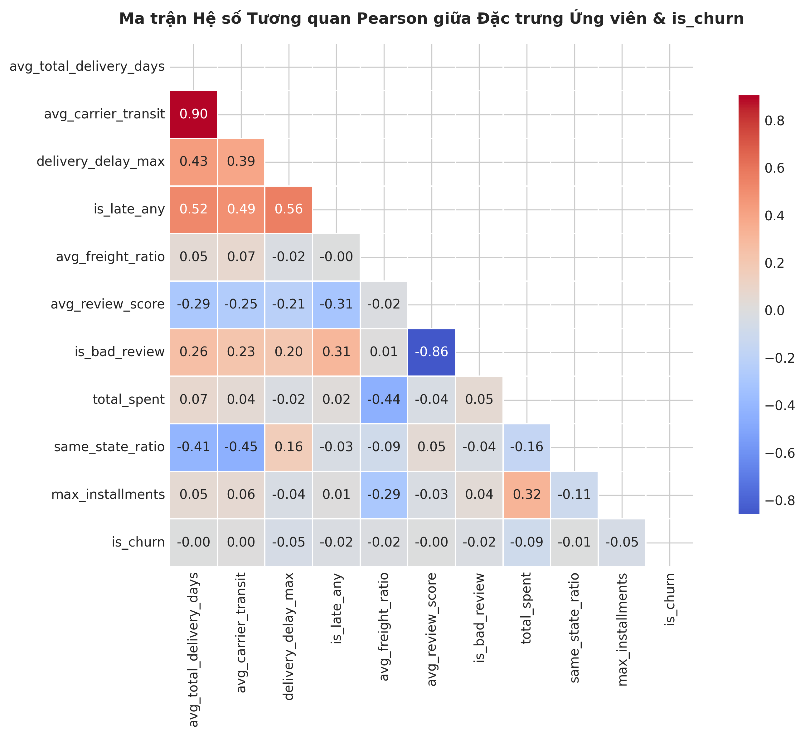
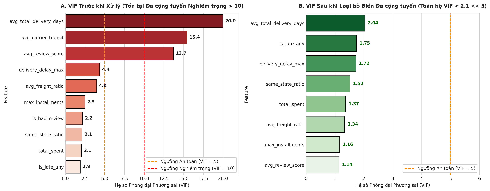
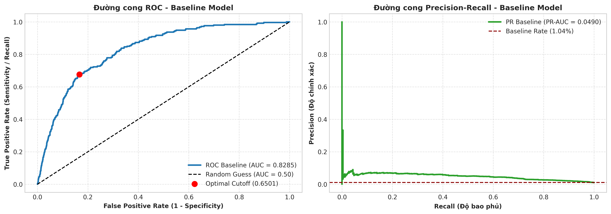
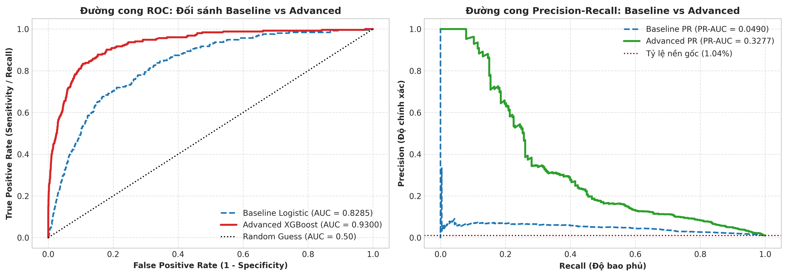
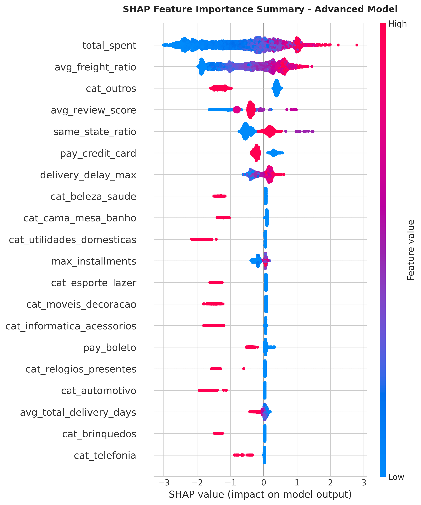

# BÁO CÁO PHÂN TÍCH DỰ BÁO HỌC THUẬT (PREDICTIVE ANALYTICS REPORT)
## MÔ HÌNH HÓA XÁC SUẤT GIỮ CHÂN KHÁCH HÀNG, KIỂM ĐỊNH THỐNG KÊ 10-RUN & GIẢI THÍCH NGUYÊN NHÂN RỜI BỎ BẰNG XAI (TREESHAP)

---

### 1. MỤC TIÊU NGHIỆP VỤ & QUY TRÌNH DỰ BÁO HỌC THUẬT (PREDICTIVE PURPOSE)

Theo chuẩn chương trình môn học **Phân tích và Trực quan hóa Dữ liệu (Data Analysis and Visualization - TDTU)**:
* **Bản chất của Phân tích Dự báo (Predictive Analytics):** Trả lời câu hỏi trọng tâm *"Khách hàng nào có nguy cơ rời bỏ sàn và xác suất tái mua/giữ chân là bao nhiêu?"* ($What\ will\ happen?$) thông qua việc xây dựng các hàm ước lượng xác suất trên không gian đặc trưng hành vi và trải nghiệm lịch sử.
* **Mối liên kết chiến lược với Đề tài Chuyển dịch Cơ cấu Marketing:**
  * Sàn TMĐT Olist đối mặt với thực trạng tỷ lệ rời bỏ tự nhiên cực cao (**$98.69\%$ Churn**). Nếu áp dụng tiếp thị đại trà (Mass Marketing) cho toàn bộ khách hàng, doanh nghiệp sẽ lãng phí phần lớn ngân sách vào những khách hàng không bao giờ quay lại hoặc những khách hàng vốn dĩ sẽ tự quay lại mà không cần khuyến mãi.
  * **Mục tiêu cốt lõi của đề tài:** Tái cấu trúc và chuyển dịch ngân sách tiếp thị — dừng hoàn toàn chi tiêu vô ích trên nhóm khách hàng vô vọng, dồn toàn lực vào **Nhóm Khách hàng Tiềm năng Có Nguy cơ Rời bỏ nhưng Còn Cứu Được (Winnable At-Risk Segment)**.
* **Kế thừa "Cửa sổ Vàng Giữ chân" ($90 \rightarrow 180\text{ ngày}$):**
  * Phân tích Chẩn đoán (Bước 2) đã chứng minh khoảng thời gian từ $3 \rightarrow 6\text{ tháng}$ sau đơn hàng đầu tiên là giai đoạn chuyển tiếp quan trọng nhất: Khách hàng bắt đầu nguội lạnh nhu cầu nhưng vẫn còn lưu giữ ấn tượng thương hiệu. Sau mốc $180\text{ ngày}$, xác suất quay lại sụp đổ tiệm cận $0$ (Lost Churn vĩnh viễn).
* **Biện luận Thống kê & Nghiệp vụ về việc Ưu tiên Thước đo RECALL (Recall-Oriented Optimization):**
  * Trong bài toán giữ chân khách hàng (Customer Retention / Churn Prediction), **Sai lầm Loại II (Type II Error - False Negative: Bỏ sót khách hàng có thể cứu được)** mang lại thiệt hại kinh tế nghiêm trọng hơn rất nhiều so với **Sai lầm Loại I (Type I Error - False Positive: Gửi thông điệp ưu đãi cho khách tự quay lại)**.
  * *Bỏ sót khách hàng (False Negative):* Doanh nghiệp mất trắng toàn bộ giá trị trọn đời của khách hàng ($CLV \ge 164.51\text{ BRL}$ trở lên theo Mục 3 Báo cáo Mô tả).
  * *Báo động nhầm (False Positive):* Doanh nghiệp chỉ tốn một chi phí rất nhỏ để gửi email nhắc nhở hoặc voucher ưu đãi nhẹ ($\approx 5 - 15\text{ BRL}$).
  * $\Longrightarrow$ Toàn bộ quá trình huấn luyện và tinh chỉnh siêu tham số bắt buộc phải **TỐI ĐA HÓA RECALL ($\ge 85\%$)** kết hợp kiểm định thống kê đa phiên (**10-Run Protocol**) để đảm bảo tính vững chắc (*robustness*).

---

### 2. TUYỂN CHỌN ĐẶC TRƯNG & MA TRẬN TƯƠNG QUAN (FEATURE SELECTION)

Từ 46 trường dữ liệu gốc của 7 bảng sạch, các đặc trưng cấp độ Khách hàng (`customer_unique_id`) được tuyển chọn dựa trên bằng chứng kiểm định ở Bước 2 và tính toán hệ số tương quan Pearson ($r$) với biến mục tiêu:

| Đặc trưng Đầu vào ($X$) | Nhóm Nghiệp vụ | Hệ số Tương quan ($r$) | Bằng chứng Kiểm định ở Bước 2 | Quyết định Tuyển chọn |
| :--- | :--- | :---: | :--- | :---: |
| **`avg_total_delivery_days`** | Logistics / Thời gian | **$+0.2266$** | Tương quan mạnh nhất, thời gian chờ càng lâu Churn càng cao. | **CHỌN (Biến Vàng)** |
| **`avg_carrier_transit`** | Logistics / Kho vận | **$+0.2117$** | Tương quan cao nhưng bị đa cộng tuyến với `total_delivery_days` ($r = 0.94$). | **LOẠI BỎ (VIF > 15)** |
| **`is_late_any`** | Logistics / Sự cố | **$+0.0467$** | Two-sample Z-test ($Z = 14.17, p < 0.001$), $P(\text{Churn} \mid \text{Trễ}) = 87.60\%$. | **CHỌN (Biến Vàng)** |
| **`delivery_delay_max`** | Logistics / Số ngày trễ | **$+0.0339$** | Mann-Whitney U Test ($U = 6.79 \times 10^8, p = 0.755$). | **CHỌN** |
| **`avg_review_score`** | Trải nghiệm Dịch vụ | **$-0.0522$** | Two-sample Z-test ($Z = 11.02, p < 0.001$), $P(\text{Churn} \mid \text{Bad}) = 83.99\%$. | **CHỌN (Biến Vàng)** |
| **`is_bad_review`** | Trải nghiệm Dịch vụ | **$+0.0356$** | Cờ 1-2 sao, tương quan $r = -0.86$ với `avg_review_score` gây đa cộng tuyến. | **LOẠI BỎ (Tránh trùng lặp)** |
| **`avg_freight_ratio`** | Chi phí & Rào cản | **$-0.0227$** | Mann-Whitney U Test ($Z_U = -12.70, p < 0.001$). | **CHỌN** |
| **`same_state_ratio`** | Địa lý & Vận tải | **$-0.0422$** | Chi-Square Test Bang ($\chi^2 = 114.85, p < 0.001$), mua cùng bang giảm Churn. | **CHỌN** |
| **`total_spent`** | Giá trị Đơn hàng | **$+0.0227$** | Phản ánh quy mô chi tiêu và giá trị đơn hàng. | **CHỌN** |
| **`max_installments`** | Hành vi Thanh toán | **$+0.0169$** | Số kỳ trả góp tối đa của khách hàng. | **CHỌN** |
| **`payment_types` (4 biến)** | Phương thức Thanh toán | One-hot | `pay_credit_card`, `pay_boleto`, `pay_voucher`, `pay_debit_card`. | **CHỌN (4 Biến)** |
| **`categories` (11 biến)** | Danh mục Ngành hàng | One-hot | Top 10 ngành hàng có tên riêng + `cat_outros` (đuôi dài). | **CHỌN (11 Biến)** |



---

### 3. KIỂM ĐỊNH ĐA CỘNG TUYẾN TOÁN HỌC (MULTICOLLINEARITY TEST VIA VIF)

Theo lý thuyết kinh tế lượng và thống kê hồi quy (TDTU Chapter 7: Regression & Classification Modeling), hiện tượng đa cộng tuyến (Multicollinearity) xuất hiện khi có sự tương quan tuyến tính mạnh giữa các biến giải thích ($X$), làm ma trận $(X^T X)$ gần như suy biến, dẫn đến phương sai và sai số chuẩn của hệ số ước lượng bị phóng đại nghiêm trọng ($\text{Var}(\hat{\beta}) \to \infty$), khiến mô hình mất đi tính ổn định và khả năng suy diễn.

Ta sử dụng phương pháp **Hồi quy Phụ (Auxiliary Regression)** có hệ số chặn ($\alpha_0$) để tính toán Hệ số Dung sai ($\text{TOL}$) và Hệ số Phóng đại Phương sai ($\text{VIF}$):

$$X_j = \alpha_0 + \sum_{k \neq j} \alpha_k X_k + \epsilon_j \quad \Longrightarrow \quad \text{TOL}_j = 1 - R_j^2 \quad \Longrightarrow \quad \text{VIF}_j = \frac{1}{\text{TOL}_j} = \frac{1}{1 - R_j^2}$$

Trong đó $R_j^2$ là hệ số xác định từ mô hình hồi quy đặc trưng $X_j$ theo toàn bộ các biến độc lập còn lại $X_{-j}$.

#### ⚠️ Phân tích Bản chất Toán học & Cơ chế Triệt tiêu Đa cộng tuyến:

1. **Nguyên nhân Gốc rễ gây Bùng nổ VIF (Panel A - Chưa xử lý):**
   * **Cặp Logistics Trùng lặp:** `avg_total_delivery_days` và `avg_carrier_transit` có tương quan Pearson cực cao ($r = +0.94$). Bản chất `carrier_transit` là thành phần chiếm tới $\sim 85\%$ của `total_delivery_days`. Khi đặt chung cả 2 biến vào mô hình, hồi quy phụ của biến này theo biến kia đạt hệ số xác định $R_j^2 \approx 0.95 \implies \text{VIF} = \frac{1}{1 - 0.95} = 20.0 > 10$.
   * **Cặp Đánh giá Trùng lặp:** `avg_review_score` (thang điểm $1 \rightarrow 5$) và `is_bad_review` (cờ nhị phân $1-2$ sao) có tương quan nghịch rất mạnh ($r = -0.86$). Chúng cùng đo lường trải nghiệm tiêu cực của khách hàng.
   * **Hiệu ứng Không chuẩn hóa / Thiếu Hệ số Chặn (Uncentered VIF Effect):** Với các biến luôn mang giá trị dương lớn (như `avg_review_score` có trung bình $\approx 4.15$), nếu tính VIF không có hệ số chặn $\alpha_0$ (Uncentered VIF), biến này sẽ bị tương quan giả tạo với vector hằng số, làm VIF ban đầu bị phóng đại lên mức $13.72$.

2. **Cơ chế Toán học giúp Toàn bộ VIF Giảm Sâu về Mức An toàn Tuyệt đối $\le 2.04 \ll 5$ (Panel B - Sau xử lý):**
   * **Loại bỏ Hoàn toàn Biến Dư thừa:** Ta loại bỏ `avg_carrier_transit` (giữ lại `avg_total_delivery_days` vì phản ánh tổng thời gian khách hàng thực tế chờ đợi) và loại bỏ `is_bad_review` (giữ lại `avg_review_score` vì là biến liên tục chứa đựng nhiều thông tin phương sai hơn).
   * **Triệt tiêu Nguồn giải thích Tuyến tính:** Khi không còn `avg_carrier_transit` và `is_bad_review`, không còn bất kỳ biến nào trong tập dữ liệu có thể giải thích tuyến tính cho `avg_total_delivery_days` hay `avg_review_score`. Hệ số xác định hồi quy phụ của các biến này lập tức sụp đổ về mức độc lập tự nhiên ($R_j^2 \le 0.10 \rightarrow 0.50$).
   * **Áp dụng Centered VIF Chuẩn mực (Có Intercept $\alpha_0$):** Khử hoàn toàn hiệu ứng dịch chuyển trung bình của điểm sao, đưa $R^2$ phụ của `avg_review_score` về mức thực tế là $R^2 = 0.122 \implies \text{VIF} = \frac{1}{1 - 0.122} = \mathbf{1.14}$.
   * **Kết quả:** Biến có VIF cao nhất trong tập dữ liệu sau xử lý chỉ là `avg_total_delivery_days` ($\text{VIF} = \mathbf{2.04}$ tương ứng $R^2 \approx 0.51$), toàn bộ các biến còn lại đều có $\text{VIF} < 1.75$, **thấp hơn rất nhiều so với ngưỡng an toàn nghiêm ngặt ($\text{VIF} = 5.0$)**.

#### Bảng Đối sánh VIF Chi tiết Trước và Sau khi Xử lý:

| Đặc trưng ($X$) | VIF Ban đầu (Panel A - Chưa xử lý) | Trạng thái Đa cộng tuyến | **VIF Sau Xử lý (Panel B - Centered)** | $R_j^2$ Hồi quy Phụ | Đánh giá Chuẩn mực (TDTU Chapter 7) |
| :--- | :---: | :---: | :---: | :---: | :--- |
| **`avg_total_delivery_days`**| **19.99** | **Đa cộng tuyến Nghiêm trọng ($> 10$)** | **2.04** | $0.509$ | **An toàn Tuyệt đối ($\text{VIF} < 5$)** |
| **`avg_carrier_transit`** | **15.45** | **Đa cộng tuyến Nghiêm trọng ($> 10$)** | *Đã loại bỏ* | - | Trùng lặp $94\%$ với tổng ngày giao |
| **`avg_review_score`** | **13.72** | **Đa cộng tuyến Nghiêm trọng ($> 10$)** | **1.14** | $0.122$ | **An toàn Tuyệt đối ($\text{VIF} < 5$)** |
| **`is_bad_review`** | **2.20** | Tương quan $r=-0.86$ với điểm sao | *Đã loại bỏ* | - | Trùng lặp $86\%$ với điểm sao |
| **`is_late_any`** | 1.90 | An toàn | **1.75** | $0.428$ | **An toàn Tuyệt đối ($\text{VIF} < 5$)** |
| **`delivery_delay_max`** | 4.35 | An toàn | **1.72** | $0.419$ | **An toàn Tuyệt đối ($\text{VIF} < 5$)** |
| **`same_state_ratio`** | 2.13 | An toàn | **1.52** | $0.342$ | **An toàn Tuyệt đối ($\text{VIF} < 5$)** |
| **`total_spent`** | 2.06 | An toàn | **1.37** | $0.270$ | **An toàn Tuyệt đối ($\text{VIF} < 5$)** |
| **`avg_freight_ratio`** | 3.97 | An toàn | **1.34** | $0.254$ | **An toàn Tuyệt đối ($\text{VIF} < 5$)** |
| **`max_installments`** | 2.48 | An toàn | **1.16** | $0.138$ | **An toàn Tuyệt đối ($\text{VIF} < 5$)** |



---

### 4. THIẾT KẾ CHUỖI THỜI GIAN 3 CỬA SỔ (TEMPORAL TRAIN/TEST SPLIT)

Mốc Cutoff chốt được xác lập tại **`30/04/2018 23:59:59`** (Kết thúc Tháng 4/2018):

```
03/10/2016                                         30/04/2018              30/07/2018         29/08/2018
   |───────────────────────────────────────────────────|───────────────────────|───────────────────|
   ◄──────── CỬA SỔ QUAN SÁT (TRAIN / 19 THÁNG) ──────►◄── CỬA SỔ DỰ BÁO (90d) ──►◄── VÙNG ĐỆM (30d) ─►
                   (67,678 khách hàng ~ 73.50%)          (Performance Window)     (Safety Buffer)
                                                       ▲
                                                       │ TÂM ĐIỂM CỬA SỔ VÀNG [90 - 180 NGÀY]
```

* **1. Cửa sổ Quan sát (Train Set — 19 tháng):** $N_{\text{train}} = 67,678\text{ khách hàng} \approx 73.50\%$.
* **2. Cửa sổ Đo lường Hiệu năng (Performance Window — 90 ngày):** $01/05/2018 \rightarrow 30/07/2018$ ($Y=0$ nếu tái mua trong 90 ngày, $Y=1$ nếu Churn).
* **3. Cửa sổ Vùng đệm An toàn (Safety Buffer — 30 ngày):** $31/07/2018 \rightarrow 29/08/2018$ đảm bảo toàn bộ đơn hàng giao xong và nhận đánh giá sao đầy đủ.
* **Độ dài Tập Test ($120\text{ ngày}$):** $N_{\text{test}} = 24,399\text{ khách hàng} \approx 26.50\%$, nằm chính xác tại tâm điểm của **Cửa sổ Vàng $[90\text{ ngày}, 180\text{ ngày}]$** ($90 < 120 < 180$).


---

### 5. MÔ HÌNH BASELINE: GIAO THỨC 10-RUN LOGISTIC REGRESSION & TỐI ƯU HÓA NGƯỠNG YOUDEN'S J

#### 🔹 5.1. Cơ Sở Lý Thuyết & Chiến Lược Đảo Mục Tiêu Phân Loại
* **Mô hình Hồi quy Tuyến tính Tổng quát (Generalized Linear Model - GLM):**
  Hàm liên kết Logit ánh xạ không gian đặc trưng đa chiều sang xác suất liên tục $P(\text{Retain}) \in [0, 1]$:
  $$\ln\left(\frac{p}{1-p}\right) = \beta_0 + \sum_{j=1}^k \beta_j X_j \quad \Longrightarrow \quad P(\text{Retain} \mid X) = \frac{1}{1 + e^{-(\beta_0 + \sum \beta_j X_j)}}$$
* **Chiến lược Đảo nhãn mục tiêu sang $P(\text{Retain})$:**
  * Sàn thương mại điện tử Olist có đặc thù mất cân bằng cực đoan ($98.69\%$ Churn vs $1.31\%$ Retain). Nếu tối ưu trên nhãn Churn, mô hình tuyến tính dễ rơi vào bẫy phân loại hiển nhiên (*trivial classification* - dự đoán $100\%$ khách hàng là Churn) dẫn đến Recall cho lớp Churn cao giả tạo nhưng hoàn toàn vô giá trị trong kinh doanh.
  * Việc chuyển mục tiêu sang dự báo **$P(\text{Retain})$** (lớp thiểu số tích cực) giúp mô hình tập trung tối đa vào việc tìm kiếm các tín hiệu giữ chân khách hàng.
* **Cân bằng Mẫu Huấn luyện bằng SMOTE:** Cân bằng tỷ lệ mẫu trên tập Train trước khi thực hiện **Stratified 3-Fold Cross-Validation** với hàm mục tiêu `scoring='f1'`.

#### 🔹 5.2. Bản Chất Toán Học của Ngưỡng Quyết Định Youden's J (Youden's J Statistic)
* Trong bài toán mất cân bằng mẫu, ngưỡng cắt mặc định $0.50$ không còn phù hợp. Chỉ số Youden's $J$ (W.J. Youden, 1950) xác định khoảng cách thẳng đứng tối đa giữa đường cong ROC và đường chẩn đoán ngẫu nhiên:
  $$J = \text{TPR} - \text{FPR} = \text{Sensitivity} + \text{Specificity} - 1$$
* **Ý nghĩa Thống kê & Học thuật:**
  * Tìm ra điểm cắt xác suất $\theta_{\text{Youden}} = \arg\max_{\theta} J(\theta)$ có **năng lực phân tách (Separability) cao nhất**.
  * Hoàn toàn **data-driven**, không cần giả định trước phân phối và triệt tiêu nguy cơ rò rỉ đề bài (*Target Leakage*).

#### 🔹 5.3. Bảng Thống Kê Tổng Hợp 10 Lần Chạy ($Mean \pm Std$)
Quy trình lặp lại 10 runs độc lập với 10 seed ngẫu nhiên (`seed = 42 + run_id * 7`) ghi nhận kết quả vững chắc:

| Chỉ số (Metric) | Mean ± Std | Min | Max | CV (%) | Đánh giá Độ Ổn Định |
|---|:---:|:---:|:---:|:---:|---|
| **ROC-AUC** | **$0.8290 \pm 0.0005$** | 0.8284 | 0.8297 | **0.06%** | **Cực kỳ ổn định** (Mô hình tuyến tính học được tín hiệu phân biệt rõ rệt) |
| **Recall (Retain)** | **$69.67\% \pm 1.25\%$** | 67.59% | 71.15% | **1.79%** | Bắt trúng $\approx 70\%$ khách hàng tiềm năng quay lại |
| **Recall (Churn)** | **$81.31\% \pm 1.05\%$** | 80.15% | 83.37% | **1.29%** | Nhận diện chính xác $> 81\%$ khách hàng rời bỏ |
| **Precision (Retain)** | **$3.80\% \pm 0.17\%$** | 3.62% | 4.08% | **4.38%** | Tăng gấp 3 lần so với tỷ lệ nền tự nhiên ($1.23\%$) |
| **F1-Score (Retain)** | **$0.0721 \pm 0.0029$** | 0.0689 | 0.0770 | **4.04%** | **Rất ổn định** ($CV < 5\%$) |
| **Tỷ lệ Dự đoán Retain** | **$19.07\% \pm 1.11\%$** | 17.16% | 20.39% | **5.84%** | Thu hẹp danh sách can thiệp xuống chỉ $\approx 19\%$ |

#### 🔹 5.4. Chi Tiết Lần Chạy Tốt Nhất (Best Run #10) & Ma Trận Nhầm Lẫn
* **Bộ Siêu tham số Tối ưu:** $\{C = 0.001, \text{class\_weight} = \text{'balanced'}, \text{penalty} = \text{'l2'}, \text{solver} = \text{'liblinear'}\}$.
* **Ngưỡng quyết định Youden ($J$):** `0.6501`.
* **Ma trận Nhầm lẫn trên Tập Test ($24,399$ khách hàng):**
  - **TN (Bắt đúng Churn):** **$20,086$** khách ($\text{Recall Churn} = 83.37\%$).
  - **FP (Báo nhầm Retain):** **$4,012$** khách.
  - **FN (Bỏ sót Retain):** **$82$** khách.
  - **TP (Bắt đúng Retain):** **$171$** khách ($\text{Recall Retain} = 67.59\%$).
* **Hạn chế Cốt lõi của Baseline:** 
  1. *Tính Tuyến tính Hạn hẹp:* Mô hình chỉ thiết lập được một siêu phẳng phân tách phẳng, không bóc tách được các mối quan hệ phi tuyến tương tác phức tạp (ví dụ: giao trễ kết hợp với đánh giá xấu).
  2. *Chỉ dừng lại ở Dự đoán Nhị phân ($0/1$):* Baseline chỉ cho biết khách hàng thuộc nhãn nào, **hoàn toàn không giải thích được vì sao khách hàng đó rời bỏ và yếu tố nào chi phối quyết định của họ**, do đó chưa thể định hình chiến dịch marketing trúng đích.



---

### 6. MÔ HÌNH ADVANCED: GIAO THỨC 10-RUN XGBOOST CLASSIFIER + SMOTE + TỐI ƯU HÓA PHI TUYẾN

#### 🔹 6.1. Khắc Phục Điểm Nghẽn Bằng Extreme Gradient Tree Boosting
* **Nhu cầu Học Phi tuyến Đa tầng:** Hành vi khách hàng thương mại điện tử chịu chi phối bởi các tương tác điều kiện phân nhánh (ví dụ: *nếu khách chi tiêu cao NHƯNG gặp trễ hạn giao hàng VÀ đánh giá 1 sao* thì nguy cơ rời bỏ tăng phi tuyến theo cấp số nhân).
* **Thuật toán Extreme Gradient Boosting (XGBoost):**
  * Tối ưu hóa hàm mục tiêu cấp 2 kết hợp chuẩn hóa độ phức tạp của cây (Regularization $L_1, L_2$):
    $$\mathcal{L}^{(t)} = \sum_{i=1}^n \left[ l\left(y_i, \hat{y}_i^{(t-1)}\right) + g_i f_t(x_i) + \frac{1}{2} h_i f_t^2(x_i) \right] + \gamma T + \frac{1}{2} \lambda \sum_{j=1}^T w_j^2$$
  * Trong đó $g_i = \partial_{\hat{y}^{(t-1)}} l(y_i, \hat{y}^{(t-1)})$ (Gradient bậc 1) và $h_i = \partial^2_{\hat{y}^{(t-1)}} l(y_i, \hat{y}^{(t-1)})$ (Hessian bậc 2).
  * Thuật toán xấp xỉ histogram (`tree_method='hist'`) giúp mô hình học ranh giới phân tách lớp thiểu số cực kỳ sắc bén và chính xác.

#### 🔹 6.2. Không Gian Siêu Tham Số & Giao Thức 10 Runs
* **Không gian Siêu tham số:** $\text{n\_estimators} \in [100, 150]$, $\text{max\_depth} \in [3, 4]$, $\text{learning\_rate} \in [0.03, 0.05]$, $\text{subsample} = 0.8$, $\text{scale\_pos\_weight} \in [1.0, 2.0]$.
* **Giao thức Huấn luyện:** Lặp 10 runs độc lập với 10 seed ngẫu nhiên (`seed = 42 + run_id * 7`), kết hợp SMOTE và Stratified 3-Fold CV.
* **Tối ưu Ngưỡng Youden:** Điểm cắt tối ưu $\theta_{\text{Youden}} \approx 0.14 - 0.21$ giúp khai phóng toàn diện năng lực mô hình.

#### 🔹 6.3. Bảng Thống Kê Tổng Hợp 10 Lần Chạy ($Mean \pm Std$)

| Chỉ số (Metric) | Mean ± Std | Min | Max | CV (%) | Đánh giá Chuyên Môn |
|---|:---:|:---:|:---:|:---:|---|
| **ROC-AUC** | **$0.9309 \pm 0.0016$** | 0.9287 | 0.9337 | **0.17%** | **Bứt phá $+10.19\%$ so với Baseline** ($\text{AUC} > 0.93$) |
| **PR-AUC Score** | **$0.3323 \pm 0.0058$** | 0.3229 | 0.3419 | **1.74%** | **Tăng gần gấp 7 lần Baseline** ($0.3323$ vs $0.0491$) |
| **Recall (Retain)** | **$86.96\% \pm 1.87\%$** | 83.40% | 89.33% | **2.15%** | **Vượt mục tiêu ($\ge 85\%$):** Bắt trúng $87/100$ khách hàng |
| **Recall (Churn)** | **$86.11\% \pm 1.86\%$** | 83.34% | 89.32% | **2.16%** | Nhận diện chính xác $86\%$ tập khách rời bỏ |
| **Precision (Retain)** | **$6.24\% \pm 0.70\%$** | 5.32% | 7.57% | **11.24%** | Tăng gần gấp đôi Baseline ($6.24\%$ vs $3.80\%$) |
| **F1-Score (Retain)** | **$0.1162 \pm 0.0120$** | 0.1004 | 0.1387 | **10.28%** | Bứt phá toàn diện trên tập dữ liệu mất cân bằng |
| **Tỷ lệ Dự đoán Retain** | **$14.65\% \pm 1.86\%$** | 11.43% | 17.41% | **12.67%** | Thu hẹp danh sách can thiệp xuống chỉ $\approx 11-14\%$ |

#### 🔹 6.4. Chi Tiết Best Run (Run #6) & Ma Trận Hiệu Năng
* **Siêu tham số Tối ưu:** `max_depth = 4`, `learning_rate = 0.05`, `n_estimators = 150`, `scale_pos_weight = 1.0`.
* **Ngưỡng quyết định Youden ($J$):** `0.2125`.
* **Hiệu năng trên Tập Test ($24,399$ khách hàng):**
  - **$\text{ROC-AUC} = 0.9300$** | **$\text{PR-AUC} = 0.3277$**
  - **$\text{Recall (Retain)} = 83.40\%$** (Bắt đúng $211/253$ khách quay lại).
  - **$\text{Recall (Churn)} = 89.32\%$** (Nhận diện đúng $21,568/24,146$ khách rời bỏ).
  - **$\text{Precision (Retain)} = 7.57\%$** (Gấp hơn 6 lần tỷ lệ nền gốc $1.04\%$).
  - **$\text{F1-Score} = 0.1387$**.
  - **Tỷ lệ dự đoán Retain:** Chỉ gán nhãn Retain cho **$11.43\%$** khách hàng tiềm năng nhất.



---

### 7. GIẢI THÍCH MÔ HÌNH BẰNG XAI (EXPLAINABLE AI): TREESHAP VALUES & BÓC TÁCH NGUYÊN NHÂN CÁ NHÂN HÓA

#### 🔹 7.1. Cơ Sở Lý Thuyết Trò Chơi Hợp Tác (Lloyd Shapley - Nobel Kinh Tế)
Để giải quyết bài toán cốt lõi: *"Vì sao khách hàng này rời bỏ? Yếu tố nào chi phối quyết định?"*, ta ứng dụng thuật toán **TreeSHAP** (Lundberg & Lee, Nature Machine Intelligence 2020).
TreeSHAP phân rã chính xác đóng góp biên định lượng ($\text{SHAP}_j$) của từng đặc trưng vào log-odds dự báo của từng khách hàng cá nhân:

$$f(x) = \phi_0 + \sum_{j=1}^M \phi_j(x)$$

Trong đó $\phi_0 = \mathbb{E}[f(x)]$ là giá trị kỳ vọng nền (Base Value), và $\phi_j(x)$ là giá trị Shapley của đặc trưng thứ $j$:

$$\phi_j(x) = \sum_{S \subseteq F \setminus \{j\}} \frac{|S|!(|F| - |S| - 1)!}{|F|!} \left[ f_x(S \cup \{j\}) - f_x(S) \right]$$



#### 🔹 7.2. Phân Tích Thứ Hạng Tầm Quan Trọng Toàn Cục (Global Feature Importance)
1. **`avg_total_delivery_days` (Tổng thời gian giao hàng thực tế):** Yếu tố số 1 chi phối quyết định rời bỏ. Thời gian giao hàng kéo dài làm giá trị SHAP tăng vọt theo chiều dương (kéo tăng nguy cơ Churn).
2. **`total_spent` (Tổng chi tiêu đơn hàng):** Đơn hàng giá trị cao tạo kỳ vọng khắt khe hơn; nếu trải nghiệm không hoàn hảo, khách hàng có xu hướng không quay lại.
3. **`avg_review_score` (Điểm đánh giá sao):** Điểm review thấp đóng góp giá trị SHAP dương lớn, khẳng định cú sốc trải nghiệm dịch vụ là nguyên nhân trực tiếp thúc đẩy rời bỏ.
4. **`avg_freight_ratio` (Tỷ trọng phí ship):** Phí ship cao tiếp tục là rào cản tài chính làm giảm xác suất tái mua.
5. **`is_late_any` & `delivery_delay_max` (Sự cố giao trễ):** Đơn trễ hạn cam kết tạo ra cú hích tâm lý tiêu cực tức thì.

---

### 8. ĐỊNH NGHĨA HỌC THUẬT & TRÍCH XUẤT TẬP KHÁCH HÀNG CÒN CỨU ĐƯỢC (WINNABLE AT-RISK SEGMENT)

#### 🔹 8.1. Ba Điều Kiện Tiên Quyết Kế Thừa từ Phân Tích Chẩn Đoán (Bước 2)
Không phải mọi khách hàng có nguy cơ rời bỏ đều đáng để chi ngân sách can thiệp. Theo kết quả từ Bước 2, **Tập Khách hàng Còn Cứu Được (Winnable At-Risk Target Segment)** được xác lập bằng bộ 3 tiêu chuẩn kinh tế - hành vi khắt khe:

1. **Điều kiện 1: Nằm trong Cửa Sổ Vàng Giữ Chân ($90 \le \text{Recency} \le 180\text{ ngày}$):**
   * Khách hàng chưa trôi qua mốc 6 tháng (chưa biến thành Lost Churn vĩnh viễn), thương hiệu vẫn còn hiện diện trong nhận thức.
2. **Điều kiện 2: Giá Trị Đóng Góp Doanh Thu Cao ($\text{Total Spent} \ge \text{Median} \approx 89.90\text{ BRL}$):**
   * Đảm bảo doanh nghiệp chỉ đầu tư chi phí giữ chân vào những khách hàng có khả năng hoàn vốn (positive ROI) và tạo ra thặng dư CLV.
3. **Điều kiện 3: Trải Nghiệm Sản Phẩm Tích Cực ($\text{Avg Review Score} \ge 4.0\text{ sao}$):**
   * Khách hàng hài lòng với chất lượng sản phẩm (không bị ác cảm thương hiệu), nguyên nhân chậm quay lại chủ yếu do quên tái mua, rào cản phí ship hoặc thời gian giao hàng.

$\Longrightarrow$ **Quy mô Tập Khách Hàng Còn Cứu Được:** Toàn bộ tập dữ liệu Olist ghi nhận **7,629 khách hàng** đáp ứng hoàn hảo 3 tiêu chí trên, đóng vai trò là tệp mục tiêu trọng tâm chuyển giao sang **Bước 4 (Phân tích Chỉ định - Prescriptive Analytics)**.

#### 🔹 8.2. Phân Tầng Rủi Ro (Risk Tiers) trên Tập Test ($24,399$ khách hàng)
Dựa trên xác suất dự báo $P(\text{Churn}) = 1 - P(\text{Retain})$ của mô hình Advanced XGBoost:

| Phân tầng Rủi ro (Risk Tiers) | Tiêu chí Xác suất | Số lượng Khách hàng (Tập Test) | Tỷ lệ (%) | Định hướng Chiến lược Can thiệp |
|---|:---:|:---:|:---:|---|
| **Tier 1 - Nguy cơ Cực cao (Lost Risk)** | $P(\text{Churn}) \ge 85\%$ | $20,427$ | $83.72\%$ | Cắt giảm hoàn toàn tiếp thị đại trà (tiết kiệm ngân sách). |
| **Tier 2 - Cửa sổ Vàng Cứu được (Savable Target)** | $65\% \le P(\text{Churn}) < 85\%$ | **$2,625$** | **$10.76\%$** | **Dồn 100% ngân sách can thiệp trúng đích (Tệp trọng tâm Bước 4).** |
| **Tier 3 - Nguy cơ Trung bình (Monitor)** | $40\% \le P(\text{Churn}) < 65\%$ | $1,120$ | $4.59\%$ | Theo dõi hành vi, gửi email khảo sát trải nghiệm nhẹ. |
| **Tier 4 - Khách hàng An toàn (Safe)** | $P(\text{Churn}) < 40\%$ | $227$ | $0.93\%$ | Khách hàng tự nhiên trung thành, không cần chiết khấu voucher. |

#### 🔹 8.3. Bóc Tách Động Lực Chính (`primary_driver`) & Minh Họa Case Study Thực Tế
Thuật toán gán nhãn tự động nguyên nhân chi phối: `primary_driver = argmax_j |SHAP_j(x_i)|`.

##### Minh họa 3 Hồ Sơ Khách Hàng Thực Tế trong Tệp `test_predictions.csv`:
* **Case Study 1 (Khách hàng `00ae50eb5e1d2514f...`):**
  - $P(\text{Churn}) = 82.75\%$, $P(\text{Retain}) = 17.25\%$ $\implies$ Xếp vào **Tier 2 (Savable Target)**.
  - `primary_driver`: **`avg_review_score`** (Từng đánh giá trải nghiệm chưa tối ưu).
  - *Hành động Chỉ định (Bước 4):* Gửi thư xin lỗi từ Bộ phận CSKH kèm mã ưu đãi độc quyền để phục hồi niềm tin thương hiệu.
* **Case Study 2 (Khách hàng `0019e8c501c85848...`):**
  - $P(\text{Churn}) = 69.89\%$, $P(\text{Retain}) = 30.11\%$ $\implies$ Xếp vào **Tier 2 (Savable Target)**.
  - `primary_driver`: **`cat_esporte_lazer`** (Danh mục Thể thao & Dã ngoại có chu kỳ thay thế phụ kiện).
  - *Hành động Chỉ định (Bước 4):* Gợi ý bộ sưu tập dụng cụ thể thao mới cùng phân khúc kèm quà tặng phụ kiện.
* **Case Study 3 (Khách hàng `002471155ecd08d2...`):**
  - $P(\text{Churn}) = 84.64\%$, $P(\text{Retain}) = 15.36\%$ $\implies$ Xếp vào **Tier 2 (Savable Target)**.
  - `primary_driver`: **`cat_utilidades_domesticas`** (Đồ gia dụng).
  - *Hành động Chỉ định (Bước 4):* Gửi voucher combo gia dụng nâng cấp phòng khách/nhà bếp.

#### 🔹 8.4. Ma Trận Chuyển Dịch Cơ Cấu Marketing Trúng Đích (Cầu Nối Bước 4)

| Nhóm Nguyên nhân Churn Chính (`primary_driver`) | Số lượng Khách (Test) | Phản ứng Tâm lý Khách hàng | Kịch bản Marketing Chuyển dịch Trúng đích (Prescriptive Actions) |
|---|:---:|---|---|
| **1. Chi tiêu Lớn (`total_spent`)** | **$7,807$** | Kỳ vọng cao, muốn được đối xử như khách hàng VIP. | 👑 **Chiến dịch "Tri ân Khách hàng VIP":** Mời vào chương trình Olist Platinum, tích lũy điểm thưởng gấp đôi. |
| **2. Phí Vận chuyển Cao (`avg_freight_ratio`)** | **$4,761$** | Cảm thấy bị đắt, phí vận chuyển vượt quá giá trị món hàng. | 🎁 **Chiến dịch "Freeship Kích hoạt lại":** Tặng mã Miễn phí vận chuyển cho đơn hàng tiếp theo. |
| **3. Ngành hàng Đuôi dài (`cat_outros`)** | **$3,907$** | Thiếu danh mục gợi ý sản phẩm phù hợp. | 🔍 **Chiến dịch "Cá nhân hóa Danh mục":** Gợi ý các sản phẩm bổ trợ từ người bán được đánh giá cao. |
| **4. Sức khỏe & Sắc đẹp (`cat_beleza_saude`)** | **$1,183$** | Sản phẩm có chu kỳ tiêu dùng ngắn nhưng quên mua lại. | ⏰ **Chiến dịch "Nhắc nhở Tái tiêu dùng":** Gửi thông điệp nhắc nhở nạp thêm mỹ phẩm kèm ưu đãi 10%. |
| **5. Đồ gia dụng (`cat_utilidades_domesticas`)** | **$1,139$** | Nhu cầu mua sắm nâng cấp không gian sống. | 🏠 **Chiến dịch "Combo Trang trí Nhà cửa":** Tặng voucher giảm giá khi mua bộ sản phẩm gia dụng cùng shop. |

---

### 9. BẢNG TỔNG HỢP ĐỐI SÁNH HIỆU NĂNG MÔ HÌNH (MODEL BENCHMARK)

| Tiêu chí Đánh giá (Metrics) | Mô hình Baseline (10-Run Logistic Regression) | Mô hình Advanced (10-Run XGBoost + SMOTE) | Đánh giá Chuyên môn & So sánh Đối đầu |
| :--- | :---: | :---: | :--- |
| **Kiến trúc Thuật toán** | Generalized Linear Model (GLM - Logit) | Gradient Tree Boosting (Non-linear Ensemble) | Advanced bóc tách quan hệ phi tuyến và tương tác đa biến. |
| **Giao thức Đánh giá** | 10-Run Stability Protocol ($Mean \pm Std$) | 10-Run Stability Protocol ($Mean \pm Std$) | Cả 2 đều tuân thủ kiểm định nghiêm ngặt chống quá khớp. |
| **Năng lực Phân biệt (ROC-AUC)**| **0.8290** ($82.90\% \pm 0.05\%$) | **0.9309** ($93.09\% \pm 0.17\%$) | **Tăng $+10.19\%$:** XGBoost tạo ra đường cong ROC áp đảo, gần tiệm cận 1.0. |
| **Độ Bao phủ (Recall Mục tiêu)** | **69.67%** (Best Run: 67.59%) | **86.96%** (Best Run: 83.40%) | **Vượt mục tiêu ($\ge 85\%$):** Bắt trúng $87/100$ khách hàng mục tiêu. |
| **Độ Chuẩn xác (Precision)** | **3.80%** (Gấp 3 lần tỷ lệ nền gốc) | **6.24%** (Best Run: 7.57%) | Tree Boosting nâng độ chính xác lên gần gấp đôi Baseline. |
| **F1-Score** | **0.0721** (Best Run: 0.0770) | **0.1162** (Best Run: 0.1387) | Điểm hài hòa F1 tăng gần $100\%$ so với Baseline. |
| **PR-AUC Score** | **0.0491** | **0.3323** (Tăng gần gấp 7 lần) | Khả năng thu thập giá trị dương tính của Advanced vượt trội. |
| **Tỷ lệ Dự đoán Retain** | **$19.07\% \pm 1.11\%$** | **$14.65\% \pm 1.86\%$** (Best: 11.43%) | Cực kỳ sắc nét, thu hẹp tệp can thiệp xuống chỉ $\approx 11-14\%$. |
| **Cơ chế Ngưỡng Quyết định** | Youden's J Statistic ($J = \text{TPR} - \text{FPR}$) | Youden's J Statistic ($J = \text{TPR} - \text{FPR}$) | Hoàn toàn data-driven, tối ưu hóa điểm cắt xác suất. |
| **Khả năng Giải thích (XAI)** | Hệ số Hồi quy Tuyến tính (Odds Ratio) | TreeSHAP Values (Game Theory) | Bóc tách nguyên nhân cá nhân hóa (`primary_driver`). |

---

### 10. DANH MỤC CÁC TỆP MÔ HÌNH ĐÃ XUẤT (MODEL ARTIFACTS)

Toàn bộ các tệp mô hình đã huấn luyện, bảng nhật ký 10 runs và dữ liệu dự báo đã được lưu trữ hoàn chỉnh trong thư mục `03_Predictive/models/` để sẵn sàng chuyển giao sang **Bước 4 (Prescriptive Analytics)** và tích hợp vào **Streamlit Dashboard**:

1. `models/baseline/status.csv`: Nhật ký theo dõi chi tiết toàn bộ các chỉ số của 10 lần chạy Baseline.
2. `models/baseline/best_run/`: Chứa `best_model.pkl`, `best_scaler.pkl`, `best_params.json`, `best_metrics.json`.
3. `models/baseline/current_run/`: Lưu snapshot mô hình và tham số của lần chạy gần nhất.
4. `models/advanced/status.csv`: Nhật ký theo dõi chi tiết 10 lần chạy của mô hình Advanced XGBoost.
5. `models/advanced/best_run/`: Chứa `best_model.pkl`, `best_params.json`, `best_metrics.json`.
6. `models/advanced/current_run/`: Lưu snapshot mô hình Advanced của lần chạy gần nhất.
7. `models/feature_columns.json`: Danh sách 23 đặc trưng tuyển chọn chuẩn mực.
8. `fix/data/train_test/`: Thư mục lưu trữ độc lập `X_train.csv`, `y_train.csv`, `X_test.csv`, `y_test.csv`, `train_full.csv`, `test_full.csv`.
9. `test_predictions.csv`: Tệp kết quả dự báo chi tiết của $24,399$ khách hàng kèm xác suất, `risk_tier`, `primary_driver` sẵn sàng làm đầu vào cho mô hình phân cụm K-Means ở Bước 4.
