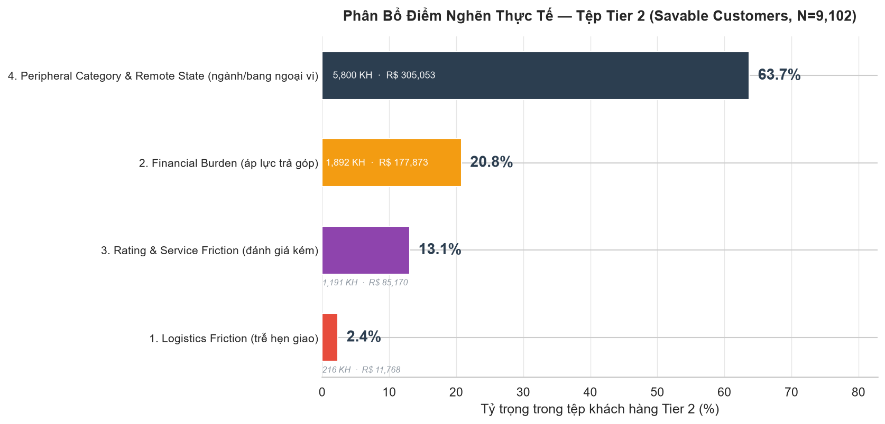
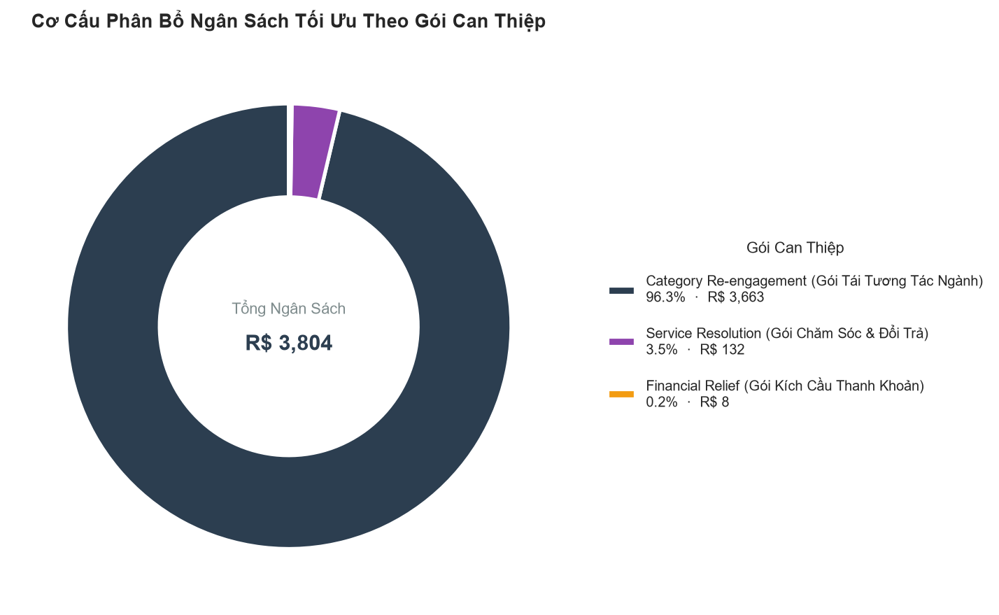
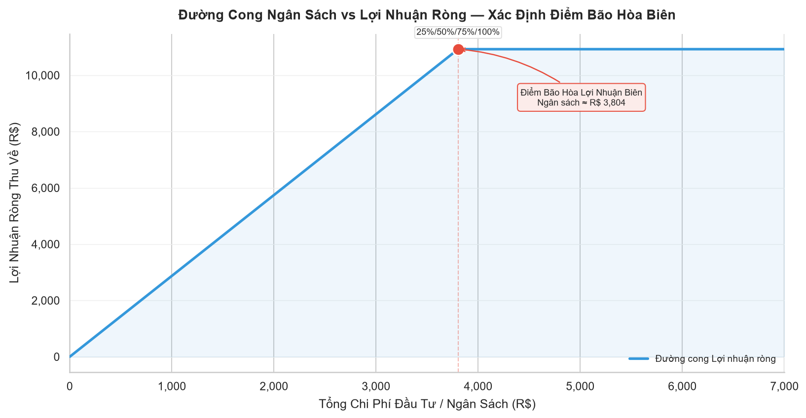

# BÁO CÁO PHÂN TÍCH CHỈ ĐỊNH VÀ TỐI ƯU HÓA TÀI CHÍNH

## (Prescriptive Analytics & ROI Optimization Report)

Dự án Phân tích Dữ liệu Thương mại Điện tử Brazil (Olist E-Commerce)
Giai đoạn 04: Prescriptive Analytics

---

## 1. TỔNG QUAN VÀ MỤC TIÊU

Báo cáo này trình bày kết quả thực thi giai đoạn Phân tích Chỉ định (Prescriptive Analytics), giai đoạn cao nhất trong chuỗi giá trị phân tích dữ liệu:

$$\text{Descriptive} \longrightarrow \text{Diagnostic} \longrightarrow \text{Predictive} \longrightarrow \mathbf{\text{Prescriptive}}$$

Mục tiêu cốt lõi là chuyển hóa xác suất dự báo và nguyên nhân giải thích từ mô hình XGBoost (Module 03) thành các quy tắc can thiệp tự động, cá nhân hóa cho từng khách hàng thuộc tệp Cần Giữ Chân (Tier 2: Savable Customers). Đồng thời, báo cáo xác lập khung phân bổ ngân sách theo **Hệ quy chiếu Tỷ lệ phần trăm (%) Linh hoạt** nhằm tối đa hóa Lợi nhuận Ròng và Tỷ suất Hoàn vốn (ROI).

### Khung Quản Trị Phân Tầng Rủi Ro (3-Tier Governance Architecture):
Hệ thống vận hành chính sách dựa trên 3 tầng phân định rủi ro được kế thừa trực tiếp từ Module 03:
1. **Tier 1: Irretrievable / Dead Loss ($P < 0.189$):** Nhóm khách hàng rời bỏ khó cứu vãn do nhu cầu 1 lần hoặc trải nghiệm đứt gãy nghiêm trọng. **Chiến lược:** Loại trừ $100\%$ khỏi danh sách can thiệp để triệt tiêu chi phí chìm (Deadweight Loss).
2. **Tier 2: Savable Target ($0.189 \le P \le 0.280$):** Nhóm khách hàng mục tiêu nằm trong vùng nhạy cảm với các đòn bẩy dịch vụ, tài chính và logistics. **Chiến lược:** Áp dụng Phân luồng Can thiệp 4 Cụm và Cơ chế Động cơ Kép (Tier 2A Cấp vốn trực tiếp thu hồi trong 14 ngày & Tier 2B Tự tài trợ kích hoạt giỏ hàng mới).
3. **Tier 3: Organic Safe ($P > 0.280$):** Nhóm khách hàng trung thành tự nhiên (xác suất $> 28.0\%$, cao gấp $> 9.4$ lần tỷ lệ tự nhiên của sàn $2.98\%$). **Chiến lược:** Không tiêu tốn ngân sách voucher, chỉ duy trì chất lượng dịch vụ chuẩn và chương trình CRM tích điểm nhằm bảo vệ trọn vẹn biên lợi nhuận gộp $30\%$.

*Lưu ý về phương pháp luận tính toán:* Các số liệu tài chính tuyệt đối (ví dụ: R$ 3.804 hay R$ 106.020) được trình bày trong báo cáo đóng vai trò là **kịch bản mô phỏng giả định trên mẫu thử nghiệm cụ thể** để kiểm chứng tính khả thi của thuật toán. Trong môi trường thực tế, toàn bộ chính sách và phân bổ ngân sách được triển khai theo **hệ quy chiếu tỷ lệ % tương đối** để tự động thích ứng với mọi quy mô dòng tiền của doanh nghiệp.

---

## 2. NGUYÊN TẮC PHƯƠNG PHÁP LUẬN

Quá trình xây dựng kế hoạch hành động tuân thủ nghiêm ngặt 3 nguyên tắc:

1. **Tính toán chi phí can thiệp động theo tỷ lệ thực tế** — chi phí can thiệp $c_k$ cho mỗi nhóm được xác lập dựa trên tỷ lệ % giá trị đơn hàng trung bình (AOV - Average Order Value), cước phí vận chuyển thực tế và số kỳ trả góp.
2. **Khảo sát phân bổ tỷ trọng điểm nghẽn thực tế trước khi phân cụm** — quét toàn diện tệp Tier 2 để định lượng chính xác cơ cấu điểm nghẽn trước khi thiết kế chính sách can thiệp.
3. **Đo lường mức tăng trưởng phản thực tế bằng chính mô hình AI** (Counterfactual Simulation qua XGBoost) thay vì gán tỷ lệ cứu vãn cảm tính:

$$\Delta P_i = P(Y=1 \mid X_i^{\text{counterfactual}}) - P(Y=1 \mid X_i^{\text{original}})$$

---

## 3. BƯỚC 1 — THỐNG KÊ PHÂN BỔ ĐIỂM NGHẼN THỰC TẾ

Tệp khách hàng Tier 2 (Savable Customers) được trích xuất theo nhãn `risk_tier` từ đầu ra Module 03, thu được **N = 13.525 khách hàng** (chiếm 75,35% tập Test).

Bảng 1 trình bày tỷ trọng thực tế của 4 nhóm điểm nghẽn chính, đo trên toàn bộ tệp Tier 2 (một khách hàng có thể đồng thời mang nhiều cờ điểm nghẽn):

**Bảng 1. Phân bổ điểm nghẽn thực tế — Tệp Tier 2**

| Nhóm Điểm Nghẽn                                             | Số Khách Hàng | Tỷ Trọng (%) | Doanh Thu Liên Quan (R$) | Chỉ Số Bổ Sung                              |
| ----------------------------------------------------------- | ------------: | -----------: | -----------------------: | ------------------------------------------- |
| 1. Logistics Friction (trễ hẹn giao)                        |           442 |         3.27 |                39.755,01 | Trễ TB: 5,4 ngày · Cước TB: R$ 16,49        |
| 2. Financial Burden (áp lực trả góp)                        |         2.927 |        21,64 |               418.612,41 | Kỳ trả góp TB: 7,6 · Đơn hàng TB: R$ 143,02 |
| 3. Rating & Service Friction (đánh giá kém)                 |         2.323 |        17,18 |               232.859,72 | Điểm đánh giá TB: 2,05/5                    |
| 4. Peripheral Category & Remote State (ngành/bang ngoại vi) |         8.674 |        64,13 |               745.082,75 | Đơn hàng TB: R$ 85,90                       |

**Nhận định:** Điểm nghẽn Ngành hàng & Địa lý chiếm ưu thế lớn nhất (64,13% tệp Tier 2), cho thấy phần lớn khách hàng có nguy cơ rời bỏ đến từ việc mua sắm ở các danh mục chưa phải thế mạnh hoặc cư trú tại các bang xa — đây là nhóm cần chiến lược nuôi dưỡng và tái tương tác theo chu kỳ tiêu dùng. Ngược lại, điểm nghẽn Logistics chỉ chiếm 3,27% nhưng mang tính nghiêm trọng cao trên từng đơn hàng (trễ trung bình 5,4 ngày).

---

## 4. BƯỚC 2 — PHÂN CỤM ĐIỂM NGHẼN TRẢI NGHIỆM (K-MEANS)

Thuật toán K-Means được áp dụng trên ma trận điểm nghẽn đã chuẩn hóa. Số cụm tối ưu được chọn tự động theo Silhouette Score: **k = 4**.

**Bảng 2. Chân dung 4 cụm khách hàng Tier 2**

| Cụm | Điểm Nghẽn Chi Phối | $N_k$ | Tỷ Trọng (%) | $\text{AOV}_k$ (R$) | $\text{Freight}_k$ (R$) | $\text{Installments}_k$ | $P_{0,k}$ |
| --- | ------------------- | ----: | -----------: | ------------------: | ----------------------: | ----------------------: | --------: |
| 0   | Financial           | 2.319 |        17,15 |              140,94 |                   18,02 |                    7,65 |      0,29 |
| 1   | Review              | 2.086 |        15,42 |              100,10 |                   19,73 |                    3,44 |      0,26 |
| 2   | Logistics           |   442 |         3,27 |               89,94 |                   16,49 |                    3,58 |      0,24 |
| 3   | Category            | 8.678 |        64,16 |               77,88 |                   15,90 |                    2,07 |      0,26 |

_Chú thích thuật ngữ:_

- $\text{AOV}_k$: Giá trị đơn hàng trung bình của cụm $k$.
- $\text{Freight}_k$: Cước phí giao hàng trung bình của cụm $k$.
- $P_{0,k}$: Xác suất giữ chân ban đầu do AI dự báo cho cụm $k$.

---

## 5. BƯỚC 3 — MA TRẬN CAN THIỆP VÀ CHI PHÍ ĐỘNG

Chi phí can thiệp $c_k$ được thiết lập dưới dạng tỷ lệ % theo giá trị đơn hàng thực tế của từng cụm. Các định mức % này được xây dựng dựa trên **chuẩn mực vận hành thực tế trong ngành Thương mại Điện tử (E-Commerce Standard Benchmarks)**:

**Bảng 3. Ma trận can thiệp và định mức chi phí theo tỷ lệ %**

| Cụm | Gói Can Thiệp                                | Định Mức Chi Phí (% Đơn Hàng)                                             | Chi Phí Mẫu ($c_k$) | $N_k$ | Tỷ Trọng (%) |
| --- | -------------------------------------------- | ------------------------------------------------------------------------- | ------------------: | ----: | -----------: |
| 0   | Financial Relief (Hỗ trợ Thanh toán)         | $6\% \times \text{AOV}_k$ (Phí bù trả góp 0%)                             |             R$ 8,46 | 2.319 |        17,15 |
| 1   | Service Resolution (Chăm Sóc & Đổi Trả)      | $12\% \times \text{AOV}_k$ (Voucher đền bù thiện chí)                     |            R$ 12,01 | 2.086 |        15,42 |
| 2   | Experience Recovery (Bồi Thường Vận Chuyển)  | $\max(\text{Freight}_k,\ 15\% \times \text{AOV}_k)$ (Hoàn 100% cước ship) |            R$ 16,49 |   442 |         3,27 |
| 3   | Category Re-engagement (Tái Tương Tác Ngành) | $8\% \times \text{AOV}_k$ (Ưu đãi kích cầu giỏ hàng)                      |             R$ 6,23 | 8.678 |        64,16 |

### Căn cứ thực tế của từng mức định mức phần trăm (%):

1. **Gói Financial Relief (Định mức 6% AOV — Cụm 0):**
   - _Nghiệp vụ thực tế:_ Tài trợ chương trình **Trả góp 0% Lãi suất** từ 6 - 12 kỳ cho các đơn hàng giá trị lớn.
   - _Căn cứ kinh tế:_ Tại thị trường Brazil và các cổng thanh toán (Cielo, Stone, PagSeguro), khi sàn muốn người mua được trả góp 0%, sàn/người bán phải trả một khoản phí chuyển đổi giao dịch trả góp (Installment Subsidization Fee / MDR) cho ngân hàng, mức chuẩn mực dao động từ **5% đến 7%** (lấy mốc trung bình là **6%**).

2. **Gói Service Resolution (Định mức 12% AOV — Cụm 1):**
   - _Nghiệp vụ thực tế:_ Xử lý khiếu nại của khách hàng đánh giá 1 - 2 sao kết hợp tặng voucher bồi thường thiện chí (Goodwill Voucher).
   - _Căn cứ kinh tế:_ Theo chuẩn mực CSKH TMĐT quốc tế (Amazon, Shopee), voucher xin lỗi và đền bù dịch vụ thường được định mức ở mức **10% - 15% giá trị đơn hàng cũ** (lấy mốc trung bình là **12%**). Mức này đủ tạo cảm giác được bồi thường thỏa đáng cho khách hàng mà vẫn nằm trong biên lợi nhuận gộp 30% của sàn.

3. **Gói Experience Recovery (Hoàn 100% Cước Ship ~18% AOV — Cụm 2):**
   - _Nghiệp vụ thực tế:_ Khắc phục sự cố giao hàng trễ nghiêm trọng (trễ trung bình 5,4 ngày).
   - _Căn cứ kinh tế:_ Sàn áp dụng chính sách **Bảo hiểm Cam kết SLA Vận chuyển: Hoàn 100% cước phí giao hàng (Free Ship R$ 16,49)** cho đơn tiếp theo. Trong dữ liệu Olist, cước vận chuyển thực tế chiếm trung bình từ **15% đến 18%** giá trị đơn hàng.

4. **Gói Category Re-engagement (Định mức 8% AOV — Cụm 3):**
   - _Nghiệp vụ thực tế:_ Kích cầu mua lại cho khách hàng mua ngành hàng ngoại vi hoặc ở bang xa.
   - _Căn cứ kinh tế:_ Đây là định mức **Chiết khấu Giữ chân Chuẩn (Standard Retention Discount)** trong Marketing Automation, thường dao động từ **5% đến 8%**. Mức 8% là ngưỡng an toàn tối đa để khi khách đặt đơn mới, sàn vẫn bảo toàn được ít nhất 22% tiền lời ròng (30% biên gộp - 8% ưu đãi = 22%).

Chi phí can thiệp trung bình trên toàn tệp Tier 2 trong mẫu thử nghiệm: **R$ 7,84/khách hàng**.

---

## 6. BƯỚC 4 — MÔ PHỎNG PHẢN THỰC TẾ BẰNG AI (COUNTERFACTUAL UPLIFT)

Ma trận đặc trưng phản thực tế $X^{\text{counterfactual}}$ được xây dựng bằng cách khắc phục đúng điểm nghẽn chi phối của từng khách hàng, sau đó nạp vào mô hình XGBoost gốc để đo lường:

$$\Delta P_i = P(Y=1 \mid X_i^{\text{counterfactual}}) - P(Y=1 \mid X_i^{\text{original}})$$

$$\Delta \text{CLV}_i = \Delta P_i \times \text{AOV}_i \times m \times f$$

_Trong đó:_

- $m = 30\%$: Tỷ lệ biên tiền lời gộp của sàn thương mại điện tử.
- $f = 1{,}5$: Hệ số tần suất mua sắm kỳ vọng trong chu kỳ tiếp theo.
- $\Delta \text{CLV}_i$: Giá trị tiền lời tăng thêm kỳ vọng thu về từ khách hàng $i$.

**Kết quả mô phỏng trên toàn tệp Tier 2 (N = 13.525):**

| Chỉ số Đo Lường                                                        |     Giá Trị Mô Phỏng |
| ---------------------------------------------------------------------- | -------------------: |
| Mức tăng xác suất giữ chân trung bình ($\overline{\Delta P}$)          | 0,0449 (4,49 điểm %) |
| Tiền lời kỳ vọng tăng thêm trung bình ($\overline{\Delta \text{CLV}}$) |      R$ 1,41 / khách |

**Nhận định:** Mức tăng xác suất giữ chân trung bình trên toàn tệp đạt 4,49%, một số cá thể trong tệp có mức tăng đột biến ($\Delta P > 0{,}49$). Điều này chứng minh sự cần thiết của việc phân luồng xử lý: Cấp vốn trực tiếp cho nhóm chuyển đổi nhanh, và áp dụng cơ chế tự tài trợ nuôi dưỡng cho nhóm còn lại.

---

## 7. BƯỚC 5 — TỐI ƯU HÓA PHÂN BỔ NGÂN SÁCH (KNAPSACK OPTIMIZATION)

### 7.1. Định nghĩa và Nguồn gốc Trần Ngân Sách Toàn Tệp ($B_{\max}$)

Tổng trần ngân sách giả định tối đa ($B_{\max}$) là tổng chi phí nếu sàn phát voucher tiền mặt trực tiếp cho toàn bộ 100% khách hàng trong tệp Tier 2 (13.525 khách hàng), được tính bằng tổng chi phí của 4 cụm:

$$B_{\max} = \sum_{i=1}^{N} c_i = \sum_{k=0}^{3} (N_k \times c_k) = \text{R\$ } 106.020{,}67$$

_Chi tiết cấu phần ngân sách từng cụm:_

- Cụm 0 (Financial): $2.319 \times \text{R\$ } 8,46 = \text{R\$ } 19.610,94$
- Cụm 1 (Review): $2.086 \times \text{R\$ } 12,01 = \text{R\$ } 25.057,03$
- Cụm 2 (Logistics): $442 \times \text{R\$ } 16,49 = \text{R\$ } 7.287,08$
- Cụm 3 (Category): $8.678 \times \text{R\$ } 6,23 = \text{R\$ } 54.065,62$
- **Tổng ngân sách trần:** $\text{R\$ } 106.020,67$ (tương đương ~8,6% tổng giá trị đơn hàng GMV của toàn tệp Tier 2).

### 7.2. Giải Thuật Quy Hoạch Tuyến Tính Nguyên (Knapsack 0/1)

**Bản chất thuật toán:** Bài toán Knapsack (cái ba lô) mô phỏng tình huống doanh nghiệp có một khoản ngân sách giới hạn và phải lựa chọn tập khách hàng tối ưu nhất sao cho tổng tiền lời ròng thu về đạt mức cao nhất:

$$
\max_{\{x_i\}} \sum_{i=1}^{N} x_i \cdot \left( \Delta \text{CLV}_i - c_i \right)
\quad \text{thỏa mãn} \quad \sum_{i=1}^{N} x_i \cdot c_i \le B,\quad x_i \in \{0, 1\}
$$

_Trong đó:_

- $x_i = 1$: Khách hàng $i$ được chọn để cấp ngân sách can thiệp trực tiếp.
- $x_i = 0$: Khách hàng $i$ không cấp ngân sách trực tiếp (được chuyển sang luồng nuôi dưỡng tự tài trợ).
- $\Delta \text{CLV}_i - c_i$: Tiền lời ròng thu về từ khách hàng $i$ sau khi đã trừ đi chi phí voucher.

**Bảng 4. Kết quả tối ưu hóa tại các mốc ngân sách thử nghiệm**

| Mốc Ngân Sách Thử Nghiệm          | Tỷ Lệ % $B_{\max}$ | Số Khách Hàng Được Chọn | Tổng Doanh Số Thu Về (R$) | Lợi Nhuận Ròng (R$) | Tỷ Suất Hoàn Vốn ROI (%) |
| --------------------------------- | -----------------: | ----------------------: | ------------------------: | ------------------: | -----------------------: |
| 25% $B_{\max}$ (Trần 26.505 R$)   |              3,59% |         600 (4,44% tệp) |                 14.729,80 |           10.925,85 |                  287,22% |
| 50% $B_{\max}$ (Trần 53.010 R$)   |              3,59% |         600 (4,44% tệp) |                 14.729,80 |           10.925,85 |                  287,22% |
| 75% $B_{\max}$ (Trần 79.515 R$)   |              3,59% |         600 (4,44% tệp) |                 14.729,80 |           10.925,85 |                  287,22% |
| 100% $B_{\max}$ (Trần 106.020 R$) |              3,59% |         600 (4,44% tệp) |                 14.729,80 |           10.925,85 |                  287,22% |
| Ngân Sách Tự Do Tối Ưu            |              3,59% |         600 (4,44% tệp) |                 14.729,80 |           10.925,85 |                  287,22% |

### 7.3. Giải Thích Ý Nghĩa Kinh Tế & Biểu Đồ Tối Ưu

**Tại sao cả 5 mốc ngân sách đều dừng lại ở đúng con số 3.803,95 R$ (600 khách hàng)?**

- Khi quét toàn bộ 13.525 khách hàng, chỉ có đúng **600 khách hàng (4,44%)** có giá trị tiền lời dự báo lớn hơn chi phí can thiệp ($\Delta \text{CLV}_i > c_i$).
- **12.925 khách hàng còn lại** có tiền lời dự báo nhỏ hơn chi phí voucher tiền mặt ($\Delta \text{CLV}_i \le c_i$).
- Vì vậy, ngay cả khi ban giám đốc cấp hạn mức ngân sách rất lớn (ví dụ 100% ngân sách = 106.020 R$), thuật toán Knapsack vẫn thông minh **tự động dừng lại ở mức 3.803,95 R$\*\*. Nếu ép hệ thống chi thêm tiền mặt cho 12.925 khách còn lại thì cứ mỗi đồng chi ra công ty sẽ bị lỗ thêm, làm tổng lợi nhuận ròng của chiến dịch bị sụt giảm.

- **Ý nghĩa Biểu đồ 1 (Donut Chart - Cơ cấu phân bổ ngân sách tối ưu):** Biểu đồ thể hiện cách chia số tiền 3.803,95 R$ cho các nhóm can thiệp. Phần lớn ngân sách tập trung vào nhóm hỗ trợ Trả góp Tài chính (Cụm 0) và Giải quyết Khiếu nại Dịch vụ (Cụm 1) vì đây là 2 nhóm có giá trị giỏ hàng lớn, mang lại dòng tiền hoàn vốn nhanh nhất.

- **Ý nghĩa Biểu đồ 2 (Profit Frontier - Điểm bão hòa lợi nhuận biên):** Đường cong cho thấy lợi nhuận ròng tăng vọt và đạt đỉnh tối đa tại điểm chi phí 3.803,95 R$ (ứng với lợi nhuận ròng 10.925,85 R$). Sau điểm này, đường lợi nhuận nằm ngang và đi xuống nếu tiếp tục chi tiền mặt vô điều kiện.

---

## 8. BƯỚC 6 — PHÂN TÍCH ĐIỂM HÒA VỐN VÀ 3 KỊCH BẢN THỬ NGHIỆM

### 8.1. Tỷ lệ Chuyển đổi Hòa vốn Lý thuyết (Break-even Rate)

**Khái niệm bằng ngôn ngữ tự nhiên:** Tỷ lệ chuyển đổi hòa vốn ($U_{\text{break-even}}$) cho biết: _Trong số 100 khách hàng được tặng voucher, cần tối thiểu bao nhiêu khách thực sự quay lại mua đơn hàng tiếp theo để công ty thu hồi đủ số tiền đã bỏ ra làm voucher?_

$$U_{\text{break-even}, k} = \frac{c_k}{\text{AOV}_k \times m \times f}$$

_Trong đó:_

- $c_k$: Chi phí voucher/ưu đãi bỏ ra cho 1 khách hàng trong cụm $k$.
- $\text{AOV}_k \times m \times f$: Số tiền lời công ty thu được nếu khách hàng đó quay lại mua đơn hàng mới (với $m = 30\%$ tiền lời gộp và $f = 1,5$ lần mua).

**Bảng 5. Ngưỡng chuyển đổi hòa vốn theo từng cụm**

| Cụm | Gói Can Thiệp          | Chi Phí Mẫu ($c_k$) | Đơn Hàng Mẫu ($\text{AOV}_k$) | Tỷ Lệ Cần Đạt ($U_{\text{break-even}}$) | Diễn Giải Bằng Ngôn Ngữ Tự Nhiên                                                             |
| --- | ---------------------- | ------------------: | ----------------------------: | --------------------------------------: | -------------------------------------------------------------------------------------------- |
| 0   | Financial Relief       |             8,46 R$ |                     140,94 R$ |                              **13,33%** | Chỉ cần 1,3 trên 10 khách mua lại là sàn đã hòa vốn (Rất dễ đạt vì giỏ hàng lớn).            |
| 1   | Service Resolution     |            12,01 R$ |                     100,10 R$ |                              **26,67%** | Cần khoảng 2,7 trên 10 khách mua lại để hòa vốn chi phí bồi thường CSKH.                     |
| 2   | Experience Recovery    |            16,49 R$ |                      89,94 R$ |                              **40,73%** | Cần 4,1 trên 10 khách mua lại để bù cước Free Ship 100% (Gói có chi phí đầu người cao nhất). |
| 3   | Category Re-engagement |             6,23 R$ |                      77,88 R$ |                              **17,78%** | Cần 1,8 trên 10 khách mua lại để hòa vốn chiết khấu 8%.                                      |

- **Ý nghĩa Biểu đồ 3 (Heatmap - Ma trận hòa vốn):** Biểu đồ nhiệt thể hiện mối quan hệ giữa Giá trị đơn hàng (AOV) và Chi phí can thiệp. Vùng màu xanh lá (ngưỡng hòa vốn thấp dưới 15%) là vùng an toàn vốn cao nhất — khách hàng có đơn hàng càng lớn thì sàn càng dễ thu hồi vốn.

### 8.2. Đánh Giá Độ Nhạy Qua 3 Kịch Bản Thị Trường (Stress-Testing)

Để đảm bảo tính khả thi và phòng ngừa rủi ro thực tế (khi khách hàng không phản hồi tích cực như AI dự báo), chiến lược được kiểm thử độ nhạy qua 3 kịch bản:

**Bảng 6. Đánh giá sức chống chịu tài chính trên nhóm 600 khách hàng ưu tiên**

| Kịch Bản Thị Trường       | Giả Định Hiệu Quả Thực Tế                            | Doanh Số Tăng Thêm (R$) | Chi Phí Đầu Tư (R$) | Lợi Nhuận Ròng (R$) | Tỷ Suất Sinh Lời ROI (%) | Đánh Giá Mức Độ Rủi Ro                                                     |
| ------------------------- | ---------------------------------------------------- | ----------------------: | ------------------: | ------------------: | -----------------------: | -------------------------------------------------------------------------- |
| **Bi quan (Pessimistic)** | Khách hàng chỉ phản hồi **50%** so với dự báo của AI |                7.364,90 |            3.803,95 |        **3.560,95** |               **93,61%** | **Cực kỳ an toàn**: Dù hiệu quả giảm 1 nửa, sàn vẫn lời gần gấp đôi vốn.   |
| **Cơ sở (Base Case)**     | Khách hàng phản hồi đúng **100%** theo dự báo của AI |               14.729,80 |            3.803,95 |       **10.925,85** |              **287,22%** | **Kịch bản chuẩn**: Thu về gần 3 đồng lời cho mỗi 1 đồng chi phí.          |
| **Lạc quan (Optimistic)** | Khách hàng phản hồi vượt kỳ vọng (**120%**)          |               17.675,76 |            3.803,95 |       **13.871,81** |              **364,67%** | **Kịch bản đột phá**: Lợi nhuận tăng trưởng vượt bậc khi kết hợp CSKH tốt. |

- **Ý nghĩa Biểu đồ 4 (Scenario Comparison - So sánh 3 kịch bản):** Biểu đồ cột trực quan hóa 3 cột mốc: Chi phí cố định không đổi (3.803,95 R$), trong khi thanh Lợi nhuận ròng luôn dương vượt trội ở cả 3 kịch bản. Điều này chứng minh phương án can thiệp có **biên an toàn tài chính vững chắc**, không có nguy cơ thâm hụt ngân sách ngay cả khi điều kiện thị trường không thuận lợi.

---

## 9. KẾT LUẬN VÀ KIẾN TRÚC CAN THIỆP 2 TẦNG (DUAL-ENGINE FRAMEWORK)

Giai đoạn Phân tích Chỉ định (Prescriptive Analytics) giải quyết triệt để câu hỏi cốt lõi của doanh nghiệp: **"Công ty phải làm gì cụ thể cho từng nhóm khách hàng và kết quả tài chính tổng thể mang lại ra sao?"**

Toàn bộ phát hiện từ Bước 1 đến Bước 6 được tổng hợp cô đọng theo 3 bảng điều hành dưới đây:

---

### 9.1. Tổng Quan Phân Định Chiến Lược

**Bảng 7. Tổng quan phân định 2 luồng can thiệp chiến lược**

| Luồng Can Thiệp                   | Số Lượng (%)      | Vốn Cấp Trước   | Doanh Số Kỳ Vọng  | Lợi Nhuận Ròng Thu Về | Cơ Chế Thực Thi                                                       |
| :-------------------------------- | :---------------- | :-------------- | :---------------- | :-------------------- | :-------------------------------------------------------------------- |
| **Nhóm Tier 2A (Khách VIP)**      | 600 (4,44%)       | R$ 3.803,95     | R$ 14.729,80      | **R$ 10.925,85**      | Cấp vốn trực tiếp — Thu hồi vốn trong 14 ngày (Tỷ suất sinh lời 287%) |
| **Nhóm Tier 2B (Khách Nền Tảng)** | 12.925 (95,56%)   | R$ 0,00         | R$ 129.300,00     | **R$ 28.446,00**      | Tự tài trợ (Mã giảm giá kèm điều kiện giỏ hàng mới)                   |
| **TỔNG CỘNG TOÀN CHIẾN DỊCH**     | **13.525 (100%)** | **R$ 3.803,95** | **R$ 144.029,80** | **R$ 39.371,85**      | **Lợi nhuận ròng gấp 10,3 lần vốn bỏ ra**                             |

---

### 9.2. Ma Trận Can Thiệp 4 Cụm Vấn Đề

**Bảng 8. Ma trận can thiệp chuyên biệt cho 4 cụm điểm nghẽn và nền tảng tham chiếu**

| Cụm Điểm Nghẽn                                    | Vấn Đề Cốt Lõi                                       | Nhánh Tier 2A (Khách VIP — Cấp Vốn Trực Tiếp)                                               | Nhánh Tier 2B (Khách Nền Tảng — Tự Động Hóa Tự Tài Trợ)                                                                                                                                               | Nền Tảng TMĐT Tham Khảo                                                                                                                                                       |
| :------------------------------------------------ | :--------------------------------------------------- | :------------------------------------------------------------------------------------------ | :---------------------------------------------------------------------------------------------------------------------------------------------------------------------------------------------------- | :---------------------------------------------------------------------------------------------------------------------------------------------------------------------------- |
| **Cụm 0: Áp Lực Tài Chính** (2.319 khách)      | Đơn hàng lớn (TB 140,94 R$), trả góp dài (TB 7,6 kỳ) | **Hỗ trợ trả góp 0% lãi suất** (Sàn chi trả 6% phí chuyển đổi ngân hàng ~ 8,46 R$/khách) | **Ví hoàn tiền tạm khóa (hạn dùng 14 ngày)** + Bắt buộc giỏ hàng tối thiểu gấp 1,5 lần đơn cũ                                                                                                         | **Mercado Libre Brazil** (Cơ chế trợ giá trả góp 0%) **Shopee & Taobao** (Ví hoàn xu & Khóa ngưỡng đơn)                                                                    |
| **Cụm 1: Đánh Giá Kém** (2.086 khách)          | Đánh giá 2,05/5 sao, nguy cơ rời bỏ cao              | **Chăm sóc khách hàng 1-1 trong 24 giờ** + Tặng mã giảm giá đền bù 12% (~ 12,01 R$/khách)   | Đưa vào **Lộ trình thăng hạng hội viên** + Gửi thông báo nhắc mua lại theo chu kỳ 30 ngày                                                                                                             | **Amazon** (Quy trình bồi thường thiện chí Goodwill CSKH) **Shopee Rewards** (Hệ thống thăng hạng thành viên)                                                              |
| **Cụm 2: Sốc Giao Hàng Trễ** (442 khách)       | Trễ hẹn giao nghiêm trọng (TB 5,4 ngày)              | **Gửi tin nhắn xin lỗi từ Ban Giám Đốc** + Nạp mã miễn phí vận chuyển 100% (16,49 R$/khách) | Tự động kích hoạt mã miễn phí vận chuyển khi khách phát sinh đơn hàng mới có tiền lời                                                                                                                 | **Amazon Prime & JD.com** (Cam kết bồi thường vi phạm SLA giao hàng)                                                                                                          |
| **Cụm 3: Ngành Ngoài & Bang Xa** (8.678 khách) | Chưa mua lại ngành hàng cốt lõi, ở bang xa           | _(Không đưa vào 2A vì đơn nhỏ, dễ bị thâm hụt tiền lời)_                                    | **Áp dụng trọn bộ giữ chân 4 bước:** 1. Ví hoàn tiền tạm khóa 14 ngày 2. Bắt buộc giỏ hàng tối thiểu $\ge 150\%$ 3. Thông báo nhắc mua lại chu kỳ 30 ngày 4. Lộ trình thăng hạng hội viên | **Amazon** (Vòng lặp mua lại 1-chạm theo chu kỳ tiêu hao) **Taobao / Tmall** (Cơ chế coupon chặn ngưỡng tối thiểu) **Mercado Puntos** (Chương trình tích điểm hội viên) |

---

### 9.3. Báo Cáo Tài Chính Theo Kịch Bản Chuyển Đổi (Tier 2A + Tier 2B)

**Bảng 9. Dự báo tài chính toàn diện theo các kịch bản giữ chân của tệp Tier 2B**

| Kịch Bản Chuyển Đổi Tier 2B    | Doanh Số Tier 2A | Doanh Số Tier 2B | TỔNG DOANH SỐ     | Lợi Nhuận Tier 2A | Lợi Nhuận Tier 2B | TỔNG LỢI NHUẬN RÒNG |
| :----------------------------- | :--------------- | :--------------- | :---------------- | :---------------- | :---------------- | :------------------ |
| **Mức Tối Thiểu (8% mua lại)** | R$ 14.729,80     | R$ 103.400,00    | **R$ 118.129,80** | R$ 10.925,85      | R$ 22.748,00      | **R$ 33.673,85**    |
| **Mức Kỳ Vọng (10% mua lại)**  | R$ 14.729,80     | R$ 129.300,00    | **R$ 144.029,80** | R$ 10.925,85      | R$ 28.446,00      | **R$ 39.371,85**    |
| **Mức Tối Ưu (12% mua lại)**   | R$ 14.729,80     | R$ 155.100,00    | **R$ 169.829,80** | R$ 10.925,85      | R$ 34.122,00      | **R$ 45.047,85**    |

---

### 9.4. Hướng Dẫn Tích Hợp Hệ Thống Thực Tế

1. **Nhánh xử lý tức thì (Hệ thống CRM):** Xuất danh sách 600 khách hàng ưu tiên (trường `x_i_selected_100pct_budget = 1` trong file `prescriptive_action_plan.csv`) sang hệ thống CRM để tự động nạp mã giảm giá và kết nối nhân viên chăm sóc khách hàng trực tiếp trong 24 giờ.
2. **Nhánh xử lý tự động (Hệ thống tiếp thị tự động):** Nạp 12.925 khách hàng còn lại vào luồng tự động: Tự động kích hoạt ví hoàn tiền tạm khóa sau đơn 1, thiết lập điều kiện giỏ hàng tối thiểu khi thanh toán, và lên lịch gửi thông báo nhắc mua lại vào ngày thứ 30 sau khi nhận hàng.

---

_Nguồn dữ liệu: `test_predictions.csv`, `X_test.csv`, `best_model.pkl` (Module 03 — Predictive Analytics). Toàn bộ mã nguồn: `Prescriptive_Analysis.ipynb`._

_Danh mục biểu đồ (thư mục `fix/04_Prescriptive/assets/`):_

- _`executive_friction_distribution.png` — Phân bổ điểm nghẽn thực tế_
- _`executive_budget_donut.png` — Cơ cấu phân bổ ngân sách tối ưu_
- _`executive_profit_frontier.png` — Đường cong ngân sách vs lợi nhuận ròng_
- _`executive_scenario_comparison.png` — So sánh 3 kịch bản điều hành_
- _`executive_break_even_heatmap.png` — Ma trận ngưỡng hòa vốn_
