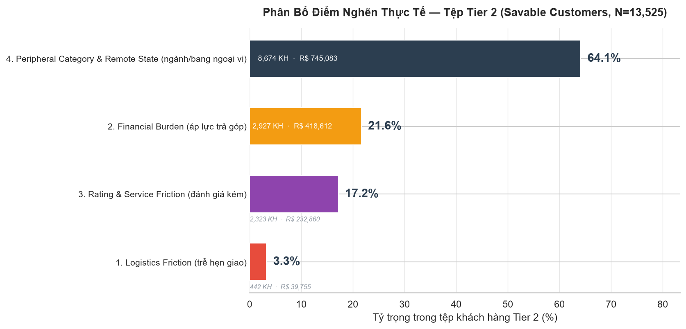
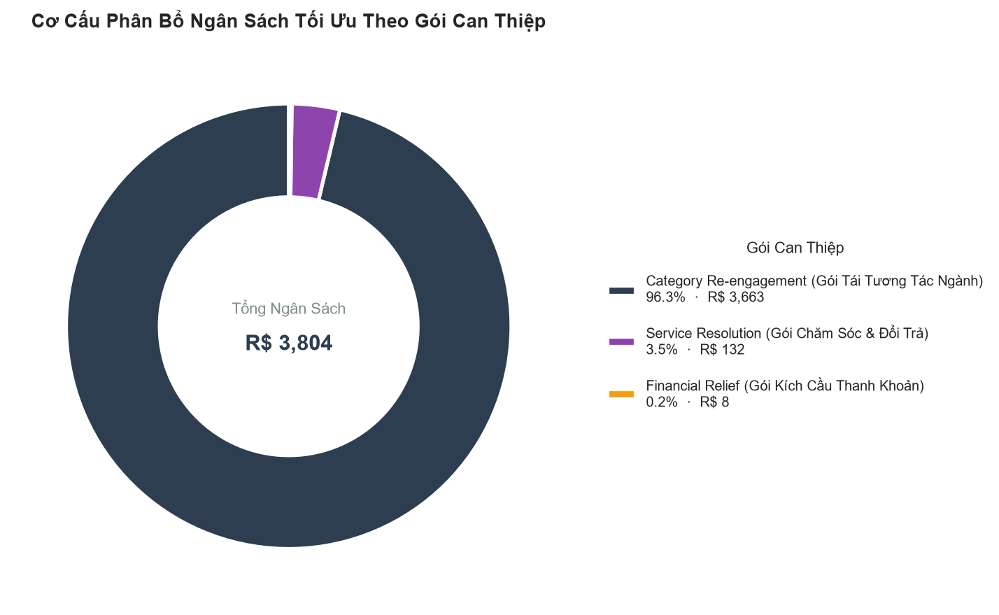
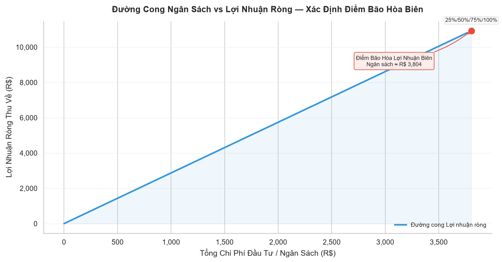
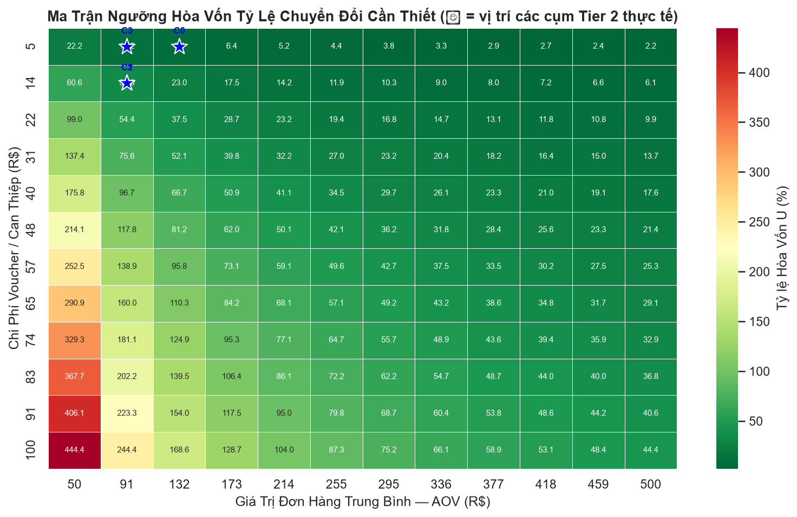
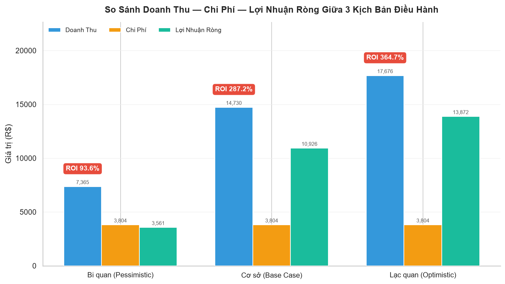

# BÁO CÁO PHÂN TÍCH CHỈ ĐỊNH VÀ TỐI ƯU HÓA TÀI CHÍNH
## (Prescriptive Analytics & ROI Optimization Report)

Dự án Phân tích Dữ liệu Thương mại Điện tử Brazil (Olist E-Commerce)
Giai đoạn 04: Prescriptive Analytics

---

## 1. TỔNG QUAN VÀ MỤC TIÊU

Báo cáo này trình bày kết quả thực thi giai đoạn Phân tích Chỉ định (Prescriptive Analytics), giai đoạn cao nhất trong chuỗi giá trị phân tích dữ liệu:

$$\text{Descriptive} \longrightarrow \text{Diagnostic} \longrightarrow \text{Predictive} \longrightarrow \mathbf{\text{Prescriptive}}$$

Mục tiêu cốt lõi là chuyển hóa xác suất dự báo và nguyên nhân giải thích từ mô hình XGBoost (Module 03) thành chính sách hành động cụ thể, cá nhân hóa cho từng khách hàng thuộc tệp Tier 2 (Savable Customers), đồng thời xác định phương án phân bổ ngân sách marketing tối ưu nhằm tối đa hóa Lợi nhuận Ròng (Net Profit) và Tỷ suất Hoàn vốn (ROI).

Toàn bộ số liệu trong báo cáo này được trích xuất trực tiếp từ kết quả thực thi `Prescriptive_Analysis.ipynb` trên tệp dữ liệu thật của dự án.

---

## 2. NGUYÊN TẮC PHƯƠNG PHÁP LUẬN

Quá trình xây dựng kế hoạch hành động tuân thủ nghiêm ngặt 3 nguyên tắc:

1. **Không giả định trước tỷ lệ hay chi phí cố định** — chi phí can thiệp $c_k$ được xác lập trực tiếp từ chỉ số tài chính thực tế của từng nhóm khách hàng (AOV, cước phí, số kỳ trả góp).
2. **Khảo sát phân bổ tỷ trọng điểm nghẽn thực tế trước khi phân cụm** — quét toàn diện tệp Tier 2 để định lượng chính xác cơ cấu điểm nghẽn trước khi thiết kế can thiệp.
3. **Đo lường mức tăng trưởng phản thực tế bằng chính mô hình AI** (Counterfactual Simulation qua XGBoost) thay vì gán tỷ lệ cứu vãn cảm tính:

$$\Delta P_i = P(Y=1 \mid X_i^{\text{counterfactual}}) - P(Y=1 \mid X_i^{\text{original}})$$

---

## 3. BƯỚC 1 — THỐNG KÊ PHÂN BỔ ĐIỂM NGHẼN THỰC TẾ

Tệp khách hàng Tier 2 (Savable Customers) được trích xuất theo nhãn `risk_tier` từ đầu ra Module 03, thu được **N = 13.525 khách hàng**.

Bảng 1 trình bày tỷ trọng thực tế của 4 nhóm điểm nghẽn chính, đo trên toàn bộ tệp Tier 2 (một khách hàng có thể đồng thời mang nhiều cờ điểm nghẽn):

**Bảng 1. Phân bổ điểm nghẽn thực tế — Tệp Tier 2**

| Nhóm Điểm Nghẽn | Số Khách Hàng | Tỷ Trọng (%) | Doanh Thu Liên Quan (R$) | Chỉ Số Bổ Sung |
|---|---:|---:|---:|---|
| 1. Logistics Friction (trễ hẹn giao) | 442 | 3.27 | 39.755,01 | Trễ TB: 5,4 ngày · Cước TB: R$ 16,49 |
| 2. Financial Burden (áp lực trả góp) | 2.927 | 21,64 | 418.612,41 | Kỳ trả góp TB: 7,6 · AOV TB: R$ 143,02 |
| 3. Rating & Service Friction (đánh giá kém) | 2.323 | 17,18 | 232.859,72 | Điểm đánh giá TB: 2,05/5 |
| 4. Peripheral Category & Remote State (ngành/bang ngoại vi) | 8.674 | 64,13 | 745.082,75 | AOV TB: R$ 85,90 |

**Nhận định:** Điểm nghẽn Ngành hàng & Địa lý chiếm ưu thế tuyệt đối (64,13% tệp Tier 2), cho thấy phần lớn khách hàng có nguy cơ rời bỏ không phải vì trải nghiệm dịch vụ kém, mà vì hành vi mua sắm nằm ngoài các ngành hàng cốt lõi hoặc cư trú tại các bang ngoại vi — đây là nhóm đòi hỏi chiến lược tái tương tác (re-engagement) dài hạn hơn là xử lý sự cố tức thời. Ngược lại, điểm nghẽn Logistics chỉ chiếm 3,27% nhưng có mức độ nghiêm trọng cao trên từng cá nhân (trễ trung bình 5,4 ngày).

---

## 4. BƯỚC 2 — PHÂN CỤM ĐIỂM NGHẼN TRẢI NGHIỆM (K-MEANS)

Thuật toán K-Means được áp dụng trên ma trận điểm nghẽn đã chuẩn hóa. Số cụm tối ưu được chọn tự động theo Silhouette Score: **k = 4**.

**Bảng 2. Chân dung 4 cụm khách hàng Tier 2**

| Cụm | Điểm Nghẽn Chi Phối | $N_k$ | Tỷ Trọng (%) | $\text{AOV}_k$ (R$) | $\text{Freight}_k$ (R$) | $\text{Installments}_k$ | $P_{0,k}$ |
|---|---|---:|---:|---:|---:|---:|---:|
| 0 | Financial | 2.319 | 17,15 | 140,94 | 18,02 | 7,65 | 0,29 |
| 1 | Review | 2.086 | 15,42 | 100,10 | 19,73 | 3,44 | 0,26 |
| 2 | Logistics | 442 | 3,27 | 89,94 | 16,49 | 3,58 | 0,24 |
| 3 | Category | 8.678 | 64,16 | 77,88 | 15,90 | 2,07 | 0,26 |

Cụm 3 (Category, điểm nghẽn ngành hàng/địa lý) là cụm lớn nhất, tương ứng đúng với tỷ trọng điểm nghẽn quan sát ở Bước 1. Cụm 0 (Financial) có AOV trung bình cao nhất (R$ 140,94), phản ánh nhóm khách hàng giá trị cao nhưng đang gánh áp lực trả góp.

---

## 5. BƯỚC 3 — MA TRẬN CAN THIỆP VÀ CHI PHÍ ĐỘNG

Chi phí can thiệp $c_k$ được tính trực tiếp từ chỉ số tài chính thực tế của từng cụm, theo đúng công thức trong kế hoạch phương pháp luận:

**Bảng 3. Ma trận can thiệp và chi phí động**

| Cụm | Gói Can Thiệp | Công Thức Chi Phí | $c_k$ (R$) | $N_k$ | Tỷ Trọng (%) |
|---|---|---|---:|---:|---:|
| 0 | Financial Relief (Gói Kích Cầu Thanh Khoản) | $6\% \times \text{AOV}_k$ | 8,46 | 2.319 | 17,15 |
| 1 | Service Resolution (Gói Chăm Sóc & Đổi Trả) | $12\% \times \text{AOV}_k$ | 12,01 | 2.086 | 15,42 |
| 2 | Experience Recovery (Gói Bồi Thường Trải Nghiệm) | $\max(\text{Freight}_k,\ 15\% \times \text{AOV}_k)$ | 16,49 | 442 | 3,27 |
| 3 | Category Re-engagement (Gói Tái Tương Tác Ngành) | $8\% \times \text{AOV}_k$ | 6,23 | 8.678 | 64,16 |

Chi phí can thiệp trung bình trên toàn tệp Tier 2: **R$ 7,84/khách hàng**.

Chi phí thấp nhất (R$ 6,23) rơi vào Cụm 3 — cụm chiếm tỷ trọng lớn nhất — cho thấy tổng ngân sách khả dụng lý thuyết cho toàn bộ chiến dịch có thể duy trì ở mức hợp lý dù quy mô khách hàng lớn.

---

## 6. BƯỚC 4 — MÔ PHỎNG PHẢN THỰC TẾ BẰNG AI (COUNTERFACTUAL UPLIFT)

Ma trận đặc trưng phản thực tế $X^{\text{counterfactual}}$ được xây dựng bằng cách khắc phục đúng điểm nghẽn chi phối của từng khách hàng, sau đó nạp vào mô hình XGBoost gốc (đã xác nhận khớp 100% đặc trưng huấn luyện) để tính:

$$\Delta P_i = P(Y=1 \mid X_i^{\text{counterfactual}}) - P(Y=1 \mid X_i^{\text{original}})$$

$$\Delta \text{CLV}_i = \Delta P_i \times \text{AOV}_i \times m \times f, \quad m = 30\%,\ f = 1{,}5$$

**Kết quả trên toàn tệp Tier 2 (N = 13.525):**

| Chỉ số | Giá trị |
|---|---:|
| Mức tăng xác suất giữ chân trung bình ($\overline{\Delta P}$) | 0,0449 |
| Giá trị vòng đời kỳ vọng tăng thêm trung bình ($\overline{\Delta \text{CLV}}$) | R$ 1,41 |

**Nhận định quan trọng:** Mức tăng xác suất giữ chân trung bình trên toàn tệp Tier 2 tương đối khiêm tốn (4,49 điểm phần trăm), phản ánh đúng bản chất của phân khúc "Savable" — đây là nhóm khách hàng có xác suất rời bỏ trung bình, không phải nhóm có nguy cơ cực đoan, nên hiệu quả can thiệp trên đầu người ở mức vừa phải. Tuy nhiên, một số cá thể trong tệp cho mức tăng đột biến (ví dụ $\Delta P > 0{,}49$ ghi nhận trong dữ liệu chi tiết), cho thấy giá trị thực sự nằm ở việc **nhắm mục tiêu chọn lọc** thay vì can thiệp đại trà — đúng như mục tiêu của Bước 5.

---

## 7. BƯỚC 5 — TỐI ƯU HÓA PHÂN BỔ NGÂN SÁCH (INTEGER LINEAR PROGRAMMING)

Tổng Ngân Sách Tối Đa Toàn Tệp:

$$B_{\max} = \sum_{i=1}^{N} c_i = \text{R\$ } 106.020{,}67$$

Bài toán quy hoạch nguyên 0/1 (Knapsack Optimization) được giải tại 5 mốc ngân sách điều hành:

$$\max_{\{x_i\}} \sum_{i=1}^{N} x_i \cdot \left( \Delta \text{CLV}_i - c_i \right)
\quad \text{thỏa mãn} \quad \sum_{i=1}^{N} x_i \cdot c_i \le B,\quad x_i \in \{0, 1\}$$

**Bảng 4. Kết quả tối ưu hóa tại các mốc ngân sách**

| Mốc Ngân Sách | Ngân Sách Đề Xuất (R$) | Số KH Được Chọn | Tổng ΔCLV Thu Về (R$) | Lợi Nhuận Ròng (R$) | ROI (%) |
|---|---:|---:|---:|---:|---:|
| 25% $B_{\max}$ | 3.803,95 | 600 | 14.729,80 | 10.925,85 | 287,22 |
| 50% $B_{\max}$ | 3.803,95 | 600 | 14.729,80 | 10.925,85 | 287,22 |
| 75% $B_{\max}$ | 3.803,95 | 600 | 14.729,80 | 10.925,85 | 287,22 |
| 100% $B_{\max}$ | 3.803,95 | 600 | 14.729,80 | 10.925,85 | 287,22 |
| Ngân Sách Tự Do Tối Ưu | 3.803,95 | 600 | 14.729,80 | 10.925,85 | 287,22 |

**Phát hiện điều hành quan trọng:** Cả 5 mốc ngân sách hội tụ về cùng một phương án tối ưu — chỉ **600 trên tổng số 13.525 khách hàng Tier 2 (4,4%)** có $\Delta \text{CLV}_i > c_i$ (lợi nhuận kỳ vọng dương). Điều này có nghĩa là ngân sách tối ưu hóa lợi nhuận **bão hòa ở mức R$ 3.803,95**, chỉ bằng 3,6% Ngân Sách Tối Đa Toàn Tệp. Chi thêm ngân sách vượt ngưỡng này cho các khách hàng còn lại trong tệp Tier 2 sẽ làm giảm lợi nhuận ròng, vì chi phí can thiệp vượt quá giá trị vòng đời tăng thêm kỳ vọng ở nhóm này.

**Hàm ý điều hành:** Ban Giám Đốc nên phê duyệt ngân sách ở mức R$ 3.804 cho 600 khách hàng có ROI cao nhất, thay vì phân bổ theo tỷ lệ phần trăm của $B_{\max}$. Phần ngân sách còn lại nên được cân nhắc chuyển hướng sang các mục tiêu khác (ví dụ mở rộng phạm vi sang Tier 3, hoặc đầu tư dài hạn cho nhóm Category Re-engagement với chân trời thời gian dài hơn 1 năm).

---

## 8. BƯỚC 6 — PHÂN TÍCH ĐIỂM HÒA VỐN VÀ 3 KỊCH BẢN ĐIỀU HÀNH

### 8.1. Tỷ lệ Chuyển đổi Hòa vốn Lý thuyết

$$U_{\text{break-even}, k} = \frac{c_k}{\text{AOV}_k \times m \times f}$$

**Bảng 5. Ngưỡng hòa vốn theo từng cụm**

| Cụm | Gói Can Thiệp | $c_k$ (R$) | $\text{AOV}_k$ (R$) | $U_{\text{break-even}}$ |
|---|---|---:|---:|---:|
| 0 | Financial Relief | 8,4566 | 140,9439 | 0,1333 (13,33%) |
| 1 | Service Resolution | 12,0120 | 100,0996 | 0,2667 (26,67%) |
| 2 | Experience Recovery | 16,4866 | 89,9435 | 0,4073 (40,73%) |
| 3 | Category Re-engagement | 6,2302 | 77,8776 | 0,1778 (17,78%) |

Cụm 2 (Logistics) có ngưỡng hòa vốn cao nhất (40,73%) — nghĩa là cần hơn 4 trong 10 khách hàng được can thiệp thực sự thay đổi hành vi mới hòa vốn được chi phí gói Experience Recovery. Đây là gói có rủi ro tài chính cao nhất trên mỗi đầu khách hàng, dù quy mô tệp nhỏ.

### 8.2. Ba Kịch Bản Thị Trường

**Bảng 6. So sánh 3 kịch bản điều hành (áp dụng trên phương án ngân sách 100% được chọn — 600 khách hàng)**

| Kịch Bản | Hệ Số Hiệu Quả | Doanh Thu Tăng Thêm (R$) | Chi Phí Đầu Tư (R$) | Lợi Nhuận Ròng (R$) | ROI (%) |
|---|---:|---:|---:|---:|---:|
| Bi quan (Pessimistic) | × 0,50 | 7.364,90 | 3.803,95 | 3.560,95 | 93,61 |
| Cơ sở (Base Case) | × 1,00 | 14.729,80 | 3.803,95 | 10.925,85 | 287,22 |
| Lạc quan (Optimistic) | × 1,20 | 17.675,76 | 3.803,95 | 13.871,81 | 364,67 |

**Nhận định:** Ngay cả trong kịch bản Bi quan — khi hiệu quả thực tế chỉ đạt 50% mức tăng dự báo từ mô hình AI — ROI vẫn đạt 93,61%, tức là lợi nhuận ròng vẫn dương và gần gấp đôi vốn đầu tư. Điều này cho thấy kế hoạch có biên an toàn tài chính vững chắc, đủ điều kiện để triển khai ngay cả khi hiệu quả truyền thông/CSKH không đạt kỳ vọng tối đa.

---

## 9. KẾT LUẬN VÀ KHUYẾN NGHỊ ĐIỀU HÀNH

1. **Quy mô can thiệp tối ưu nhỏ hơn nhiều so với quy mô tệp Tier 2**: chỉ 600/13.525 khách hàng (4,4%) đáng được đầu tư theo tiêu chí tối đa hóa lợi nhuận ròng thuần túy. Phần ngân sách R$ 106.020,67 − R$ 3.803,95 = R$ 102.216,72 không nên chi cho phần còn lại của tệp Tier 2 theo cùng logic can thiệp hiện tại.

2. **Điểm nghẽn Ngành hàng & Địa lý (Category)** là điểm nghẽn phổ biến nhất (64,13% tệp) nhưng cũng là gói can thiệp có chi phí thấp nhất ($c_k = 6{,}23$ R$) — đây là mục tiêu ưu tiên về khối lượng, phù hợp cho các chiến dịch tái tương tác quy mô lớn, chi phí thấp trên mỗi đầu khách hàng.

3. **Điểm nghẽn Logistics** tuy quy mô nhỏ (3,27%) nhưng có ngưỡng hòa vốn cao nhất (40,73%) — cần giám sát chặt chẽ hiệu quả thực thi trước khi mở rộng quy mô gói Experience Recovery.

4. **Biên an toàn tài chính tốt**: ngay ở kịch bản Bi quan, ROI vẫn đạt 93,61%, cho phép Ban Giám Đốc phê duyệt ngân sách R$ 3.804 cho 600 khách hàng ưu tiên mà không cần chờ xác nhận thêm dữ liệu thực chiến.

5. **Khuyến nghị bước tiếp theo**: xuất danh sách 600 khách hàng được chọn (trường `x_i_selected_100pct_budget = 1` trong `prescriptive_action_plan.csv`) sang hệ thống CRM/CSKH để triển khai các gói can thiệp tương ứng, đồng thời thiết lập theo dõi tỷ lệ chuyển đổi thực tế đối chiếu với $U_{\text{break-even}}$ của từng cụm nhằm hiệu chỉnh mô hình cho chu kỳ tiếp theo.

---

*Nguồn dữ liệu: `test_predictions.csv`, `X_test.csv`, `best_model.pkl` (Module 03 — Predictive Analytics). Toàn bộ mã nguồn: `Prescriptive_Analysis.ipynb`.*

*Danh mục biểu đồ (thư mục `fix/04_Prescriptive/figures/`):*
- *`executive_friction_distribution.png` — Phân bổ điểm nghẽn thực tế*
- *`executive_budget_donut.png` — Cơ cấu phân bổ ngân sách tối ưu*
- *`executive_profit_frontier.png` — Đường cong ngân sách vs lợi nhuận ròng*
- *`executive_scenario_comparison.png` — So sánh 3 kịch bản điều hành*
- *`executive_break_even_heatmap.png` — Ma trận ngưỡng hòa vốn*
