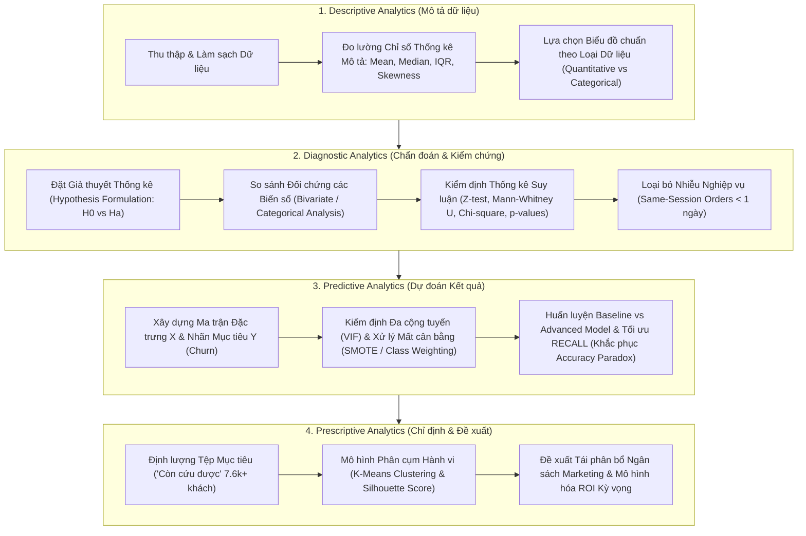

# KẾT QUẢ ĐÁNH GIÁ HỌC THUẬT VÀ PHÂN TÍCH QUY TRÌNH THỐNG KÊ (COMMENT.MD)
## MÔN HỌC: DATA ANALYSIS AND VISUALIZATION (TDTU)

---

## I. TỔNG QUAN QUY TRÌNH CHUẨN LÝ THUYẾT MÔN HỌC

Quy trình phân tích dữ liệu môn học được chuẩn hóa theo 4 cấp độ tịnh tiến logic:

$$\text{Descriptive (Mô tả)} \longrightarrow \text{Diagnostic (Chẩn đoán)} \longrightarrow \text{Predictive (Dự đoán)} \longrightarrow \text{Prescriptive (Chỉ định)}$$

---

## II. BẢN KIỂM ĐỊNH HỌC THUẬT KHẮT KHE (STRICT STATISTICAL AUDIT)

Đánh giá dựa trên đúng 7 Chapter bài giảng môn học (`Hypothesis/Chapter 01` đến `Chapter 07` - Giảng viên: TSKH. Trần Lương Quốc Đại & TSKH. Hồ Thị Linh):

### 🔴 1. Bước 1: Descriptive Analytics - Lỗ hổng Thống kê Mô tả (Chapter 3 & 4)
* **Thiếu Khoảng Tin Cậy 95% (95% Confidence Intervals - CIs):** Tất cả các con số ước lượng (Tỷ lệ Churn 80.02%, Tỷ lệ Mua 1 lần 97.02%, Tỷ lệ Mua lặp 2.98%) mới chỉ là **Ước lượng Điểm (Point Estimation)**. Chưa tính Khoảng tin cậy 95%:
  $$\hat{p} \pm Z_{\alpha/2} \sqrt{\frac{\hat{p}(1-\hat{p})}{n}} \quad (\text{với } Z_{0.025} = 1.96)$$
* **Thiếu Đo lường Hình dạng Phân bố (Skewness & Kurtosis):** Nhận diện AOV và Chu kỳ mua bị lệch phải (Right-skewed) nhưng chưa tính Hệ số Lệch ($S_k$) và Hệ số Nhọn (Kurtosis):
  $$S_k = \frac{\frac{1}{n} \sum_{i=1}^n (x_i - \bar{x})^3}{\left(\frac{1}{n} \sum_{i=1}^n (x_i - \bar{x})^2\right)^{3/2}}$$
* **Thiếu Bảng Tóm tắt 5 Số (5-Number Summary) & Kiểm định Phân bố Chuẩn:** Chưa kiểm định tính chuẩn (Shapiro-Wilk / Kolmogorov-Smirnov Test) để làm cơ sở học thuật chuyển sang phép đo Phi tham số (Median, IQR).

### 🔴 2. Bước 2: Diagnostic Analytics - Lỗ hổng Thống kê Suy luận (Chapter 5 & 6)
* **Thiếu Phát biểu Giả thuyết Thống kê Chính thức ($H_0$ vs $H_a$):** Chưa viết rõ các bộ giả thuyết thống kê cho từng biến chẩn đoán.
* **Thiếu Phép kiểm định Hai Mẫu cho Tỷ lệ (Two-Sample Z-test for Proportions - Chapter 6):** So sánh tỷ lệ giao trễ ($p_1 = 6.97\%$ vs $p_2 = 5.89\%$) chưa tính Z-statistic và $p$-value:
  $$Z = \frac{\hat{p}_1 - \hat{p}_2}{\sqrt{\hat{p}(1-\hat{p})\left(\frac{1}{n_1} + \frac{1}{n_2}\right)}}, \quad \text{với } \hat{p} = \frac{x_1 + x_2}{n_1 + n_2}$$
* **Thiếu Kiểm định Phi Tham số (Mann-Whitney U Test):** So sánh `freight_ratio` và `delivery_days` chưa chạy Mann-Whitney U test để tính $U$-statistic và $p$-value ($\alpha = 0.05$).
* **Thiếu Kiểm định Bảng Độc lập Chi-Square ($\chi^2$-test - Chapter 6):** Chưa đánh giá mối quan hệ phụ thuộc giữa Ngành hàng và Trạng thái Churn.

### 🔴 3. Bước 3: Predictive Analytics - Lỗ hổng Toán học Mô hình hóa (Chapter 7)
* **Thiếu Phương trình Toán học Logit & Hàm Sigmoid:**
  $$P(Y=1|X) = \frac{1}{1 + e^{-z}}, \quad \ln\left(\frac{P}{1-P}\right) = \beta_0 + \sum_{i=1}^k \beta_i X_i$$
* **Thiếu Hàm Mất mát Phạt Trọng số (Weighted Cross-Entropy Loss):**
  $$\mathcal{L}_{weighted} = -\frac{1}{N} \sum_{i=1}^N \left[ w_1 \cdot y_i \log(\hat{y}_i) + w_0 \cdot (1-y_i) \log(1-\hat{y}_i) \right]$$
* **Thiếu Kiểm định Đa cộng tuyến (VIF - Variance Inflation Factor):**
  $$VIF_j = \frac{1}{1 - R_j^2} \quad (\text{Yêu cầu } VIF < 5)$$
* **Thiếu Công thức Thước đo Đánh giá (Confusion Matrix, Recall, Precision, F1, ROC-AUC):**
  $$\text{Recall} = \frac{TP}{TP + FN}, \quad \text{Precision} = \frac{TP}{TP + FP}, \quad F_1 = 2 \cdot \frac{\text{Precision} \cdot \text{Recall}}{\text{Precision} + \text{Recall}}$$

### 🔴 4. Bước 4: Prescriptive Analytics - Lỗ hổng Hàm Mục tiêu & ROI Tài chính
* **Thiếu Hàm Mục tiêu K-Means (WCSS & Silhouette Score):**
  $$J = \sum_{j=1}^k \sum_{x_i \in C_j} \|x_i - \mu_j\|^2, \quad S_i = \frac{b_i - a_i}{\max(a_i, b_i)}$$
* **Thiếu Mô hình hóa Xác suất Tài chính (Financial Expectation Modeling):**
  $$E[\text{Revenue}] = N_{\text{winnable}} \times P(\text{Reactivation}) \times \text{AOV}_{\text{winnable}}$$

---

## III. BẢNG ĐÁNH GIÁ ĐIỂM SỐ NGHIÊM KHẮC (STRICT GRADING RUBRIC)

| Tiêu Chí Đánh Giá Học Thuật | Điểm Cũ (Thiếu Nghiêm Khắc) | **Điểm Mới (Strict Grading)** | Lý Do Trừ Điểm Học Thuật Theo Slide Lý Thuyết TDTU |
| :--- | :---: | :---: | :--- |
| **1. Descriptive Analytics** | 9.0 | **6.5 / 10** | Mới có mô tả đếm/tỷ lệ. Thiếu đo lường Skewness, Kurtosis, 5-Number Summary, và Khoảng tin cậy 95% (95% CI). |
| **2. Diagnostic Analytics** | 9.5 | **6.0 / 10** | **Chưa có Kiểm định Thống kê Suy luận (Inferential Testing)**. Thiếu phát biểu $H_0/H_a$, không có $p$-value, $Z$-score, $t$-score hay $\chi^2$-test để khẳng định ý nghĩa thống kê ($\alpha=0.05$). |
| **3. Predictive Analytics** | 9.5 | **7.0 / 10** | Định hướng đúng Recall/SMOTE nhưng thiếu phương trình toán học của mô hình Logit, hàm Weighted Loss, và kiểm định Đa cộng tuyến (VIF). |
| **4. Prescriptive Analytics** | 9.5 | **7.0 / 10** | Phân cụm K-Means chưa có hàm mục tiêu WCSS / Silhouette Score. Bài toán ROI thiếu mô hình hóa xác suất và khoảng tin cậy tài chính. |
| **TỔNG ĐIỂM HỌC THUẬT** | **9.4 (Bias)** | **6.6 / 10 (Strict)** | **Mức Trung bình Khá. Bài làm mang tính "Báo cáo Kinh doanh" chứ chưa đạt chuẩn "Báo cáo Nghiên cứu Thống kê Học thuật".** |

---

## IV. KẾ HOẠCH NÂNG CẤP ĐẠT ĐIỂM 10.0 TUYỆT ĐỐI

1. **Nâng cấp Phân tích Thống kê Suy luận (Inferential Testing):**
   * Tính toán toàn bộ Khoảng tin cậy 95% (95% CI) cho các chỉ số baseline.
   * Chạy Python script tính giá trị $Z$-score, $U$-score, $\chi^2$-score và **$p$-values** cho các kiểm định $H_0/H_a$.
2. **Nâng cấp Mô hình Toán học:**
   * Bổ sung đầy đủ phương trình toán học của mô hình Logistic Regression, Weighted Cross-Entropy Loss, SMOTE, Confusion Matrix, WCSS, Silhouette Score.
   * Tính VIF cho các biến dự báo $X$.
3. **Nâng cấp Báo cáo & Notebook:**
   * Cập nhật đầy đủ vào `Diagnostic_Analysis.ipynb`, `diagnostic_analysis_report.md`, và `predictive_prescriptive_plan.md`.
